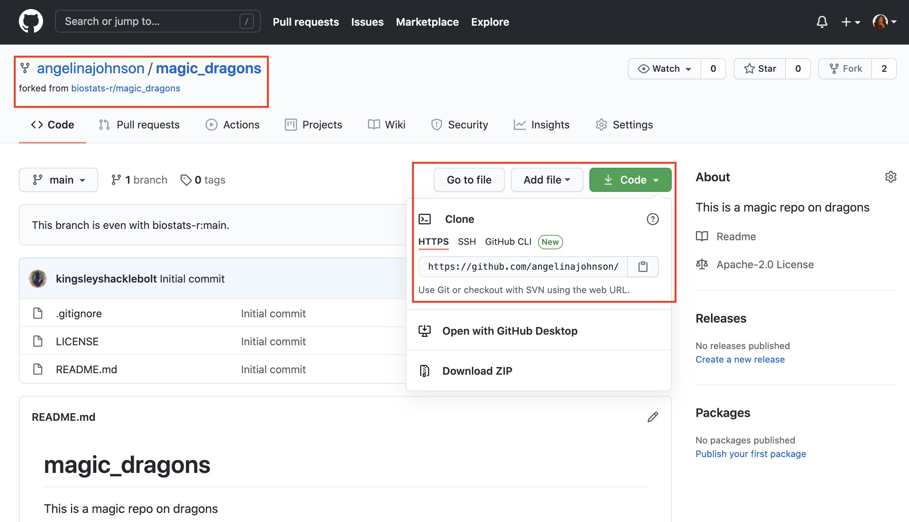
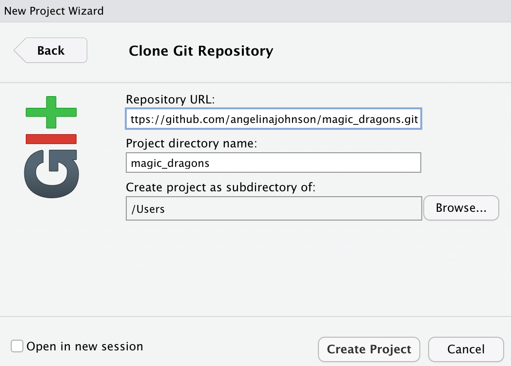

---
title: "Collaborating with forks and branches"
output:
  bookdown::html_document2:
    highlight: tango
    toc: true
    toc_float: true
    css: ../css/style-chapters.css
--- 

```{r setup, include=FALSE}
knitr::opts_chunk$set(echo = FALSE, out.width = '100%')
```

```{r title-pic}
knitr::include_graphics("Pics/fork_branch_tutorial/0_forks_branches.jpg")
```


## What is a fork?

GitHub is useful for developing your own code, but at some point you might want to collaborate with other people on a project. 
Or you might come across a GitHub repository that you want to use as a starting point for your own work. In both cases **forks** are the way to go. 

A fork is a copy of somebody's GitHub repository. 
You can fork a repo and work independently of the original project. 
Or if you are collaborating with other people you can stay connected with the original repository via **pull requests**.

However, you cannot directly affect (or damage) the original project, which is somewhat less scary, right?
<br/><br/>

### the workflow

To understand the **workflow**, let's see how Angelina and Kingsley collaborate (see Figure \@ref(fig:github)).

Kingsley owns a GitHub repo. Angelina **forks** this repo (1) and then **clones** is to her computer (2). Angelina develops code using **branches** and makes **commits** (3). then she **pushes** these changes to her **remote repo** on GitHub (4) and makes a **pull request** to the original repo, which Kingsley **merges** (5).

From now on Angelina will **fetch** (6) and **merge** (7) the newest changes from **upstream** and continue the workflow (3-5). 

```{r github, fig.cap="GitHub workflow"}
knitr::include_graphics("Pics/fork_branch_tutorial/1_workflow3.png")
```
<br/><br/>

### Fork a repo on GitHub

Go to GitHub, log into your account (see section \@ref(preparation) for how to make an GitHub account) and go to the repository you want to fork.

Let us assume that Angelina wants to fork the magic_dragon repo from biostats.
Click on the **fork** button on the top right of the webpage and wait until the repo is forked.

```{r fork-repo}
knitr::include_graphics("Pics/fork_branch_tutorial/2_fork_repo.png")
```
<br/><br/>
<br/><br/>

### Clone a the forked GitHub repository

On the top is the name of the **forked repository** and the project name.
Click on the green **Code** button on the top right and copy the url link.

```{r clone}

```
<br/><br/>
<br/><br/>
Go to RStudio and click on **File > New Project**.

```{r new-project, out.width = '60%'}
knitr::include_graphics("Pics/gittutorial/12_new_project.png")
```
<br/><br/>
<br/><br/>
Select **Version Control**.

```{r version-control, out.width = '60%'}
knitr::include_graphics("Pics/gittutorial/13_version_control.png")
```
<br/><br/>
<br/><br/>
Select **Git**.

```{r git, out.width = '60%'}
knitr::include_graphics("Pics/gittutorial/14_git.png")
```
<br/><br/>
<br/><br/>
Paste the url link from above and click **Create Project**.

```{r add-url, out.width = '60%'}

```

If you want to **work independently** from the original repo, then this is it.

However, if you want to stay connected to the **upstream repo**, then go to terminal and type:

```
git remote add upstream git@github.com:user_name/repo_name.git
```

So Angelina would then type:
```
git remote add upstream git@github.com:biostats_r/magic_dragons.git
```

Now you have cloned the project **local** to your computer and you are ready to start working in your fork.


## What is a branch?

You have forked a repository and are ready to start working on the project. 
Let's talk about **branches**.

A **branch** lets you develop code, fix a problem, or test an idea without affecting the original project. 
A **branch** is created from an existing **branch**, usually from the **main branch** of the project.
Note that **main branch** was previously named master branch, but removed because of the reference to slavery.
Because of this change you might find references to the old name when looking for help elsewhere.

You can work on a **branch**, bravely develop code that works or does not work and it  does not break the code on the **main branch**.
Basically, you can experiment on your own.

If the idea did not work or you have another idea, the **branch** can be deleted and nobody ever needs to know about it. 
Make a new **branch** and start all over again. 
None of this will affect the original project.

If you are working **on your own** project, and happy with the new code, or the idea is tested and working, you can **merge** the **branch** you are working on with the **main branch**.

If you are **collaborating** with other people and you have forked a repo you should not work on the **main branch**.
When you change the **main branch** and later update your repo from the original repo, it will cause **merge conflicts**.
Therefore, when collaborating with others, you always work on **branches**, and then you make a **pull requests**.
The maintainer will then **merge** the changes in the **current branch** to the **main branch** (see \@ref(make-pull-request-in-github)).

Let's have a look how to create, use and delete branches.


### Make a new branch in RStudio

In RStudio, click on the **New Branch** button in the Git tab. 
Next to this button it will say on which branch you are.
In this case it is main, which is the default branch.


```{r new-branch}
knitr::include_graphics("Pics/fork_branch_tutorial/5_make_new_branch.png")
```
<br/><br/>
<br/><br/>
Give the branch a short and informative name (no spaces) and click **Create**.

```{r name-branch, out.width = '50%'}
knitr::include_graphics("Pics/fork_branch_tutorial/6_name_branch.png")
```
<br/><br/>
<br/><br/>
You are now in the newly created branch.

```{r new-branch-2}
knitr::include_graphics("Pics/fork_branch_tutorial/7_new_branch.png")
```


### Code, commit and push to origin in RStudio

Now is the time work in a new or edit an existing file on the project. 
You can work the way it is described in the \@ref(how-to-work-in-git) How to work with GitHub tutorial. Write or edit code, test it, **commit** regularly, add a useful commit message.

Once you are done with the task in this **branch**, test it and **push** it to your **fork** on GitHub. This is the workflow, if you are working on your own.

If you are collaborating with others, you will want to send your code **upstream** to the original repo, which is described in the next section.


### Make a pull request on GitHub

Once you have **pushed** your branch back to the **main branch** you can make a **pull request**.
A **pull request** is a request to the maintainer of the **upstream** repository to pull your code into the original repository.

Go to your fork on GitHub (not the upstream repo).
Click on the green box **Compare & pull request** which has appear at the top of the page.
<br/><br/>
<br/><br/>
```{r pull-request-1}
knitr::include_graphics("Pics/fork_branch_tutorial/8_pull_request.png")
```
<br/><br/>
<br/><br/>
Add a comment about your pull request and click **Create pull request**.
<br/><br/>
<br/><br/>
```{r pull-request-2}
knitr::include_graphics("Pics/fork_branch_tutorial/9_create_pull_request.png")
```
<br/><br/>
<br/><br/>
Once you have created your **pull request**, GitHub will check if there are any **merge conflict**.
A **merge conflict** can occur when two people are changing the same line in one file differently.
See \@ref(trouble-shooting) for how to deal with a **merge conflict**.

If no **merge conflict** occurs GitHub will give green light for merging.
If there is a merge conflict, it has to be resolved before the file can be merged (see \@ref(trouble-shooting) Trouble shooting).
<br/><br/>
<br/><br/>
```{r pull-request-3}
knitr::include_graphics("Pics/fork_branch_tutorial/10_merge_pull_request.png")
```
<br/><br/>
<br/><br/>
Now it's time for you to relax, have some cake 🍰, you have earned it!
<br/><br/>
<br/><br/>

### Repo maintainer accepts pull request (or not)

The **maintainer** of the original repository will then get notified about your **pull request**.
<br/><br/>
<br/><br/>
```{r maintainer}
knitr::include_graphics("Pics/fork_branch_tutorial/11_maintainer_view.png")
```

The **maintainer** has to evaluate your changes to the project and can make comments to specific parts of the code, or even **start a review**.
You will get a notification if changes are required and this can go forth and back for a while.
<br/><br/>
<br/><br/>
```{r comment}
knitr::include_graphics("Pics/fork_branch_tutorial/12_comment.png")
```
<br/><br/>
<br/><br/>
Eventually, the **maintainer** will **confirm the merge** and you will get a notification.
<br/><br/>
<br/><br/>
```{r merge}
knitr::include_graphics("Pics/fork_branch_tutorial/13_confirm_merge.png")
```
<br/><br/>
<br/><br/>

### Update your fork in the Terminal

Once your **pull request** has been accepted, you have to update your fork to get the latest changes from **upstream**. 
Go to RStudio and the **Terminal** tab.
<br/><br/>
<br/><br/>
```{r terminal-request}
knitr::include_graphics("Pics/gittutorial/16_terminal.png")
```
<br/><br/>
<br/><br/>

And type:

```
git fetch upstream

git checkout main

git merge upstream/main
```
**Fetch** downloads all the changes from **upstream**. 
**Checkout main** makes sure your **main branch** is active. 
And the last line **merges** the changes with your local repository.
<br/><br/>
<br/><br/>


### Richards way (need ot disscuss if we want to show them git2r)

library(git2r)
#add remote - only needs doing once per fork
remote_add(name = "audhalbritter", url = "https://github.com/audhalbritter/biostats.git")
# run every update
fetch(name = "audhalbritter")
b <- branches(flags = "remote")
b <- b[["audhalbritter/FixGitTutorial"]]
sha <- branch_target(b)
branch_create(commit = lookup(sha = sha), name = "audhalbritter-FixGitTutorial", force = TRUE)
checkout(object = ".", branch = "audhalbritter-FixGitTutorial")
#to view again after updates (probably is a  better solution)
#return to master branch
checkout(branch = "master")
#delete pull request branch
git2r::branch_delete(branch = "audhalbritter-FixGitTutorial")


### Delete branches

Once you have created a couple of **branches**, it will become difficult to track which **branch** you are still working on and which are old. Generally, you want to delete a **branch** when you are done with it.

To delete a **branch** locally type:

```
git branch -D community_analysis
```
To delete the **branch** remotely, type:
```
git push origin --delete community_analysis
```
<br/><br/>
<br/><br/>


### Trouble shooting

**Check configurations in the Terminal**

You might want to check the configurations of your repository.
In the **Terminal** you can check the **origin** of your repo, which is from where you **push** and **pull**.
If you have forked a repo it will also show you the **upstream** repo (see \@ref(collaborating-with-forks-and-branches) Collaborating with forks and branches tutorial for more details).
This will also show you if your **origin** is wrong or the **upstream** repo has not been set.

Go to the **Terminal** tab and type repo type:

```
git remote -v
```
<br/><br/>


**Add remote origin**

To add the **remote origin** go to the **Terminal** and type:

```
git remote add origin [url]
```

For Kingsley this would be:
```
git remote add origin https://github.com/git:kingsleyshacklebolt/dragon_study.git
```
<br/><br/>


**Handle a merge conflict**

A **merge conflict** can occur when two people are changing the same line in one file differently.
First, do not panic and find the files that are conflicting.

The file that has a conflict will look like this:

```
### Dragon analysis ###

library("broom")

# Import data
source("R/import_dragon_data.R")


# Run model

<<<<<< HEAD:dragon_analysis 
mod <- lm(body_size ~ body_length, data = dragon)
======
mod <- lm(body_size ~ body_length * temperature, data = dragon)
>>>>>>> issue-5:dragon_analysis 

tidy(mod)

```

In this file the **merge conflict** starts with `<<<<<< HEAD:dragon_analysis` indicating the name of the file.
Then the two different versions of the code are shown, and separated by `======`.
Finally, `>>>>>>> issue-5:dragon_analysis` indicates the end of the merge conflict.

To resolve the conflict, you have to edit this section and remove the conflicting parts.
Basically, choose one of the versions or combine them.
Also remove the conflict markers `<<<<<<`, `======` and `>>>>>>`.

```
### Dragon analysis ###

library("broom")

# Import data
source("R/import_dragon_data.R")


# Run model
mod <- lm(body_size ~ body_length * temperature, data = dragon)

tidy(mod)

```

Save the file, commit and push again.


**Prevent from pushing to main**

We have already established that when you work on a fork, never change the **main branch**.
This can be difficult to remember, and there is a way to prevent from committing to *main*.

!!! NEED TO FIGURE OUT HOW TO DESRIBE THIS!!!
https://stackoverflow.com/questions/40462111/git-prevent-commits-in-master-branch

Go to your repository.
Create file .git/hooks/pre-commit with following content:

#!/bin/sh

branch="$(git rev-parse --abbrev-ref HEAD)"

if [ "$branch" = "master" ]; then
  echo "You can't commit directly to master branch"
  exit 1
fi
Make it executable (not required on Windows):

$ chmod +x .git/hooks/pre-commit
To disable fast-forward merges you must also add following option to your .git/config file:

[branch "master"]
    mergeoptions = --no-ff

<br/><br/>
<br/><br/>

### Further reading {.facta .toc-ignore}

**Happy Git** provides instructions for how to getting started with Git, R and RStudio, explains the workflows and useful tips for when things go wrong.
https://happygitwithr.com/ 

The **Git fligh rules** are an exaustive ressource for what to do whne things go wrong. https://github.com/k88hudson/git-flight-rules


### What's next {.facta .toc-ignore}

Nothing yet. Go and eat more cake 🍰