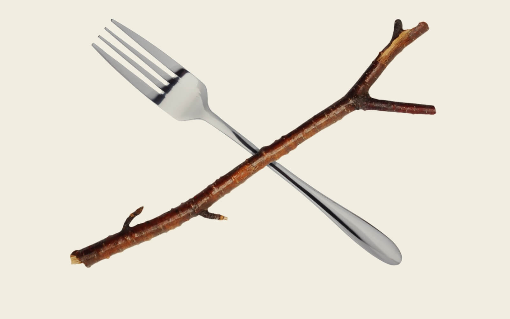
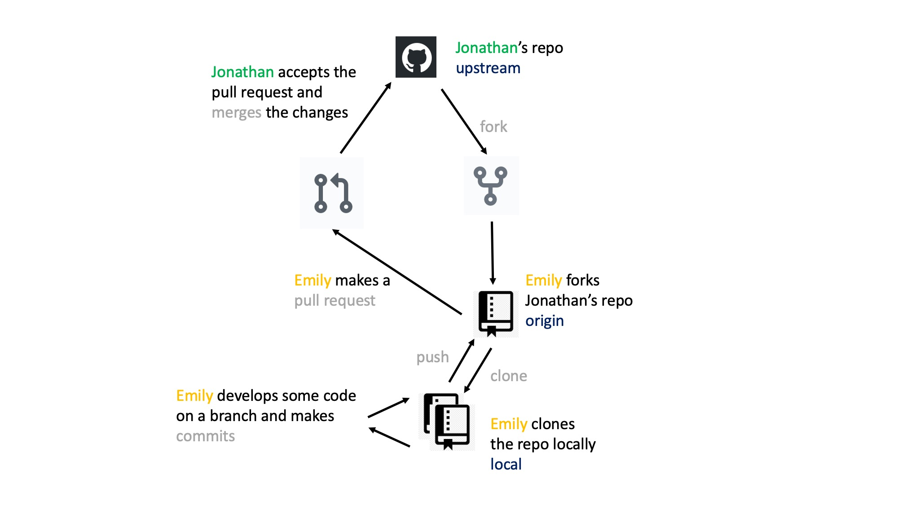
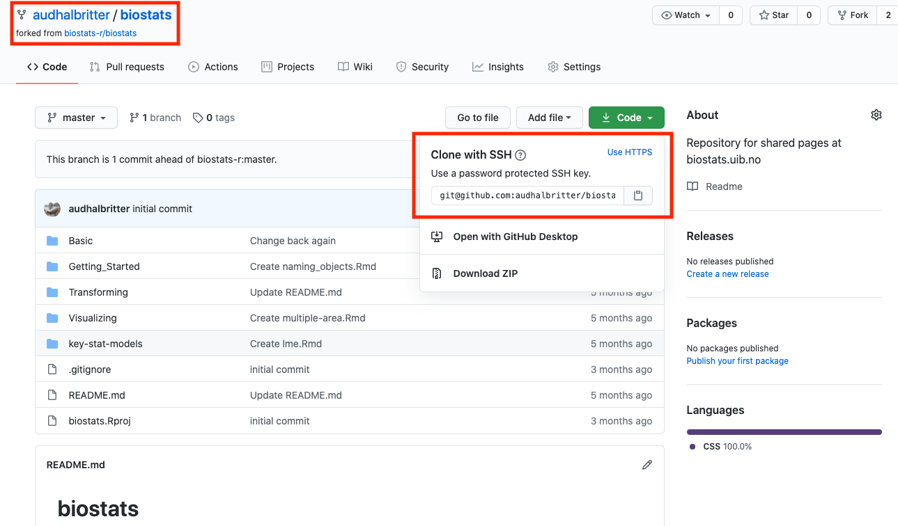
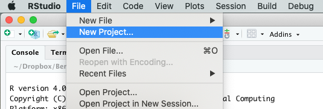
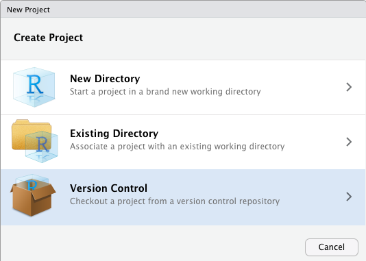
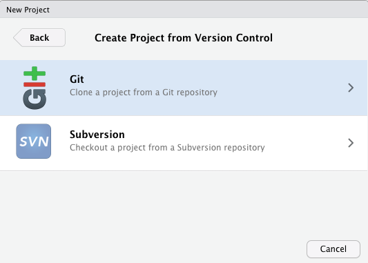
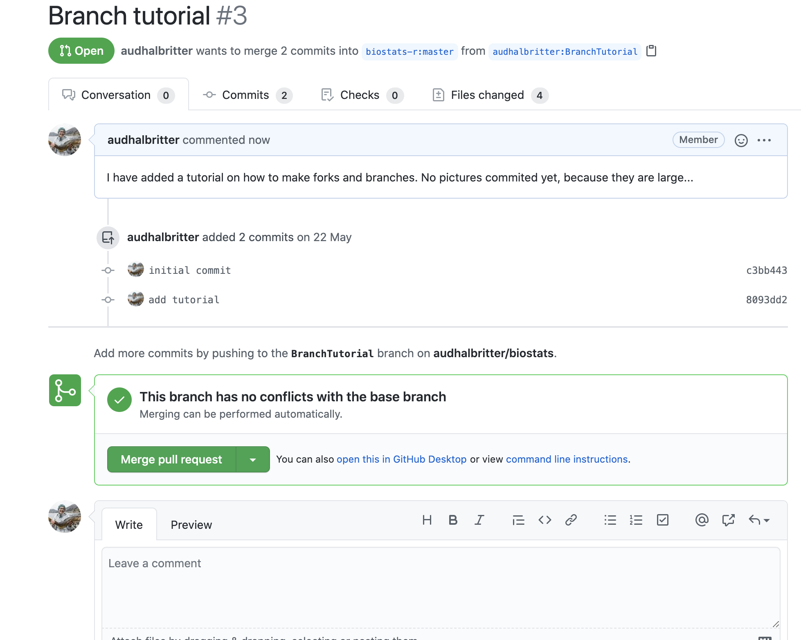

---
title: "Forks and branches"
output:
  html_document:
    highlight: tango
    toc: true
    toc_float: true
    #css: ../css/style-chapters.css
--- 

```{r setup, include=FALSE}
knitr::opts_chunk$set(echo = FALSE, out.width = '100%')
```

```{r title-pic}

```


## Forks

GitHub is very useful for developing your own code, but at some point you might want to collaborate with other people on a project. Or you might come across a GitHub repository that you want to use as a starting point for your own work. In both cases "forks" are the way to go. 

A fork is making a copy of somebody's GitHub repository. You can fork a repo and work independently of the original project. Or if you are collaborating with other people you can stay connected with the original repository via pull requests. However, you cannot directly affect (or damage) the original project.


```{r github}

```
<br/><br/>

```{r how-forks-work}
#knitr::include_graphics("Pics/.jpg")
```
<br/><br/>
<br/><br/>

### Fork repo (on github)

Go to GitHub, login into your account (see here for how to make an account) and go to the repository you want to fork. Click on the fork button on the top right of the page.


```{r fork-repo}
knitr::include_graphics("Pics/1. Fork_repo.png")
```
<br/><br/>
<br/><br/>

### Clone (Rstudio)

On the top left you find the name of your forked repository and you can see it has been forked from another project.
Click on the green button on the top right and copy the url link.

```{r clone}

```
<br/><br/>
<br/><br/>
Go to RStudio. Click on File > New Project

```{r new-project, out.width = '60%'}

```
<br/><br/>
<br/><br/>
Select Version Control

```{r version-control, out.width = '60%'}

```
<br/><br/>
<br/><br/>
Select Git

```{r git, out.width = '60%'}

```
<br/><br/>
<br/><br/>
And paste the url link from above.

```{r add-url, out.width = '60%'}
knitr::include_graphics("Pics/6. add_url.png")
```
<br/><br/>
<br/><br/>

## Branch

You have forked a repository and are ready to start working on the project. Let's talk about branches.

A branch lets you develop code or test an idea without affecting the original project. Once you are happy with the new code, or the idea is tested and working you can merge the branch with master branch. If the idea did not work or you have another idea, the branch can be deleted. None of this will affect the original project.

You make a copy of the code and your fork allows you to make changes or develope new code without affecting the original repository. This means you can bravely develop code, which works or not. If it does not work, you delete your branch and nobody ever needs to know about it.


The master branch is the default branch in Git (also the name).

Let's have a look how to create Git branches, use Git branches and remove Git branches.
<br/><br/>
<br/><br/>

### Make new branch (RStudio)
In RStudio, click on the New Branch button in the Git window. The box next to it will tell you in which branch you are. Master is the default and original branch.

```{r new-branch}
knitr::include_graphics("Pics/7. NewBranch.png")
```
<br/><br/>
Give the branch a short and informative name.

```{r name-branch, out.width = '50%'}
knitr::include_graphics("Pics/8. NameBranch.png")
```
<br/><br/>
You can now see that you are in the new branch.
```{r new-branch-2}
knitr::include_graphics("Pics/9. NewBranch2.png")
```
<br/><br/>

### Write R code (Rstudio)
Now is the time to open a new or an existing file and start to write code. Work in the usual way, do small steps, commit regularly and push (see how to work in with git tutorial). 
```{r make-file}
knitr::include_graphics("Pics/10. make file.png")
```
<br/><br/>

### Commit and push
!!! This will be a separate tutorial!!! so very briefly described!!!
write code, work in small logical steps (e.g. write a function, fix a function, add a plot, etc.). Do not make too many steps at a time. One step - commit - next step - commit -.... At the end of the day push.
<br/><br/>

### Make pull request (github)
Once you have pushed your branch back to the master branch you can make a pull request. Go back to Github, to the forked repository. A green box appears at the top of the page "pull requst". Click on this button.
<br/><br/>
```{r pull-request-1}
knitr::include_graphics("Pics/12 Pull request.png")
```
<br/><br/>
Add some comments about your pull request if necessary and create the pull request.
<br/><br/>
```{r pull-request-2}
knitr::include_graphics("Pics/13. Pullrequest 2.png")
```
<br/><br/>
Once you have created your pull request, github will check if there are any merge conflict.
<br/><br/>
```{r pull-request-3}

```
<br/><br/>
Now it's time for you to relax, have some cake 🍰, you have earned it!
<br/><br/>

### Owner accepts pull request (or not)
The owner of the original project has to evaluate your changes to the project. The owner can accept your code, decline or make suggestions for improvement.

You will get a notification if your pull request has been accepted.
<br/><br/>

### Update your fork (Terminal)
Once your pull request has been accepted, you have to update your fork to get the lastest changes. In RStudio open up the terminal:
```{r terminal-request}
knitr::include_graphics("Pics/11. Terminal.png")
```
<br/><br/>
And type:

```
git fetch upstream

git checkout master

git merge upstream/master
```
download
move to master branch
merge

<br/><br/>

### Delete branches
Type:
```
git branch -d BranchTutorial
```

This will delete the branch locally.

And
```
git push origin --delete BranchTutorial
```

This will delete the branch remotely.