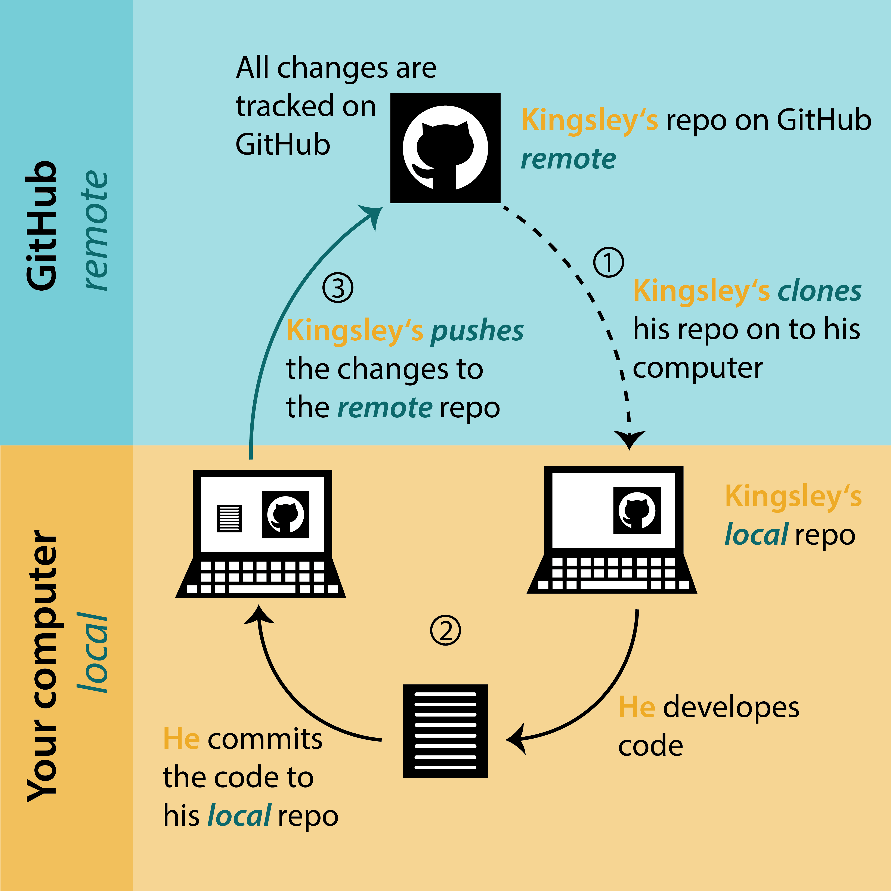

---
title: "Working with branches"
output:
  bookdown::html_document2:
    highlight: tango
    toc: true
    toc_float: true
    css: ../css/style-chapters.css
--- 

```{r setup, include=FALSE}
knitr::opts_chunk$set(echo = FALSE, out.width = '100%')
```

```{r title-pic}
knitr::include_graphics("Pics/branch_tutorial/0_winter_forest.JPEG")
```

## What is a branch?

A **branch** lets you develop code, fix a problem, or test an idea without affecting the original project. 
A **branch** is created from an existing **branch**, usually from the **main branch** of the project.
Note that **main branch** was previously named master branch, but removed because of the reference to slavery.
Because of this change you might find references to the old name when looking for help elsewhere.

You can work on a **branch**, bravely develop code that works or does not work and it  does not break the code on the **main branch**.
Basically, you can experiment on your own.

If the idea did not work or you have another idea, the **branch** can be deleted and nobody ever needs to know about it. 
Make a new **branch** and start all over again. 
None of this will affect the original project.

If you are working **on your own** project, and happy with the new code, or the idea is tested and working, you can **merge** the **branch** you are working on with the **main branch**.
<br/><br/>

### the workflow

To understand the **workflow**, let's see how Kingsley is using branches (see Figure \@ref(fig:workflow-branches)).

Kingsley owns a GitHub repo.
He **clones** the repo to his computer (1).
To develop code, he create a **new branch** (2) and makes **commits** (3).
Then he **pushes** these changes to his **remote repo** on GitHub (4) and makes a **pull request** to **merge** the **new branch** with the **main branch** (5).
Kingsley then **pulls** (6) the newest changes into his local repo and continue the workflow (2-5).


NEED TO ADD BRANCHES TO THIS PICTURE!!!
```{r workflow-branches, fig.cap="Workflow using branches"}

```

Let's have a look how to create, use and delete **branches**.
<br/><br/>

### Make a new branch in RStudio

In RStudio, click on the **New Branch** button in the Git tab. 
Next to this button it will say on which branch you are.
In this case it is main, which is the default branch.


```{r new-branch}
knitr::include_graphics("Pics/fork_branch_tutorial/5_make_new_branch.png")
```
<br/><br/>
<br/><br/>
Give the branch a short and informative name (no spaces) and click **Create**.

```{r name-branch, out.width = '50%'}
knitr::include_graphics("Pics/fork_branch_tutorial/6_name_branch.png")
```
<br/><br/>
<br/><br/>
You are now in the newly created branch.

```{r new-branch-2}
knitr::include_graphics("Pics/fork_branch_tutorial/7_new_branch.png")
```

If you want to switch back to the **main branch** or another **branch**, click again on the box in the top corner to switch.
Note that you cannot switch to another branch if you have uncommitted changes.
They need to be committed first.


### Code, commit and push to origin in RStudio

Now is the time to work in a new or edit an existing file on the project. 
You can work the way it is described in the \@ref(how-to-work-in-git) How to work with GitHub tutorial. Write or edit code, test it, **commit** regularly, add a useful commit message.

Once you are done with the task it is time to **merge** your **new branch** into the **main branch**.

First you need to go to the **main branch**.
For this go to the **Terminal** and type:

```
git checkout main
```

To merge the **new branch** into the **main branch** type:

```
git merge my_branch
```

For the example we had above, where the name of the **new branch** was community_analysis it would be:

```
git merge community_analysis
```

The last step is to push these changes to GitHub.
For this, go to the git tab in RStudio and push the green arrow.
```{r push-to-git}
#knitr::include_graphics("Pics/gittutorial/")
```
<br/><br/>
<br/><br/>

### Delete branches

Once you have created a couple of **branches**, it will become difficult to track which **branch** you are still working on and which are old.
Generally, you want to delete a **branch** when you are done with it.

To delete a **branch** locally type:

```
git branch -d community_analysis
```
To delete the **branch** remotely, type:
```
git push origin --delete community_analysis
```
<br/><br/>
<br/><br/>

### Trouble shooting

**Check configurations in the Terminal**

You might want to check the configurations of your repository.
In the **Terminal** you can check the **origin** of your repo, which is from where you **push** and **pull**.
And it will show you if your **origin** is wrong.

Go to the **Terminal** tab and type repo type:

```
git remote -v
```

The output will look like this:
```
origin  git@github.com:kingsleyshacklebolt/magic_dragons.git (pull)
origin  git@github.com:kingsleyshacklebolt/magic_dragons.git (push)
```
<br/><br/>


**Handle a merge conflict**

A **merge conflict** can occur when two people are changing the same line in one file differently.

The goal is to avoid such conflicts and a good strategy for this is to commit often, work in small steps, push and pull/fetch regular and communicate with the people you are collaborating with.
**Merge conflicts** can easily be avoided if you do not work in the same files.

But **merge conflicts** cannot always be avoided and should it happen that you have one in your pull request, you will get a message to resolve this conflict before the changes can be merge.
First, do not panic and find the files that are conflicting.

```{r merge-conflict}
knitr::include_graphics("Pics/fork_branch_tutorial/14_merge_conflict.png")
```

The conflicting file is called dragon_analysis.
Most likely somebody has changed the file in the meantime and you do not have the most recent version of code.
Check the status of this file on the upstream repo.
Fix the changes, so that they are not conflicting anymore, **commit**, **push** and make the **pull request** again.
Now everything should work.
<br/><br/>
<br/><br/>

### Further reading {.facta .toc-ignore}

**Happy Git** provides instructions for how to getting started with Git, R and RStudio, explains the workflow and useful tips for when things go wrong.
https://git-scm.com/book/en/v2/Git-Branching-Basic-Branching-and-Merging
Note that this book is competent user level with command line focus.

The **Git flight rules** are an exhaustive resource for what to do when things go wrong. https://github.com/k88hudson/git-flight-rules


### What's next {.facta .toc-ignore}

Nothing yet. Go and eat more cake 🍰