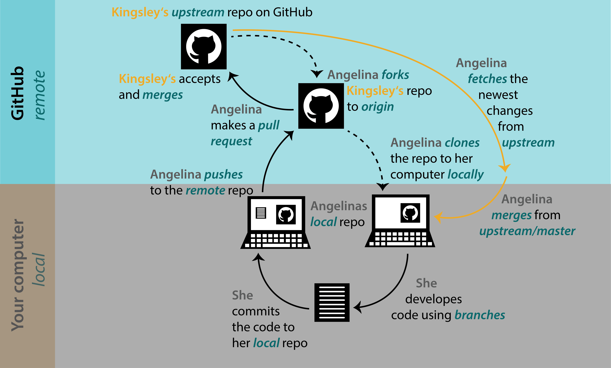
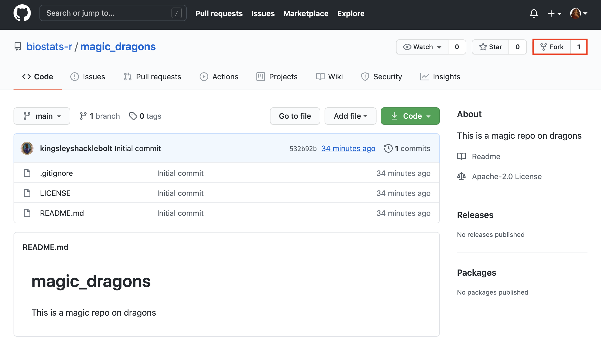
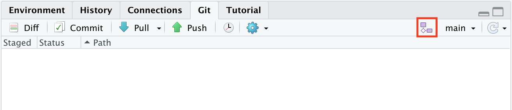
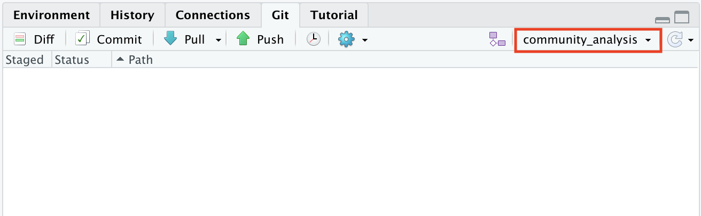
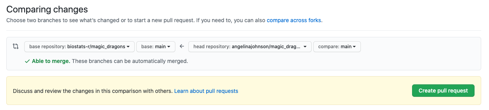
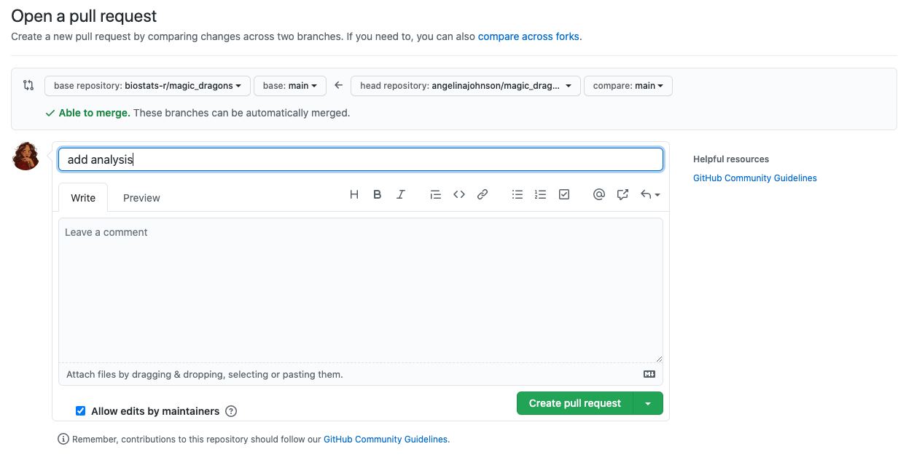
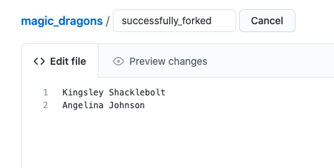
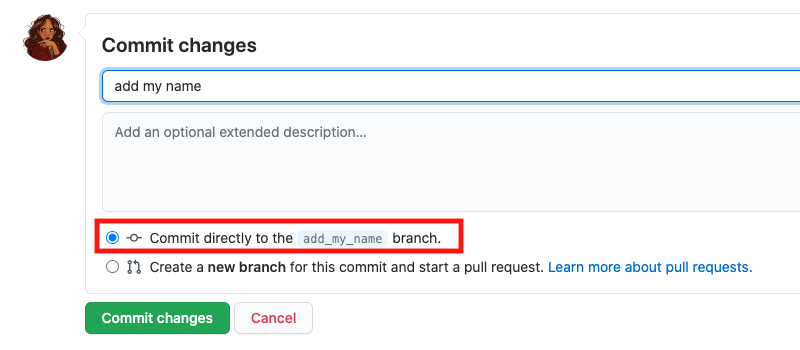
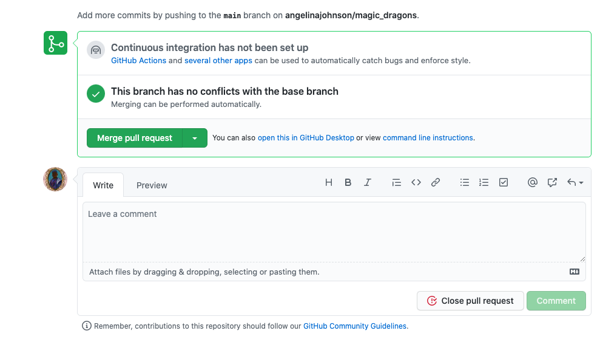
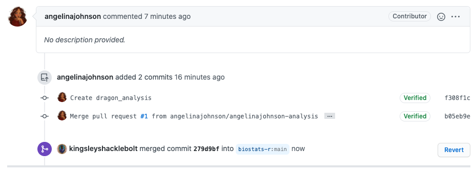

---
title: "Collaborating with forks"
output:
  bookdown::html_document2:
    highlight: tango
    toc: true
    toc_float: true
    css: ../css/style-chapters.css
--- 

```{r setup, include=FALSE}
knitr::opts_chunk$set(echo = FALSE, out.width = '100%')
```

```{r title-pic}

```


## What is a fork?

GitHub is useful for developing your own code, but at some point you might want to collaborate with other people on a project. 
Or you might come across a GitHub repository that you want to use as a starting point for your own work.
In both cases **forks** are the way to go. 

A fork is a copy of somebody's GitHub repository. 
You can fork a repo and work independently of the original project. 
Or if you are collaborating with other people you can stay connected with the original repository via **pull requests**.

However, you cannot directly affect (or damage) the original project, which is somewhat less scary, right?
<br/><br/>

### The workflow

To understand the **workflow**, let's see how Angelina and Kingsley collaborate using GitHub (see Figure \@ref(fig:github)).

Kingsley owns a GitHub repo.
Angelina **forks** this repo (1) and then **clones** is to her computer (2).
Angelina develops code using **branches** and makes **commits** (3).
Then she **pushes** these changes to her **remote repo** on GitHub (4) and makes a **pull request** to the original repo, which Kingsley **merges** (5).

From now on Angelina will **fetch** (6) and **merge** (7) the newest changes from **upstream** into her local repo and continue the workflow (3-5). 

```{r github, fig.cap="GitHub workflow using a fork"}

```
<br/><br/>

### Forking with `usethis`

The easiest way to fork a repo on GitHub and clone it to your computer is with the `usethis` package.
Find the user name and repo name of the repo you want to fork.
To fork and clone the "kingsleyshacklebolt/dragon_study" repo, use

```{r create-with-github, eval = FALSE, echo = TRUE}
library(usethis)
create_from_github("kingsleyshacklebolt/dragon_study", fork = TRUE)
```

This will 

- fork the repo, creating a copy in your own GitHub account.
- clone your fork of the repo onto your computer. 
By default, the clone will be put on your desktop. 
You can copy the entire folder to somewhere more convenient, or set the `destdir` argument.
- set up the connections between the clone, your fork and the original repo. You can see these connections in the terminal with the command

```{bash remotes, echo = TRUE, eval = FALSE}
git remote -v
```


### Fork a repo on GitHub

Sometimes if you only want to make a small change to a repo, it might be more convenient to make a **fork** on GitHub and make all the edits directy on GitHub.

To do this, go to GitHub, log into your account (see section \@ref(preparation) for how to make an GitHub account) and go to the repository you want to **fork**.

Let us assume that Angelina wants to fork the magic_dragon repo from biostats.
Click on the **fork** button on the top right of the webpage and wait until the repo is forked.

```{r fork-repo}

```
<br/><br/>
<br/><br/>


## What is a branch?

You have forked a repository and are ready to start working on the project.
Let's talk about **branches**.

A **branch** lets you develop code, fix a problem, or test an idea without affecting the original project. 
A **branch** is created from an existing **branch**, usually from the **main branch** of the project.
Note that **main branch** was previously named master branch, but removed because of the reference to slavery.
Because of this change you might find references to the old name when looking for help elsewhere.

You can work on a **branch**, bravely develop code that works or does not work and it  does not break the code on the **main branch**.
Basically, you can experiment on your own.

If the idea did not work or you have another idea, the **branch** can be deleted and nobody ever needs to know about it. 
Make a new **branch** and start all over again. 
None of this will affect the original project.

If you are **collaborating** with other people and you have forked a repo you should not work on the **main branch**.
When you change the **main branch** and later update your repo from the original repo, it will cause **merge conflicts**.
Therefore, when collaborating with others, you always work on **branches**, and then you make a **pull requests**.
The maintainer will then review the pull-request and maybe ask for changes in the **current branch**.
When the maintainer is satisfied, the changes in the **current branch** are **merge** to the **main branch** (see \@ref(trouble-shooting)).

Let's have a look how to create, use and delete branches.


### Make a new branch in RStudio

In RStudio, click on the **New Branch** button in the Git tab. 
Next to this button it will say on which branch you are.
In this case it is main, which is the default branch.


```{r new-branch}

```
<br/><br/>
<br/><br/>
Give the branch a short and informative name (no spaces) and click **Create**.

```{r name-branch, out.width = '50%'}
knitr::include_graphics("Pics/fork_branch_tutorial/6_name_branch.png")
```
<br/><br/>
<br/><br/>
You are now in the newly created branch.

```{r new-branch-2}

```

If you want to switch back to the **main branch** or another **branch**, click again on the box in the top corner to switch.
Note that you cannot switch to another branch if you have uncommited changes.
They need to be commited first.
<br/><br/>
<br/><br/>

### Code, commit and push to origin in RStudio

Now is the time to work in a new or edit an existing file on the project. 
You can work the way it is described in the \@ref(how-to-work-in-git) How to work with GitHub tutorial. Write or edit code, test it, **commit** regularly, add a useful commit message.

Once you are done with the task in this **branch**, test it and send your code **upstream** to the original repo, which is described in the next section.


### Make a pull request on GitHub

Once you have **pushed** your branch back to the **main branch** you can make a **pull request**.
A **pull request** is a request to the maintainer of the **upstream** repository to pull your code into the original repository.

Go to your fork on GitHub (not the upstream repo).
Click on the green box **Compare & pull request** which has appear at the top of the page.
<br/><br/>
<br/><br/>
```{r pull-request-1}

```
<br/><br/>
<br/><br/>
Add a comment about your pull request and click **Create pull request**.
<br/><br/>
<br/><br/>
```{r pull-request-2}

```
<br/><br/>
<br/><br/>
Once you have created your **pull request**, GitHub will check if there are any **merge conflict**.
A **merge conflict** can occur when two people are changing the same line in one file differently.
See \@ref(trouble-shooting) for how to deal with a **merge conflict**.

If no **merge conflict** occurs, GitHub will give green light for merging.
If there is a merge conflict, it has to be resolved before the file can be merged (see \@ref(trouble-shooting) Trouble shooting).
<br/><br/>
<br/><br/>
```{r pull-request-3}
knitr::include_graphics("Pics/fork_branch_tutorial/10_merge_pull_request.png")
```
<br/><br/>
<br/><br/>
Now it's time for you to relax, wait for the response of the repo maintainer and have some cake 🍰, you have earned it!
<br/><br/>
<br/><br/>

#### Excercise: make pull request

Let's make a pull request together.
Go to the magic_dragons repo that you forked above, or fork it now.
Open the file called **successfully forked**.

Click on the **main** button to create a new **branch**.
Type a name and click **Create branch: new_name**.

```{r successful-file}
knitr::include_graphics("Pics/fork_branch_tutorial/10.1_successful_file.png")
```

You are now working on the **new branch**.
Click on the pencil symbol on the right side to edit the file.
Add your name and scroll all the way to the bottom of the page.

```{r add-your-name, out.width = '60%'}

```

Type a commit message and make sure you commit to the **new branch** you just made.

```{r commit-to-new-branch}

```

Go to the original magic_dragons repo on GitHub and click on the green button **Compare & pull request** and on the next page **Create pull request**

```{r another-pull-request}
knitr::include_graphics("Pics/fork_branch_tutorial/10.4_another_pull_request.png")
```

<br/><br/>
Now it's time for you to relax, wait for the response of the repo maintainer and have some cake 🍰, you have earned it!
<br/><br/>
<br/><br/>


### Repo maintainer accepts pull request (or not)

The **maintainer** of the original repository will then get notified about your **pull request**.
<br/><br/>
<br/><br/>
```{r maintainer}

```

The **maintainer** has to evaluate your changes to the project and can make comments to specific parts of the code, or even **start a review**.
You will get a notification if changes are required and this can go forth and back for a while.
<br/><br/>
<br/><br/>
```{r comment}
knitr::include_graphics("Pics/fork_branch_tutorial/12_comment.png")
```
<br/><br/>
<br/><br/>
Eventually, the **maintainer** will **merge** the **pull request** and you will get a notification.
<br/><br/>
<br/><br/>
```{r merge}

```
<br/><br/>
<br/><br/>


#### Excercise: make pull request continues

Maybe you got a request from Kingsley Shackelbolt about your pull request.
Go ahead and fix it.

If everything was ok, then you are done.


### Update your fork

Once your **pull request** has been accepted, you have to update your fork to get the latest changes from **upstream**.

You can do this either on GitHub or in the terminal

#### On GitHub

Go to your fork on GitHub.
Click the "Fetch upstream" link beneath the green "Code" button, then press "Fetch and Merge" in the popup.

<blockquote class="twitter-tweet"><p lang="en" dir="ltr">Is your fork behind? You can now sync from the parent repo with just a single click! 🖱💥 <a href="https://t.co/4Zx6OwVTxO">pic.twitter.com/4Zx6OwVTxO</a></p>&mdash; GitHub (@github) <a href="https://twitter.com/github/status/1390382527588798477?ref_src=twsrc%5Etfw">May 6, 2021</a></blockquote> <script async src="https://platform.twitter.com/widgets.js" charset="utf-8"></script> 

Now go to RStudio and pull the updates to your computer. 
Unless you want to continue working on the same branch, you should now return to the main branch. 

#### In the terminal

Go to RStudio and the **Terminal** tab.
<br/><br/>
<br/><br/>
```{r terminal-request}
knitr::include_graphics("Pics/gittutorial/16_terminal.png")
```
<br/><br/>
<br/><br/>

And type:

```
git fetch upstream

git checkout main

git merge upstream/main
```
**Fetch** downloads all the changes from **upstream**. 
**Checkout main** makes sure your **main branch** is active. 
And the last line **merges** the changes with your local repository.
<br/><br/>
<br/><br/>


### Delete branches

Once you have created a couple of **branches**, it will become difficult to track which **branch** you are still working on and which are old.
Generally, you want to delete a **branch** when you are done with it.

To delete a **branch** locally type:

```
git branch -d community_analysis
```
To delete the **branch** remotely, type:
```
git push origin --delete community_analysis
```

<br/><br/>
<br/><br/>


### Trouble shooting

**Check configurations in the Terminal**

You might want to check the configurations of your repository.
In the **Terminal** you can check the **origin** of your repo, which is from where you **push** and **pull**.
If you have forked a repo it will also show you the **upstream** repo (see \@ref(collaborating-with-forks-and-branches) Collaborating with forks and branches tutorial for more details).
This will also show you if your **origin** is wrong or the **upstream** repo has not been set.

Go to the **Terminal** tab and type repo type:

```
git remote -v
```

The output will look like this:
```
origin  git@github.com:angelinajohnson/magic_dragons.git (fetch)
origin  git@github.com:angelinajohnson/magic_dragons.git (push)
upstream        git@github.com:biostats-r/magic_dragons.git (fetch)
upstream        git@github.com:biostats-r/magic_dragons.git (push)
```
<br/><br/>


**Handle a merge conflict**

A **merge conflict** can occur when two people are changing the same line in one file differently.

The goal is to avoid such conflicts and a good strategy fo this is to commit often, work in small steps, push and pull/fetch regular and communicate with the people you are collaborating with.
**Merge conflicts** can easily be avoided if you do not work in the same files.

But **merge conflicts** cannot always be avoided and should it happen that you have one in your pull request, you will get a message to resolve this conflict before the changes can be merge.
First, do not panic and find the files that are conflicting.

```{r merge-conflict}
knitr::include_graphics("Pics/fork_branch_tutorial/14_merge_conflict.png")
```

The conflicting file is called dragon_analysis.
Most likely somebody has changed the file in the meantime and you do not have the most recent version of code.
Check the status of this file on the upstream repo.
Fix the changes, so that they are not conflicting anymore, **commit**, **push** and make the **pull request** again.
Now everything should work.

<br/><br/>

**Prevent from pushing to main**

We have already established that when you collaborate on a repo using a fork, never change the **main branch**.
This can be difficult to remember, and there is a way to prevent from committing to *main*.
Install the package **usethis** if you do not have it already.

```
install.packages("usethis")
```

Then run this code in your console:
```
usethis::use_git_hook(
  hook = "pre-commit",
  script = '#!/bin/sh
  branch="$(git rev-parse --abbrev-ref HEAD)"
  if [ "$branch" = "main" ]; then
  echo "You cannot commit directly to main branch"
  exit 1
  fi'
)
```

From now on if you are trying to commit changes to main it will give you a warning message.
If this happens, make a **new branch**, **commit** the changes and **push**.

<br/><br/>
<br/><br/>

### Further reading {- .literature .toc-ignore}

**Happy Git** provides instructions for how to getting started with Git, R and RStudio, explains the workflows and useful tips for when things go wrong.
https://happygitwithr.com/ 

The **Git flight rules** are an exhaustive resource for what to do when things go wrong. https://github.com/k88hudson/git-flight-rules


### What's next {.facta .toc-ignore}

Nothing yet. 
Go and eat more cake 🍰


### Contributors {- .contributors .toc-ignore}

* Aud H. Halbritter
* Richard J. Telford