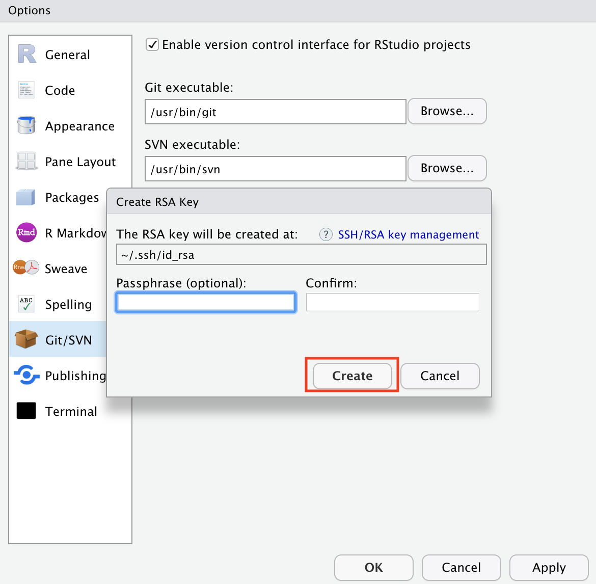
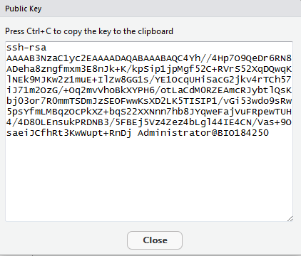
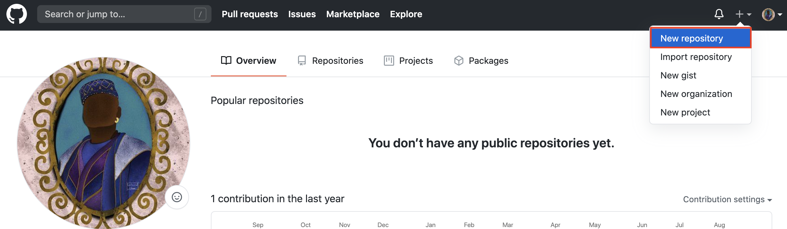
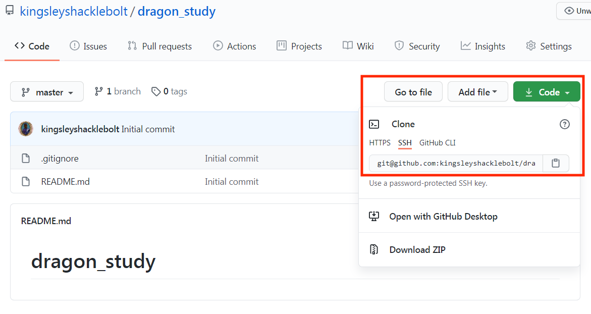
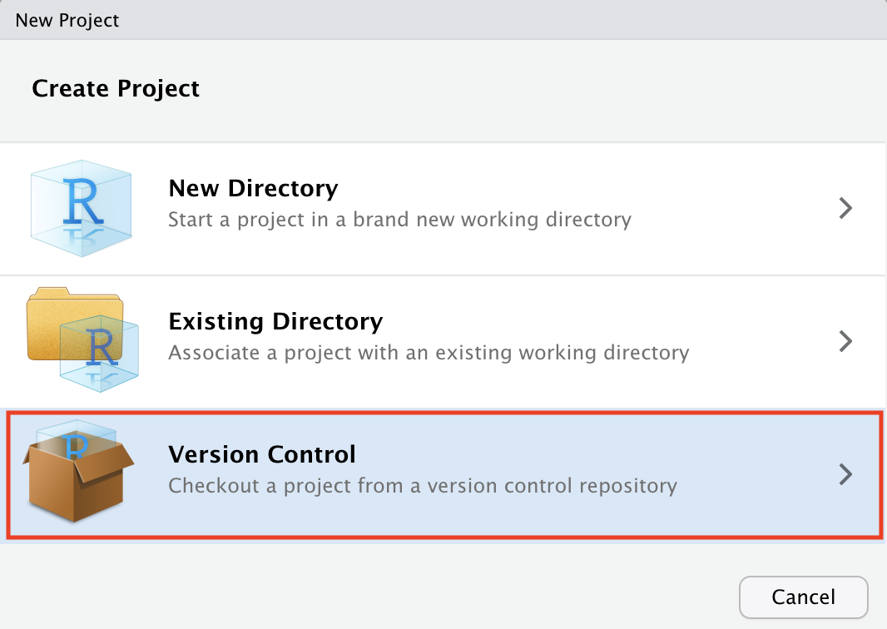
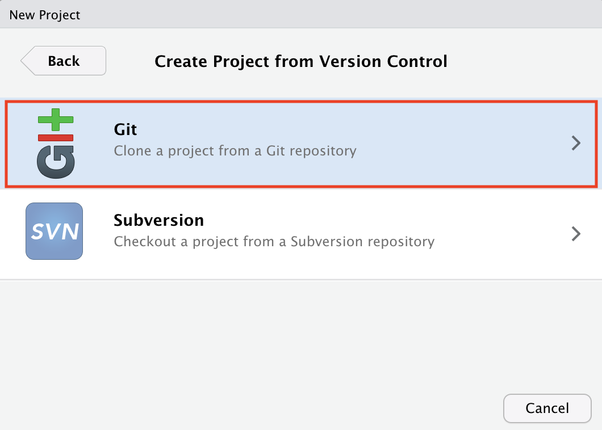
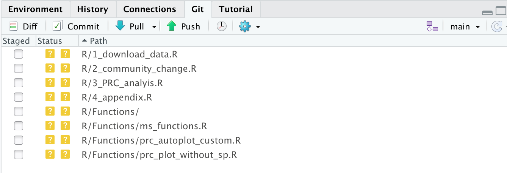

---
title: "How to work with GitHub"
output:
  bookdown::html_document2:
    highlight: tango
    toc: true
    toc_float: true
    css: ../css/style-chapters.css
--- 

```{r setup, include=FALSE}
knitr::opts_chunk$set(echo = FALSE, out.width = '80%')
```


## Why we use version control?

Version control makes it is easy to share code, collaborate on the same project, and keep track of all the changes in your code.

Here we will guide you through the process of installing git, connecting RStudio and GitHub and explain the basic workflow.

GitHub is a online tool using the software git to store data and track changes. 
GitHub can be used with different coding software such as R or phyton. 
Here we will focus on the statistical program R.

Let's start with explaining the basic workflow briefly.
On GitHub you can make repositories, which is a kind of project.
Your online repository, or short repo, is called *remote*.
To use your repository, you need to clone it locally onto your computer and it is then called *local*.
Locally on your computer you can write and develop R code.
The new code is then committed and pushed back to the remote. 
If you follow this workflow consistently, GitHub will keep track of all the changes you make.

For the sake of this tutorial, let's look at Kingsley's repo.

<br/><br/>
```{r workflow}
knitr::include_graphics("Pics/gittutorial/0_workflow_git.png")
```
<br/><br/>
<br/><br/>


## Preparation

Download Git or a similar software: https://git-scm.com/

(For UiB users, you can find Git in the Software Centre)

Get a GitHub account on: https://github.com/, sign up and follow the instructions.
<br/><br/>
```{r sign-up}
knitr::include_graphics("Pics/gittutorial/1_sign_up.png")
```
<br/><br/>
<br/><br/>
The next step is to connect RStudio and GitHub.
Note that this tutorial is shown on a Mac and will look slightly different if you are using Windows or Linux.


## Connect RStudio and GitHub

In RStudio click on **Tools > Global Options**, select **Git/SVN** tab. 

Ensure that the path to the Git executable is correct.
This is particularly important in Windows where it may not default correctly (e.g. C:/Program Files (x86)/Git/bin/git.exe).

Click **Create RSA Key**
<br/><br/>
```{r git-svn}
knitr::include_graphics("Pics/gittutorial/2_git_svn.png")
```
<br/><br/>
<br/><br/>

Click **Create** and close this window.
<br/><br/>
```{r create-key}

```
<br/><br/>
<br/><br/>

Back on the previous window click **View public key**. And copy the displayed **Public Key**.
<br/><br/>
```{r public-key}

```
<br/><br/>
<br/><br/>
Go to your GitHub account, click in the upper right corner and open your account **Settings**.
<br/><br/>
```{r settings}
knitr::include_graphics("Pics/gittutorial/5_settings.png")
```
<br/><br/>
<br/><br/>

Click on **SSH and GPG keys**.
<br/><br/>
```{r ssh}
knitr::include_graphics("Pics/gittutorial/6_ssh.png")
```
<br/><br/>
<br/><br/>

Click **New SSH key**. Paste in the **Public Key** that you copied from RStudio.
<br/><br/>
```{r new-ssh}
knitr::include_graphics("Pics/gittutorial/7_new_ssh.png")
```
<br/><br/>
<br/><br/>
Now you are ready to start using RStudio and GitHub!
<br/><br/>


## Create a GitHub repository

Go to Github, click on the plus sign in the upper right corner and create a **New Repository**. 
Give a meaningful and concise name.
Spaces will not be accepted in the name, use underscore or dashe instead.
You can choose if you want to add a **README** file (advisable), a **gitignore** file and choose the relevant type (advisable) and select a **licence** (relevant for publishing a project).

You can also choose if you want to make your repository **Public** or **Private**.
Keeping your repository private makes collaborations more difficult.

<br/><br/>
```{r new-repo}

```
<br/><br/>
<br/><br/>
```{r name-it}
knitr::include_graphics("Pics/gittutorial/9_name_it.png")
```
<br/><br/>
<br/><br/>
This is how your new repo looks like.
<br/><br/>
```{r new-repo2}
knitr::include_graphics("Pics/gittutorial/10_new_repo.png")
```
<br/><br/>


## Clone a GitHub repository

Cloning your GitHub repository means that you are making a copy from your **remote** repository on Github, **locally** to your computer. 
You can clone any repository on GitHub, whether it is your own or belongs to somebody else, as long as it is public. 
This also means, that all your repositories that are public can be seen by everybody.
But don't worry too much about this, GitHub has millions of repos.

Go to the GitHub repository you just created or any other that you want to clone. 
Click on the green **Code** button and copy the repository URL.

<br/><br/>
```{r clone}

```
<br/><br/>
<br/><br/>
Go to RStudio, click on **File > New Project > Version Control > Git**.
<br/><br/>
```{r new-project, out.width = '50%'}
knitr::include_graphics("Pics/gittutorial/12_new_project.png")
```
<br/><br/>
<br/><br/>
```{r version-control, out.width = '50%'}

```
<br/><br/>
<br/><br/>
```{r git, out.width = '50%'}

```
<br/><br/>
<br/><br/>
Paste the url link from GitHub.
It should be something like https://github.com/myaccount/myrepo.git
Enter the **Project directory name**.
Again choose a useful name that describes the project.
Choose where to store the project and click **Create Project**.
<br/><br/>
```{r paste-url, out.width = '50%'}
knitr::include_graphics("Pics/gittutorial/15_paste_url.png")
```
<br/><br/>
<br/><br/>
Now you are ready to start coding.


## Push existing RStudio project to GitHub

The general workflow for how to start a new project is described above (see 0.5 Create a GitHub repository). 
But you might have existing RStudio projects that you want to connect to GitHub, which we will explain here.

Go to Github and create a new repository (see previous chapter).

Open the RStudio project you want to connect with GitHub.

Go to the **Terminal** tab in RStudio and type:

### Add picture from Terminal ###
<!-- <br/><br/> -->
<!-- ```{r terminal} -->
<!-- knitr::include_graphics("Pics/gittutorial/16_terminal.png") -->
<!-- ``` -->
<!-- <br/><br/> -->

```
git clone git:myaccount/myrepo.git

# For Kingsley this would be:
git clone git:kingsleyshacklebolt/dragon_study.git

```
<br/><br/>
Restart Rstudio.
You should now see the git panel with a green and blue arrow to push and pull.

<br/><br/>
```{r git_window}

```
<br/><br/>

It is time to write some code for your project.


## GitHub workflow

### Commit

If you create or edit a file in your repository and save the changes the file will appear in the **Git** panel.
There will be two yellow boxes with **question marks** if you add a file, a blue box with a **M** if you edit a file that has already been committed.
And a red box with a **D** if you delete a file. 

<br/><br/>
```{r changed_file}
knitr::include_graphics("Pics/gittutorial/18_changed_files.png")
```
<br/><br/>

Once you have written a chunk of code, save it and click on the **Commit** button. 
A new window will appear.

<br/><br/>
```{r commit_window}
knitr::include_graphics("Pics/gittutorial/19_commit_window.png")
```
<br/><br/>

All the changes in the file are shown in green and red color.
Green is code that you have added to the file.
Red is code that has been deleted.
This makes it very easy to see all the changes that haven been made.

Stage the changes you made to the **Commit message** (top right). 
The commit message should contain all the changes you have done.
It can be short, but should be complete.
It will help you later if you are searching for a specific commit.

Note that you need to tick all files that you want to commit.


Click **Commit** to save the changes which creates a permanent snapshot of the file in the Git directory along with a message that describe the changes you made in this file. 


### Some rules

Commits are cheap.
It does not take much time to click on **Commit**, write a few words or sentences about the commit and stage it.
Therefore, commit often and provide useful messages so you can keep track of what you are doing. 

This is a bad example of a workflow:
<br/><br/>
```{r git_commit}
knitr::include_graphics("Pics/gittutorial/20_git_commit.png")
```

(Picture from xkcd)

### Push and pull

So far you are still working **locally** on your computer and you have not done anything to the **remote** repository on GitHub.
All the new code is still **locally** on your computer.
To upload your commits to your **remote** GitHub repository you need to **Push** (green arrow in the **Git** tab) these changes to your **remote** repository on GitHub.

<br/><br/>
```{r git_window2}
knitr::include_graphics("Pics/gittutorial/21_push.png")
```
<br/><br/>
<br/><br/>

## Share a repository

It is possible to share a repository on GitHub.
Let's say that Kingsley has a repo on GitHub and wants to collaborate with Angelina on a project.
Angelina can clone Kingsley's repo locally on her computer, and they can both develop code and push the code to the remote repo on GitHub.

There are a few things to consider when using this workflow.
If you are working with other people in a shared repository on GitHub, you will need to pull (blue arrow in the **Git** tab) to bring the modifications your collaborator(s) have made into your local copy of the repository. 
Do this everytime before you start to work and also push your changes regularly to make sure everybody is working on the latest version.
This is very important if you are working on the same files.

```{r workflow2}
knitr::include_graphics("Pics/gittutorial/22_workflow2.png")
```
<br/><br/>
We strongly suggest to use forks and branches when collaborating on a project (see the Collaborating with forks and branches tutorial for more details).
<br/><br/>
<br/><br/>

## .gitignore file

When creating a new GitHub repository you can add a .gitignore text file, which tells git all the files that should be ignored.
In general only data or output files are commited, but exceptions can be useful for relatively small and unchanging files.

Every change you are making to a file in your R project and commit to GitHub, will be tracked. 
Commit files, code and output to GitHub, where you want to track changes.
Do not commit all files, for example output files like figures which can easily be recreated with code. 

Here is an example of a .gitignore file:
<br/><br/>
```
# History files
.Rhistory
.Rapp.history

# Session Data files
.RData

# RStudio files
.Rproj.user/

# OAuth2 token, see https://github.com/hadley/httr/releases/tag/v0.3
.httr-oauth
.Rproj.user

#data (excludes everything in the folder data)
data/

# you can make exceptions for specific files
!data/dragon_taxonomy.csv

#figures & output (excludes all figure files)
*.png
*.pdf
*.jpeg

```

<br/><br/>
<br/><br/>


## Useful terminal comands

Most commands can also be executed in the terminal in RStudio (**Terminal** tab).
Here is a list with a few imporant commands that might come in handy.

### Clone a repo from GitHub

To **clone** or make a local copy of a **remote** repository on GitHub type:

```git clone https://github.com/git:kingsleyshacklebolt/dragon_study.git```


### Check configurations

To check the configurations of your repo type:

```git remote -v```

This command will show you the origin or your repo, basically from were you push and pull.
If you have forked a repo it will also show you the upstream repo (see the tutorial on branches for more details).


You might want to configure the information of your local repositories.
This command sets the name you want attached to your commit transactions.
Note that this will change the name for all your local repos.

```
$ git config --global user.name "yourname"
$ git config --global user.name "kingsleyshaklebolt"
```

Similarly, you can sets the email you want attached to your commit transactions.

```
$ git config --global user.email "youremail"
$ git config --global user.email "kingsleyshaklebolt@ministryofmagic.com"
```

You can also manually set the **remote** repository for your **local** repository.
The url points to a repository on GitHub.

```
$ git remote add origin [url]
$ git remote add origin https://github.com/git:kingsleyshacklebolt/dragon_study.git
```


### Workflow commands

In the beginning commiting, pulling and pushing might be confusing.
In the **Terminal** it is easy to see what you changed since last commit.
This command shows you all the files that have been added, modified or deleted.
It shows you the same files as in the **Git** tab.

```git status```


It is also possible to make commits in the **Terminal**.
For example you can add a file **Readme.txt**.

```git add Readme.txt```

The next step is then to commit this and add a commit message to remember for future reference.

```git commit -m “Created a Readme.txt”```

You can also **push** and **pull** in the **Terminal**.
**Push** uploads all local commits to GitHub.
**Pull** updates your local repo with all new commits from the corresponding remote repo on GitHub.

```
$ git push

$ git pull

```


### Useful resources {.facta .toc-ignore}

- Happy Git: https://happygitwithr.com/
- git flight rules: https://github.com/k88hudson/git-flight-rules


### What's next {.facta .toc-ignore}

For collaborating with others on the same project read the chapter on **Collaborating with forks and branches**
