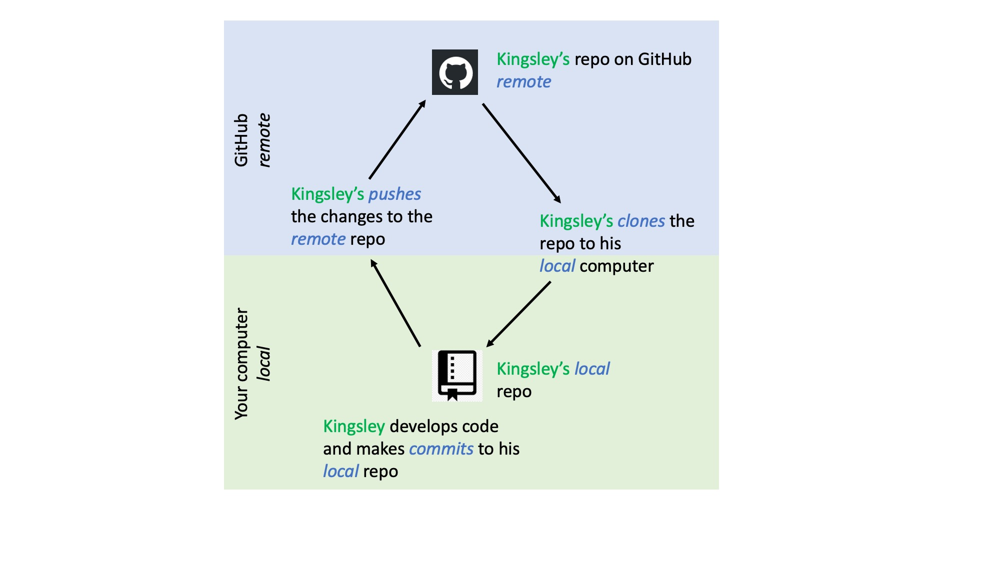

---
title: "How to work with GitHub"
output:
  html_document:
    highlight: tango
    toc: true
    toc_float: true
    #css: ../css/style-chapters.css
--- 

```{r setup, include=FALSE}
knitr::opts_chunk$set(echo = FALSE, out.width = '80%')
```


## Why we use version control?

It makes it is easy to share code, collaborate on the same project, and keep track of all the changes in your code.

Here we will guide you through the whole process of installing git, connect RStudio and GitHub and the basic workflow.

!!! Explain in a few sentences how this works...!!!


```{r workflow}

```

## Preparation

Download Git or a similar software: https://git-scm.com/
(For UiB users, you can find Git in the Software Centre)

Get a GitHub account: go to https://github.com/, sign up and follow the instructions.

```{r sign-up}
knitr::include_graphics("Pics/gittutorial/1_sign_up.png")
```

Now you can connect RStudio and GitHub.


## Connect RStudio and GitHub

In RStudio click on Tools > Global Options, select Git/SVN tab. 

Ensure the path to the Git executable is correct. This is particularly important in Windows where it may not default correctly (e.g. C:/Program Files (x86)/Git/bin/git.exe).

Click Create RSA Key

```{r git-svn}
knitr::include_graphics("Pics/gittutorial/2_git_svn.png")
```


Click Create and close this window.


```{r create-key}
knitr::include_graphics("Pics/gittutorial/3_create_key.png")
```


Back on the previous window click View public key. Copy the displayed public key.

```{r public-key}
knitr::include_graphics("Pics/gittutorial/4_public_key.png")
```


Go to your GitHub account, click in the upper right corner and open your account Settings.

```{r settings}
knitr::include_graphics("Pics/gittutorial/5_settings.png")
```


Click on SSH and GPG keys.


```{r ssh}
knitr::include_graphics("Pics/gittutorial/6_ssh.png")
```

Click New SSH key. Paste in the public key that you copied from above.


```{r new-ssh}
knitr::include_graphics("Pics/gittutorial/7_new_ssh.png")
```


Now you are ready to start using RStudio and GitHub!


## Create a GitHub repository

Go to Github, click on the plus sign and create a new repository. Give it a meaningful and concise name. You can choose if you want to add a README file (advisable), a gitignore file (advisable) and choose a licence (relevant for publishing a project).

You can also choose if you want to make your repository public or private. Your possibilities will depend on your GitHub subscription.

```{r new-repo}
knitr::include_graphics("Pics/gittutorial/8_new_repo.png")
```

```{r name-it}
knitr::include_graphics("Pics/gittutorial/9_name_it.png")
```

This is how your new repo looks like.

```{r new-repo2}
knitr::include_graphics("Pics/gittutorial/10_new_repo.png")
```


## Clone a GitHub repository

Cloning your GitHub repository means that you are making a copy from the repository on Github to your local computer. You can clone any repository on GitHub, whether it is your own or somebody else, as long as it is public. Here we go:

Go to the GitHub repository you just created or any other that you want to clone. Click on green clone Git Respository and entre it in Respository URL.

```{r clone}
knitr::include_graphics("Pics/gittutorial/11_clone.png")
```


Go to RStudio, click on File > New Project > Version Control > Git

```{r new-project}
knitr::include_graphics("Pics/gittutorial/12_new_project.png")
```

```{r version-control}
knitr::include_graphics("Pics/gittutorial/13_version_control.png")
```

```{r git}
knitr::include_graphics("Pics/gittutorial/14_git.png")
```

Entre Project directory name, paste the url link and create the project.

```{r paste-url}
knitr::include_graphics("Pics/gittutorial/15_paste_url.png")
```


!!! NOT SURE IF THIS STEP IS EVEN NEEDED:::!!!???!!!
In RStudio, click on the terminal tab.

```{r terminal}
knitr::include_graphics("Pics/gittutorial/16_terminal.png")
```

type the following line and click return.

```
git config remote.origin.url git@github.com:EnterYourGitUserName/EnterYourGitProject.git
```

Kingsley would have to type:
```
git config remote.origin.url git@github.com:kingsleyshacklebolt/dragon_study.git
```


## Push existing RStudio project to GitHub

The general workflow for how to start a new project is described above (see create and clone repository). But when you start to work with GitHub you will have RStudio projects that you want to connect to GitHub. Here is how it works.


Go to Github and create a git New repository (see above).

Open the RStudio project you want to connect with GitHub.

Initiate the upstream tracking of the project on the GitHub repo
```
git remote add origin https://github.com/EnterUserName/EnterGitProject.git

# so for Kingsley this would be:
git remote add origin https://github.com/kingsleyshacklebolt/dragon_study.git
```

Pull all files from the GitHub repo (typically just readme, license, gitignore)
```
git pull origin master
```

Set up GitHub repo to track changes on local machine
```
git push -u origin master
```


## GitHub workflow

If you create or edit a file inside your repository and save the chages the file will turn up in the git panel labelled with two yellow question marks.

Once you have written a chunk of code, save it and click on the commit button. A new window will appear. Stage the changes you made to the commit message (top right). Write a useful message, it will help you later if you are searching for a specific commit. Click commit to commit these changes which creates a permanent snapshot of the file in the Git directory along with a message that indicates what you did to the file. So far you are still working locally on your computer and you have not done anything to the remote repository on GitHub.

All the changes in the file will be shown in green and red color.
Green: code you have added
Red: code you have deleted

Commits are cheap. Commit often and provide useful messages so you can keep track of what you are doing. Don’t do this:

(From xkcd)


At this stage, everything is still locally on your computer. To upload your commits to GitHub you need to push (green arrow) these changes to your remote repository on GitHub.


If you are working with other people in a shared repository on GitHub, you will need to pull (blue arrow) to bring their modifications into your local copy of the repository. Do this everytime before you start to work and push your changes regularly to make sure everybody is working on the latest version. However, if you are collaborating on a project we strongly suggest you to use forks and branches (see Collaborating with forks and branches tutorial).


## Gitignore file

When creating a new GitHub repository you can choose to make a gitignore file.

The gitignore file let's you decide which files you want to commit to GitHub. We suggest to commit only code and plain text, no data or output files. Data should be stored in a separate data repository and outputfiles such as figures and tables are created via your code and should not use up your space on GitHub.

Everything change you are making to a file commited to GitHub will be tracked. If you commit all your figures, they are often large and each change you make will be saved. The important thing is the code to create the figure.


Here is an example of a gitignore file:


```
# History files
.Rhistory
.Rapp.history

# Session Data files
.RData

# RStudio files
.Rproj.user/

# OAuth2 token, see https://github.com/hadley/httr/releases/tag/v0.3
.httr-oauth
.Rproj.user

#data (excludes everything in the folder data)
data/

# you can make exceptions for specific files
!data/dragon_taxonomy.csv

#figures & output (excludes all figure files)
*.png
*.pdf
*.jpeg

```


## Useful terminal comands

