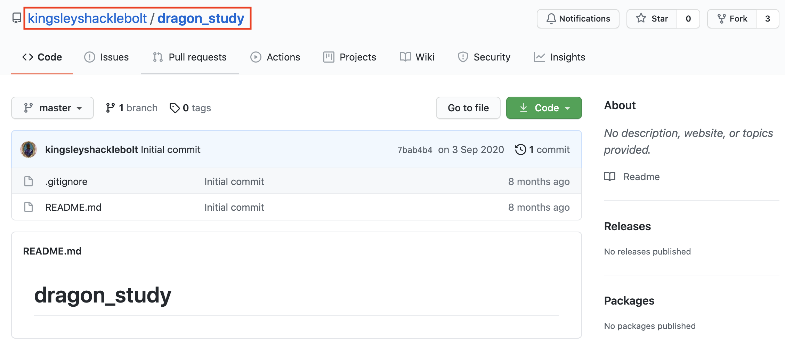

---
title: "Version control with GitHub and RStudio"
output:
  bookdown::html_document2:
    highlight: tango
    toc: true
    toc_float: true
    css: ../css/style-chapters.css
--- 

```{r setup, include=FALSE}
knitr::opts_chunk$set(echo = FALSE, out.width = '100%')
```


## Why we use version control?

Version control makes it is easy to share code, collaborate on the same project, and keep track of all the changes in your code.

Here we will guide you through the process of installing git, connecting RStudio and GitHub and explain the basic workflow.

Git is a **version control system**, which manages the evolution of files. GitHub is a online tool using the software git to store data and track changes. 
GitHub can be used with any files but works best with text files, for example R scripts. 
Here we will focus on using git and GitHub with RStudio.

Let's start with explaining the basic workflow briefly.
On GitHub you can make **repositories**, which is a kind of project.
Your online repository, or short repo, is called **remote**.
To use your repository, you need to **clone** it locally onto your computer and it is then called **local**.
You can write and edit R code locally on your computer.
The new code is then **committed** and **pushed** back to the **remote**. 
If you follow this workflow consistently, GitHub will keep track of all the changes you make.


### The workflow

For the sake of this tutorial, Kingsley and Angelina will show us the workflow with RStudio and GitHub.

```{r kingsley-angelina, fig.cap="GitHub workflow"}
knitr::include_graphics("Pics/gittutorial/Angelina and Kingsley.png")
```

The general **workflow** looks like this (Figure \@ref(fig:workflow)):
Kingsley has a repo on GitHub.
He **clones** the repo on his computer (1).
He develops code and makes **commits** (2).
Then he **pushes** the changes back to the remote repo on GitHub (3).
In this tutorial, we will explain each of these steps in detal.


<br/><br/>
```{r workflow, fig.cap="GitHub workflow"}
knitr::include_graphics("Pics/gittutorial/0_workflow_git.png")
```
<br/><br/>
<br/><br/>


## Installation

Download and install git: https://git-scm.com/

(For UiB users, you can find Git in the Software Center;
Mac users need the software xcode)

Get a GitHub account on: https://github.com/, sign up and follow the instructions.
<br/><br/>
```{r sign-up}
knitr::include_graphics("Pics/gittutorial/1_sign_up.png")
```
<br/><br/>
<br/><br/>

## Set-up

Now you have to configure your name and email associated with your GitHub account.
Go to RStudio and, using your own identification, type:

```{r eval = FALSE, echo=TRUE}
## install if needed (do this exactly once):
## install.packages("usethis")

library(usethis)
use_git_config(
  user.name = "kingsleyshaklebolt", 
  user.email = "kingsleyshaklebolt@ministryofmagic.com"
  )
```

The next step is to connect RStudio and GitHub.
There are several ways to do this. 
The easiest is to use the `usethis` package (version 2.0.0 or higher).

## Connect RStudio and GitHub

GitHub needs to validate who you are before you can connect it and RStudio.
We can do this by generating and saving a Personal Access Token (PAT).
You only need to do this once.

```{r PAT, eval = FALSE, echo = TRUE}
create_github_token()
```
This function will open GitHub. 
After confirming your password, you will be shown a page to make a new PAT.
You don't need to change any of the options.
Just click the green "Generate token" button at the bottom of the page.

The next page will show you your PAT. 
Copy it by clicking on the clipboard icon and return to R.

Now run

```{r PAT2, eval = FALSE, echo = TRUE}
gitcreds::gitcreds_set()
```

this will ask you for your PAT: paste it at the prompt and press return.
This will save the PAT so that it can be used to access GitHub.
Treat your PAT as a password - never save it in a script.

This is a good time to run

```{r eval = FALSE, echo = TRUE}
git_vaccinate()
```

to make git safer to use.

## Making a repo

Now you are ready to start using RStudio and GitHub.
There are two main workflows:

1. Make a new local repo and push it to GitHub
2. Clone an existing repo from GitHub onto your computer

We will cover these in turn.

### Local first

This workflow is useful if you already have an RStudio project on your computer or are starting a new project.

In Rstudio, start by creating a git repo for your project with 

```{r init, eval = FALSE, echo = TRUE}
use_git()
```

After creating the repo, the function will ask whether you want to commit some files.

- If it is a new project, this is safe to agree to.
- If it is an existing project there might be some files that you don't want to commit, for example very large files or files with sensitive information such as passwords. 
In this case, don't let R commit everything, instead pick which files you want committed (see section \@ref(stage-commit-and-push)) and improve the `.gitignore` (see section \@ref(gitignore-file)) so they cannot be committed by accident.

Then let RStudio restart so that the git panel is activated.

Once you have committed at least one file, you can create a repo on GitHub.

```{r github, eval = FALSE, echo = TRUE}
use_github()
```

By default, the repo name on GitHub will match the RStudio project name, and the repo will be public.

Now go to GitHub, find your repo and check the files you committed have been uploaded.

This is how your new repo looks like.
<br/><br/>
```{r new-repo2}
knitr::include_graphics("Pics/gittutorial/10_new_repo.png")
```
<br/><br/>


### GitHub first

Cloning your GitHub repository means that you are making a copy of your **remote** repository on Github, **locally** on your computer. 
You can clone any repository on GitHub, whether it is your own or belongs to somebody else, as long as it is public. 
This also means that all your repositories that are public can be seen by everybody, but do not worry too much about this, GitHub has millions of repos.
But make sure you do not commit sensitive information such as passwords.

Go to the GitHub repository you that you want to clone and find the names of the owner and the repo. 

<br/><br/>
```{r clone}

```
<br/><br/>
<br/><br/> 

To clone the "kingsleyshacklebolt/dragon_study" repo, use

```{r create-with-github, eval = FALSE, echo = TRUE}
create_from_github("kingsleyshacklebolt/dragon_study")
```

If the repo you are trying to clone is not your own, the function will first make a **fork** (see forking tutorial) on GitHub into your account.
The function will clone the repo onto your desktop by default. 
You can copy the entire directory from there to somewhere more appropriate.

Now it is time to commit and push.

## Stage, commit and push

If you create or edit a file in your repository and save the changes the file will appear in the **Git** panel.
There will be two yellow boxes with **question marks** if you add a file, a blue box with a **M** if you edit a file that has already been committed.
And a red box with a **D** if you delete a file.
You can also move files and they will show up as deleted **and** added in the new place.
Once you have staged (ticking the box by the file name) both the deleted and new file, it will become a purple **R**.

<br/><br/>
```{r changed_file}
knitr::include_graphics("Pics/gittutorial/18_changed_files.png")
```
<br/><br/>

Once you have written a chunk of code, save it and click on the **Commit** button. 
A new window will appear.

<br/><br/>
```{r commit_window}
knitr::include_graphics("Pics/gittutorial/19_commit_window.png")
```
<br/><br/>

All the changes in the file are shown in green and red color.
Green is code that you have **added** to the file.
Red is code that has been **deleted**.
This makes it very easy to see all the changes that haven been made.

**Stage the changes** you made by ticking the box by the file name and add a **Commit message** (top right).
The **commit message** should contain all the changes you have done.
It can be short, but should be complete.
It will help you later if you are searching for a specific **commit**.

Note that you need to tick all files that you want to **commit**.


Click **Commit** to save the changes which creates a permanent snapshot of the file in the Git directory along with a message that describe the changes you made in this file. 


### Some rules

**Commits** are cheap.
It does not take much time to click on **Commit**, stage the file(s) and write a few words about the **commit** (aim for max 50 characters).
A good rule is if you use the word *and* then this should probably have been two **commits**.
Therefore, **commit** often and provide useful messages so you can keep track of what you are doing. 

This is an example of useless **commit messages**:
<br/><br/>
```{r git_commit}
knitr::include_graphics("Pics/gittutorial/20_git_commit.png")
```

(Picture from xkcd; https://xkcd.com/1296/)

### Push and pull

So far you are still working **locally** on your computer and you have not changed the **remote** repository on GitHub.
All the new code is still **locally** on your computer.
To upload your commits to your **remote** GitHub repository you need to **Push** (green arrow in the **Git** tab) these changes to your **remote** repository on GitHub.

<br/><br/>
```{r git_window2}
knitr::include_graphics("Pics/gittutorial/21_push.png")
```
<br/><br/>

## Share a repository

It is possible to share a repository on GitHub.

Let's say that Kingsley has a repo on GitHub and wants to collaborate with Angelina on a project (Figure \@ref(fig:workflow2)).
Both Angelina and Kingsley can **clone** the repo locally on their computer (1), develop code (2) and **push** the changes to the remote repo on GitHub (3). To get the changes the other person has made to the repo, they need to **pull** from GitHub (4).

There are a few things to consider when using this workflow.
If you are working with other people in a shared repository on GitHub, you will need to **pull** (blue arrow in the **Git** tab) to bring the modifications your collaborator(s) have made into your local copy of the repository. 
Do this every time before you start to work and also push your changes regularly to make sure everybody is working on the latest version.
<br/><br/>
```{r workflow2, fig.cap="The workflow when sharing a GitHub repo"}
knitr::include_graphics("Pics/gittutorial/22_workflow2.png")
```
<br/><br/>
Regular **pulling** and **pushing** is very important if you are working on the same files to avoid **merge conflicts**.
A **merge conflict** occurs when two people are modifying the same file at the same time.
Such a conflict can be resolved, but it is tedious and best avoid.
We strongly suggest to use forks and branches when collaborating on a project (see \@ref(collaborating-with-forks) Collaborating with forks tutorial for more details).
<br/><br/>

## .gitignore file

When creating a new GitHub repository you can add a `.gitignore` text file, which tells git all the files that should be ignored.
In general, data or output files should not be **committed**, but exceptions can be useful for relatively small and unchanging files.

Every change you are making to a file in your R project and **commit** to GitHub, will be tracked. 
**Commit** files, code and output to GitHub, where you want to track changes.
Do not **commit** all files, for example output files like figures which can easily be recreated with code. 

Here is an example of a `.gitignore` file:
<br/><br/>
```
# History files
.Rhistory
.Rapp.history

# Session Data files
.RData

# RStudio files
.Rproj.user/

# OAuth2 token, see https://github.com/hadley/httr/releases/tag/v0.3
.httr-oauth
.Rproj.user

#data (excludes everything in the folder data)
data/*

# you can make exceptions for specific files
!data/dragon_taxonomy.csv

#figures & output (excludes all figure files)
*.png
*.pdf
*.jpeg

```
<br/><br/>


## Useful terminal comands

RStudio has a range of possibilities to work with Git and GitHub as shown in this tutorial.
The **Terminal** has more commands and options and will be handy for trouble shooting.
In this tutorial we only explain a limited selection of things that can go wrong.


## Trouble shooting

**Git not found**

Sometimes, RStudio will complain that is cannot find git even after you install it.

In RStudio click on Tools > Global Options, select Git/SVN tab.

Ensure that the path to the Git executable is correct.
This is particularly important in Windows where it may not default correctly (e.g. C:/Program Files (x86)/Git/bin/git.exe).


**Git not working**

If you use a university windows computer, it might default to using a path like

`\\helix\user_name\..` 

This is a UNC path.
Git does not work with UNC paths.
Make sure you start RStudio from, for example, `O:\`.

**Undo last commit**

If you have committed something that you do not want to, you can undo the last commit.
This only works if you have **not pushed** yet.
Go to the terminal and type:

```
git reset --soft HEAD@{1}
```

For more help with trouble shooting see the [https://github.com/k88hudson/git-flight-rules git](flight rules is a good source).
<br/><br/>


### Useful resources {- .literature .toc-ignore}

**Happy Git** provides instructions for how to getting started with Git, R and RStudio, explains the workflows and useful tips for when things go wrong.
https://happygitwithr.com/ 

The **Git flight rules** are an exaustive ressource for what to do whne things go wrong. https://github.com/k88hudson/git-flight-rules


### What's next {.facta .toc-ignore}

For more advanced workflows using branches see the chapter **Working with branches**

For collaborating with others on the same project see chapter **Collaborating with forks and branches**


### Contributors {- .contributors .toc-ignore}

* Aud H. Halbritter
* Richard J. Telford