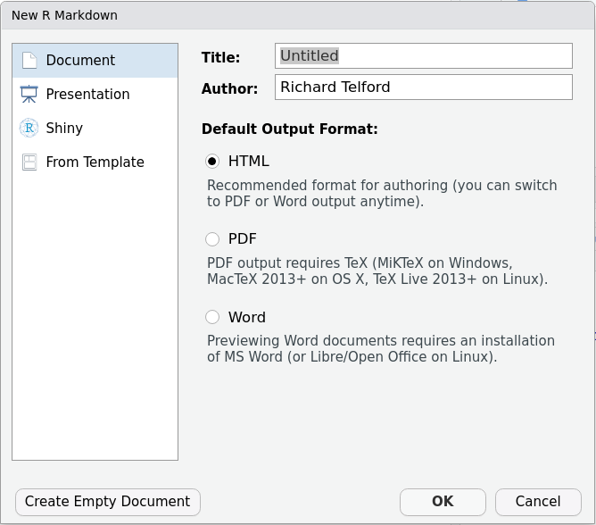

# (PART\*) First steps in R markdown{-}

# Getting started

## Creating and knitting an R markdown file

An R markdown file is a plain text file.
You can create a new text file, give it the ".Rmd" extension, and start typing.
But it is better to use RStudio.

Go to the "File" menu bar, then "New File", then "R Markdown...".
The first time you do this, you may be asked to install some extra packages. 
Now you will have a pop-up window asking for the Title, author and output format (Fig. \@ref(fig:output-pic)).

```{r output-pic, fig.cap = "Choose the output format", echo = FALSE}

```

You can fill these in now, or edit the document later.
I recommend you start with "HTML" format as is doesn't require anything else to be installed.
When you are ready, click OK, and a new R markdown file will open. 
It will look something like Figure \@ref(fig:rmarkdown-pic)

```{r rmarkdown-pic, fig.cap = "The default R markdown document.", echo = FALSE}
knitr::include_graphics("Pics/rmarkdown.png")
```

You will learn about the elements of this file in section \@ref(elements-of-an-r-markdown-file).

### Exercise {.unnumbered .facta .toc-ignore}

Create an R Markdown document with output format HTML.

## Knitting the R markdown file

You can see the rendered R markdown document by knitting it.
Click the blue "Knit" button which is above the document.

```{r knit-pic, fig.cap = "The knit button", out.width="214px", echo = FALSE}
knitr::include_graphics("Pics/knit.png")
```
The first time you knit the document, you need to save it.


### Exercise {.unnumbered .facta .toc-ignore}

Render your R Markdown document and examine the output.
If it worked then everything is set up correctly.

### Exercise {.unnumbered .facta .toc-ignore}

For the rest of this tutorial, we will analyse plant trait data from Svalbard and make a reproducible report.

To download the data and R Markdown document, you need to run

```{r}
#| eval: false

#install.packages("usethis") # if you don't have it already.
usethis::use_course("biostats-r/svalbardQuartoDemo")

```

Then follow the instructions.
This will open the svalbardQuartoDemo Rstudio project. 
Open the file svalbard_traits.Rmd and render it. 
The output is a bit of a mess - we are going to make it better!

# Elements of an R markdown file

## YAML

The YAML is metadata for the document that goes right at the top of the file. 
The YAML consists of `key: values` pairs.
The colon and space are required.
It can set the document author and title, the output format and many other things.
YAML format can be difficult to get right as it is sensitive to white space.
You can use an RStudio Addin from the package `ymlthis` to help write the YAML.

### R code in YAML

It is possible to add R code to the YAML, for example to show the current date.
The R code needs to be enclosed in quote marks AND back-ticks with an `r` before the code.
If the code contains quotemarks, then they need to be different from the enclosing quotemarks (i.e. single vs double quotes).

``` yaml
---
title: "My Manuscript"
output: html_document
date: '`r format(Sys.Date(), "%d %B %Y")`'
---
```

See the data-time tutorial for more about the codes in `"%d %B %Y"`.

### Exercise {.unnumbered .facta .toc-ignore}

Add date and author to the YAML of your svalbard_traits R Markdown document so it shows today's date and your name when knitted.

### Output formats

R Markdown documents can be rendered in many different output formats, including

- presentations (with [`xaringan::moon_reader`](https://bookdown.org/yihui/rmarkdown/xaringan.html) or [ioslides](https://bookdown.org/yihui/rmarkdown/ioslides-presentation.html))
- posters (with [`posterdown`](https://cran.r-project.org/web/packages/posterdown/))
- books (with [`bookdown`](https://bookdown.org/yihui/bookdown/)).
- theses (with [`thesisdown`](https://github.com/ismayc/thesisdown))

This tutorial focuses on document-like reports.

There is a choice of output format for documents. 
This can be specified when the R markdown file is created in RStudio or by editing the YAML.

Producing an html file to view in a browser is the simplest, as nothing extra needs installing. 
The YAML should look something like this.

``` yaml
---
title: "My Manuscript"
output: html_document
---
```

Word documents are also easy; just change the output to `word_document`.
This can be very useful if you have a supervisor or collaborators who cannot cope with R markdown directly, but consider using the [`redoc`](https://noamross.github.io/redoc/index.html) package which lets you convert an edited word document back into R markdown.

Rendering the R markdown file as a PDF requires some external tools (LaTeX) to be installed (you don't need to learn any LaTeX). 
This can be done with the `tinytxt package`.

```{r tinytxt, eval = FALSE, echo = TRUE}
# run this only once
install.packages('tinytex')
tinytex::install_tinytex()
```

Then the output format in the YAML can be changed to `pdf_document`.
With PDF documents, it can be tricky to control exactly where the figures are positioned, so I recommend working with html as long as possible.

::: {.infobox}
## R Markdown, PDF and LaTeX

R Markdown uses LaTeX to make PDFs.
You don't need to know any LaTeX, but you can include some if you want to change the formatting etc.
For example, you force a new page, you could use the command.

``` latex
\\newpage
```
:::

::: {.infobox}
## Coauthoring with R Markdown

Perhaps the best way to collaborate with coauthors on a R Markdown document is to use version control for example with [GitHub](https://biostats-r.github.io/biostats/github/index.html "Git and GitHub book").

An alternative is to use the `trackdown` package to upload markdown files to Google Drive where they can be edited and then downloaded again.
:::

::: {.infobox}
## Comments

A comment in an R code block starts with a `#`, just as in an ordinary R script.

A comment in the text is enclosed an html comment mark

``` markdown
<!-- This is a comment  -->
```

Type <kbd>Ctrl</kbd> + <kbd>Shift</kbd> + <kbd>C</kbd> to get this comment mark.

In the source editor, you can select text you want to hide and use this keyboard short-cut to comment it out.
:::


## Text

Type to make text!
In the RStudio visual editor, which you can access by clicking on "Visual" above the document, you can format the text in much the same way you would work in MS word or Libra Office.
RStudio has a built-in spell checker that will underline words it doesn't recognise in red. 
Go to "Tools" >> "Global Options..." >> "Spelling" to change the language.

### Source editor

Sometimes it is useful to be able to write in markdown directly, rather than using the visual editor, for example if you are writing a question for [stackoverflow.com](stackoverflow.com) or an issue on [github.com](github.com).
You can see this mode by clicking on "Source" above the document

Paragraphs have a blank line between them.
It is good practice to write one sentence per line. 
The extra line breaks will be removed when the document in knitted.
If you want to force a line break, put two spaces at the end of the line.


Formatting is generated with some special characters.
For example:


```{=html}
<style type="text/css">
.heading-output {
  border-bottom: none;
  margin-top: 0;
  margin-bottom: 0;
}
</style>
```
+------------------------------+--------------------------------+
| Markdown Syntax              | Output                         |
+==============================+================================+
|     # Header 1               | ## Header 1{.unlisted .unnumbered .heading-output}   |
+------------------------------+--------------------------------+
|     ## Header 2              | ## Header 2 {.heading-output}  |
+------------------------------+--------------------------------+
|     ### Header 3             | ### Header 3 {.heading-output} |
+------------------------------+--------------------------------+
| \*italics\* and \*\*bold\*\* | *italics* and **bold**         |
+------------------------------+--------------------------------+
| superscript m\^2\^           | superscript m^2^               |
+------------------------------+--------------------------------+
| subscript CO\~2\~            | subscript CO~2~                |
+------------------------------+--------------------------------+
| `` `verbatim code` ``        | `verbatim code`                |
+------------------------------+--------------------------------+

::: {.infobox}
## Escaping characters

If you actually want a \*\_\^\~ in the text, you need to escape it by putting a backslash \\ before it, e.g. \\\*.
:::

A more complete list of formatting is given in the [R markdown cheat sheet](https://github.com/rstudio/cheatsheets/blob/master/rmarkdown-2.0.pdf).

A more complete list is given in the [R markdown cheat sheet](https://github.com/rstudio/cheatsheets/blob/master/rmarkdown-2.0.pdf).

### Exercise {.unnumbered .facta .toc-ignore}

The Results section of the svalbard_traits document should be in Header 1 style, and species names should be in italics.
Fix this and render the document to check the formatting has worked.

## Code chunks

Code in an R Markdown document is contained in code chunks.

This is a code chunk that loads the penguin data from the `palmerpenguins` package.

````
```{r}`r ''`
data(penguins, package = "palmerpenguins)
```
````

It starts with three back-ticks, followed by braces.
Inside the braces, the "r" indicates that this is a chunk in the R language.
Next, on a new line, is the body of the chunk.
The chunk ends with three back-ticks on their own line.
In the visual editor, you won't see the back-ticks, but the code block will start with `{r}` and have a grey background.

### Making a chunk

You can type the back-ticks and braces needed to make a block, but, when using the visual editor, it is easier to get RStudio to insert the block with the insert tool.
Type a forwards slash <kbd>/</kbd> on a blank line and choose "R code chunk".
You can also use the RStudio keyboard shortcut  <kbd>ctrl</kbd>+<kbd>alt</kbd>+<kbd>i</kbd> (on a mac <kbd>Command</kbd>+<kbd>Option</kbd>+<kbd>i</kbd>).

### Chunk language

We will just work with R chunks, but it is possible to run chunks in other languages in RStudio, including Python.

### Exercise {.unnumbered .facta .toc-ignore}

Make a new code block (or blocks) that make a plot showing the effect of the treatment on leaf thickness.

<details>

<summary>

Hint

</summary>

You can copy and modify some of the existing code rather than writing from scratch.

</details>

### Chunk options

Code block options control how the blocks work and how any output is treated.
Options are given in special comments at the top of the block (in previous versions of R Markdown they were given after the r in the braces at the start of the chunk).

````
```{r}`r ''`
#| echo: false
#| label: penguins-bill-body
#| warning: false
#| fig-cap: "The figure caption"
#| fig-alt: Plot of penguin bill length against body mass by species 

library(ggplot2)
ggplot(penguins, aes(x = body_mass_g, y = bill_length_mm, colour = species)) +
  geom_point()
```
````

::: {.infobox}
## Options format

The white space in the block options is critical.

-   If you don't have the space after the `#|` then the option becomes a regular comment and is ignored.

-   If you don't have a space after the colon, you get "[ERROR: Render failed due to invalid YAML]{style="color: red"}."

`true` and `false` can be written in lower case (in R they must be upper case).
:::


There are lots of chunk options, but only a few that you will need to use frequently.
Here are some and their default.

- `echo` (`true`) Show the chunk's code in the output.
- `eval` (`false`) Run the chunk code.
- `include` (`true`) Include the output of the chunk in the document.
- `message` (`true`) Include messages from R.
- `warning` (`true`) Include warnings from R.
- `error` (`false`) If `true`, shows any error message. 
If `false`, stops knitting when there is an error in R code.

I leave `message` and `warning` as `true` while I am writing the document, so I can see any possible problems, and set them to `false` when I knit the final version.

I sometimes find it useful to set `error` to `true` as can make it easier to debug any errors in the code.

Chunk options for figures are shown in section \@ref(figure-chunk-options).

For more options see <http://yihui.name/knitr/options/>

### Exercise {.unnumbered .facta .toc-ignore}

Importing packages produces lots of output that we don't need to see in the final report Use block options to hide the output of this block.

The code block making the table is giving a message about the grouping.
Use block options to make this message go away.
Use block options to make this message go away.

### Setting default chunk options

Default chunk options can be set for all chunks with `knitr::opts_chunk$set` in the first chunk.
New R markdown files created by RStudio automatically have this in a chunk called "setup".

````
```{r setup, include=FALSE}`r ''`
knitr::opts_chunk$set(echo = TRUE)
```
````

This chunk sets `echo = TRUE` for all chunks.
The `include=FALSE` will stop any output from this chunk being included in the output.

### Exercise {.unnumbered .facta .toc-ignore}

Use global block options to stop the code from showing in the report.

### Chunk labels

It is a good idea to label chunks.
If you don't, they will automatically be called "unnamed-chunk-n" where "n" is a incrementing number.
This is inconvenient for debugging (you need to work out which chunk is "unnamed-chunk-37") and for working with any image files generated by the document.
In section \@ref(cross-referencing) you will see how to use chunk names to cross-reference figures and tables in your document.

Chunks can be labelled either by putting the label in the braces at the start of the chunk

````
```{r load-packages}`r ''`
library(tidyverse)
```
````

or with the label chunk option

````
```{r}`r ''`
#| label: load-packages
library(tidyverse)
```
````

#### Rules for naming chunks

Chunk labels should be informative and can contain letters and numbers.
Words should be separated by hyphens ("-").

::: {.infobox}
## Special characters in labels

Avoid spaces, underscores, periods and other special characters in code block labels.
They will cause all sorts of strange problems.
:::

### Running a chunk

Code in chunks will be run when the document is knitted (unless `eval: false`), but it is also useful to run the code interactively to check that it works.
You can do this by clicking on the green play buttons at the right of the chunk (Fig. \@ref(fig:run-pic)) or from the Run button above the document.
If the code depends on previous chunks, the grey/green icon will run them all.

```{r run-pic, fig.cap = "The green run chunk icon and the grey/green icon to run all previous chunks.", out.width="220px", echo = FALSE}
knitr::include_graphics("Pics/run-chunk.png")
```

### Hiding a chunk

If a chunk has a lot of code, it can be useful to hide it to make it easier to navigate the document.
The grey arrow next to the line numbers will do this. 
Sections of text can also be hidden.


### Environments and working directory

R knits R Markdown documents in a new R session.
Initially, no packages are loaded and the environment is empty: the R markdown document does not have access to any objects in your current environment (this is a good thing for reproducible analyses).
This means that any data or packages you want to use in the document needs to be imported by the code in the document.

The working directory for the new R session used when knitting the R markdown file is the directory where the file is.
If the file is in the root directory of an RStudio project, relative paths will work the same way in the R markdown document as from the console.
If the file is in a sub-directory, use `here::here()` to form paths relative to the project root.

## Inline code

In addition to the output from chunks of code, you can insert code directly into text.
This lets you avoid copying and pasting numbers from the output.
Inline code is enclosed by back-ticks and starts with an `r`.

```{r inline1, echo = FALSE, eval = FALSE}
Seven times six is `r 7 * 6`
```

```{r inline1-flair, echo=FALSE}
decorate("inline1", eval = FALSE) |> 
  flair_rx("`.*`") |> 
  knit_print.with_flair()
```

<span style="background-color: Beige;">Seven times six is `r 7 * 6`</span>

::: {.infobox}
## Numbers in words

If you want numbers written as words, for example at the start of a sentence, use the package `english`.

```{r inline-english, echo = FALSE, eval = FALSE}
Seven times six is `r english::words(7 * 6)`
```

```{r inline-english-flair, echo=FALSE}
decorate("inline-english", eval = FALSE) |> 
  flair_rx("`.*`") |> 
  knit_print.with_flair()
```

<span style="background-color: Beige;">Seven times six is `r english::words(7 * 6)`</span>
:::


It is best to keep inline code short to keep the text readable.
One trick is to do all necessary calculations in a previous chunk, so only the name of the object with the result needs to be in the inline code.
If there are many results to report, consider storing them in a list as in the following example.

```{r penguin-stats}
cor_adelie <- cor.test(
  ~ bill_length_mm + body_mass_g, 
  data = penguins, 
  subset = species == "Adelie")

adelie_list <- list(
  #degrees of freedom
  df = cor_adelie$parameter,
  # extract correlation and round
  est = round(cor_adelie$estimate, 2),
  #format p.value with an "=" is the first character is not "<". 
  #See the characters tutorial for more on the stringr package and regular expressions.
  p_val = str_replace(
    string = format.pval(cor_adelie$p.value, eps = 0.001),
    pattern = "^(?!<)", 
    replacement = "= ")
)
```

```{r inline-list, echo = FALSE, eval = FALSE}
Bill length and body mass in Adelie penguins are positively correlated, 
r = `r adelie_list$est` (df = `r adelie_list$df`, p `r adelie_list$p_val`).
```

```{r inline-list-flair, echo=FALSE}
decorate("inline-list", eval = FALSE) |> 
  flair_rx("`r [a-z_\\$]*`") |> 
  knit_print.with_flair()
```


<span style="background-color: Beige;">Bill length and body mass in Adelie penguins are positively correlated, r = `r adelie_list$est` (df = `r adelie_list$df`, p `r adelie_list$p_val`).</span>

### Exercise {.unnumbered .facta .toc-ignore}

Use some inline R code to report the maximum height recorded for _Bistorta vivipera_.

<details>

<summary>

Hint

</summary>

`max()`

</details>


# Figures, tables and equations

## Figures made in R

Plots can be included with a chunk that makes a figure with either base plot or ggplot.

If you make the plot with ggplot, remember to print it.

```` 
```{r}`r ''`
#| label: histogram
#| fig-cap: "An embedded figure"
p <- ggplot(penguins, aes(x = bill_length_mm)) + 
  geom_histogram()
p # remember to print the plot
```
````

### Figure chunk options

There are several useful chunk options for figures, including:

-   `fig-cap` figure caption.
-   `fig-alt` alternate text to improve accessibility
-   `fig-height` figure height *in inches* (1 inch = 25.4 mm)
-   `fig-width` figure width *in inches*

### Exercise {.unnumbered .facta .toc-ignore}

The figure of height against treatment is missing a caption. 
Use code block options to give it an appropriate caption and alt-text.

Many journals require figures to be a specific size so they fit with the journal layout. 
For PLOSone, figures that fit in one column can be up to 13.2 cm (5.2 inches) wide. 
Use code block options to ensure that the figure would fit.

## Embedding external images

In the visual editor, photographs and other figures that have been prepared outside of R can be included with the insert tool by typing "/" on a blank line and choosing "Figure/Image".
This will open an menu to get the path to the image and set the caption etc.
Once you close the menu, you can set the figure size.
This will generate a bit of markdown that looks like.

`{fig-alt="SEM photograph of marine diatoms" width="491"}`

{fig-alt="SEM photograph of marine diatoms - from https://commons.wikimedia.org/wiki/File:Marine_diatoms_SEM2.jpg" width="491"}

Alternatively, you can use `knitr::include_graphics()` in a regular code block.

```{r}
#| echo: fenced
#| label: fig-include-figure
#| out-width: "491px"
#| fig-cap: "An embedded figure of diatoms"
#| fig-alt: "An embedded figure of diatoms"
knitr::include_graphics("Pics/Marine_diatoms_SEM2.jpg")
```

Use the `out.width` and `out.height` chunk options to set the display size of the figure.

## Tables

You can make tables in markdown by hand (the <kbd>/</kbd> insert tool helps a lot), but it often so much easier to use R.

Simple tables can be made with the function `knitr::kable`.
Several packages, including `kableExtra` and `gt` can make beautiful tables.

### kable

```{r kable}

knitr::kable(x = slice(penguins, 1:5), #the data for the table
             caption = "The top penguins" # the caption
)
```

### gt

The [`gt`](https://gt.rstudio.com/articles/intro-creating-gt-tables.html) package can make more elaborate tables than `knitr::kable()`.

```{r gt}
#| label: gt
library(gt)
penguins |>
  slice(1:5) |> 
  gt(caption = "Basic gt table")

penguins |>
  slice(1:5) |> 
  rename_with(str_to_sentence) |>
  gt(caption = "gt table with more features") |> 
  cols_label(Bill_length_mm = "Length mm",
             Bill_depth_mm  = "Depth mm",
             Flipper_length_mm = "Flipper length mm", 
             Body_mass_g = "Body mass g") |> 
  tab_spanner(label = "Bill", columns = c(Bill_length_mm, Bill_depth_mm)) |> 
  tab_spanner(label = "Body", columns = c(Flipper_length_mm, Body_mass_g)) 
```


::: {.infobox}
## Number of decimal places

When reporting real numbers (i.e. numbers that have a decimal part), you need to decide how many digits to display.
Be careful not to show spurious precision.
You can use `round()` to remove unwanted decimals, or `gt::fmt_number()` to clean up one or more columns in a table. 
To control the default number of decimals across the whole document, use `options(digits = 2)` in the first chunk.
:::

### Exercise {.unnumbered .facta .toc-ignore}

Write a code block to make a table showing the mean leaf thickness and its standard deviation for each month.

<details>

<summary>

Hint

</summary>

`sd()` for standard deviation

`group_by()` and `summarise()` then use any of the table making functions.

</details>

## Equations

Equations are embedded in a pair of dollar symbols.
RStudio will show a preview of the equation as you type it.
Equations are written with [LaTeX notation](https://en.wikibooks.org/wiki/LaTeX/Mathematics).

```{r equations, echo = FALSE, message = FALSE}
read_csv('
What, How, Output         
"Lower-case Greek letters", "`$\\sigma$`", "$\\sigma$"
"Upper-Case Greek Letters", "`$\\Sigma$`", "$\\Sigma$"
"Subscript", "`$\\beta_{0}$`", "$\\beta_{0}$"
"Superscript", "`$\\chi^{2}$`", "$\\chi^{2}$"
"Fractions", "`$\\frac{1}{2}$`", "$\\frac{1}{2}$"
"Roots", "`$\\sqrt{4} = 2$`", "$\\sqrt{4} = 2$"') |> 
  select(What, Output, How) |> 
  set_names(c("What", "How", "Output")) |> 
 gt()
```

<br>

Here is an example of using an inline equation.

``` markdown
The $\delta^{13}C$ value ...
```
<span style="background-color: Beige;">The $\delta^{13}C$ value ...</span>


A double dollar enclosure gives the equation its own line.
For example, this is the equation of a standard deviation that uses several different elements.

``` markdown
$$SD = \sqrt{\frac{\sum_{i=1}^{n}{(x_i - \bar{x})^2}}{n-1}}$$
```
$$SD = \sqrt{\frac{\sum_{i=1}^{n}{(x_i - \bar{x})^2}}{n-1}}$$

When making a complex formula, build one element at a time, often starting in the middle, rather than trying to get it all working at once.

## Chemistry

Equations are printed in an italic font, which is not great for chemical formulae.
We can fix this with the \\mathrm command which forces roman typeface.   

``` markdown
Sulphate $\mathrm{SO_4^{2-}}$
```
<span style="background-color: Beige;">Sulphate $\mathrm{SO_4^{2-}}$</span>

``` markdown
$$\mathrm{CO_3^{2-} + H^+ \rightleftharpoons HCO_3^{2-}}$$
```

$$\mathrm{CO_3^{2-} + H^+ \rightleftharpoons HCO_3^{2-}}$$

# (PART\*) Towards a manuscript{-}

# Citations and bibliographies

R markdown can add citations and a bibliography to a document.
Use the bibliography field in the YAML to point to the bibliography file.

``` yaml
---
title: "My Manuscript"
output: html_document
bibliography: reproducibility.bib
---
```

The bibliography file can be in one of several formats, including bibTeX (\*.bib) and endnote (\*.enl).
Any reference manager should be able to export to a bibTeX file.

## Bibliography placement

By default, the bibliography is placed at the end of the document.
It is a good idea to end the R markdown file with an appropriate header.

```{r bib-pos, echo = FALSE, eval = FALSE}
# Conclusions

R markdown is cool.

# References {-}
```

```{r bib-pos-flair, echo=FALSE}
decorate("bib-pos", eval = FALSE) |> 
  flair_lines(5) |> 
  knit_print.with_flair()
```

The `{-}` stops R markdown from numbering the reference section header.

If you want to move the bibliography, for example because you need to finish with an appendix, you need to use this bit of magic.
You also need to use the output format `bookdown::html_document2` in the YAML.

```{r bib-move, echo = FALSE, eval = FALSE}
# Conclusions

R markdown is very cool.

# References {-}

&lt;div id="refs"&gt;&lt;/div&gt;

# Appendix A
```

```{r bib-move-flair, echo=FALSE}
decorate("bib-move", eval = FALSE) |> 
  flair_lines(7) |> 
  knit_print.with_flair()
```

## Citations

Use the citation keys from the bibliography to cite the reference in the text.
So to cite the reference with the citation key "Cooper2017" we would use.


    Reproducible code [@Cooper2017] ...
    @Cooper2017 discuss ... 

The output depends on the csl file.
Using the default author-date style gives

<hr>
<span style="background-color: Beige;">
Reproducible code [@Cooper2017] ...\
@Cooper2017 discuss ...
\
</span>
<hr>

In the visual editor, type <kbd>\@</kbd> to get suggestions from the bibliography. 
This is not so useful if you have many references. Alternatively, summon the import anything tool by typing <kbd>ctrl</kbd> + <kbd>/</kbd> and opening the citation menu, which lets you search for references in the bibliography or add new ones.

### Exercise {.unnumbered .facta .toc-ignore}

Add a citation to Töpper et al (2018) to the introduction to your R Markdown document as an example of climate change impacts on terrestrial ecosystems.

## Citation style

If you don't like the default citation style, or you want to submit a manuscript to a journal with an overly pedantic editor, you can change the citation style by specifying a csl file in the YAML.

``` yaml
---
title: "My Manuscript"
output: html_document
bibliography: reproducibility.bib
csl: plos-one.csl
---
```

The csl (Citation Style Language) file defines the citation style. 
There are thousands of citation style available from <http://zotero.org/styles> (there are specific formats for publishers and many journals).

### Exercise {.unnumbered .facta .toc-ignore}

Change the csl file from nordic-journal-of-botany.csl to plos.cls.
Knit the document to see how the citations change in the text and in the bibliography.


## Citation problems

Unfortunately, there can be problems with the bibliography and citation.
Most can be solved by googling the error message.
A few common problems are addressed here.

### Incorrect capitalisation

Many CLS styles convert the title to title case (i.e. only first letter of the first word is capitalised).
This can be annoying as names (people, countries, species) can be given in the wrong case.

A paper with the title 

`Population ecology of polar bears at Svalbard, Norway.`

may appear as

`Population ecology of polar bears at svalbard, norway.`

This can be fixed by editing the bibtex file, putting braces around the word with capitals that need to be kept.

`Population ecology of polar bears at {Svalbard}, {Norway}.`

### Accents and other special characters

The tool-chain that processes R markdown files can sometimes fall over with accented characters or other diacritic marks in the references. 
The error message will look something like this

```
! Package inputenc Error: Unicode character ́ (U+0301)  
(inputenc)                not set up for use with LaTeX.
```

One solution is to edit the bibtex file to replace the accented character with an [escaped code](https://en.wikibooks.org/wiki/LaTeX/Special_Characters#Escaped_codes).
For example, the "í" in "Martínez" could be replaced by "\\'{i}".  

# Cross-referencing

Cross-referencing lets you refer to figures and tables in your document.
Once set up, this happens automatically, so you don't need to re-number all the figures when you add or delete one.

Cross-referencing needs to use a bookdown package output, declared in the YAML.

```{r bookdown, echo = FALSE, eval = FALSE}
---
title: "My Manuscript"
output: bookdown::html_document2
---
```

```{r bookdown-flair, echo=FALSE}
decorate("bookdown", eval = FALSE) |> 
  flair_lines(3) |> 
  knit_print.with_flair()
```

## Cross-referencing figures and tables

The chunk that made the figure or table needs to have a label (no underscores!) and a caption.

````
```{r}`r ''`
#| label: penguin-dens
#| fig-cap = Histogram of penguin body mass
penguins |> 
  ggplot(aes(x = flipper_length_mm, fill = species)) +
  geom_density(alpha = 0.7) +
  scale_fill_brewer(palette = "Set1")
```
````

```{r penguin-dens, echo = FALSE, fig.cap = "Boxplot of penguin body mass", fig.height=3, fig.width=5, message=FALSE, warning = FALSE}
penguins |> 
  ggplot(aes(x = flipper_length_mm, fill = species)) +
  geom_density(alpha = 0.7) +
  scale_fill_brewer(palette = "Set1")
```

To cross-reference the figure made by the above chunk, we need to use this notation.

```
Penguins are cool (Fig. \@ref(fig:penguin-dens))
```

<span style="background-color: Beige;">Penguins are cool (Fig. \@ref(fig:penguin-dens))</span>

To refer to a table made by a chunk called `penguin-results`, you would use

```
Penguins are cool (Table \@ref(tab:penguin-results))
```

Note that the `fig` has been replaced by `tab` in the reference.

If you get the chunk name wrong, there will be a warning when the document in knitted, and question marks shown where the reference should be.

```
Figure \@ref(fig:no-exist)) does not exist
```
<span style="background-color: Beige;">Non-existing figure (Fig. \@ref(fig:no-exist))</span>

## Cross-referencing equations

To cross-reference an equation, we need to give it a label.

```
$$
\frac{\sum_{i=1}^{n}{x_i}}{n}
 (\#eq:mean)
$$
```
Note that the equation must be on the line below the dollars. 
RStudio will try to show the label in the preview - ignore it.
Now the label can be used.

```
The mean (equation \@ref(eq:mean)).
```

$$
\frac{\sum_{i=1}^{n}{x_i}}{n}
 (\#eq:mean)
$$
 
<span style="background-color: Beige;">The mean (equation \@ref(eq:mean)).</span>


## Cross-referencing document sections

You can also refer to other sections of the document using the title/subtitle.
For example, to refer to this section, you would use

```
Cross-referencing (Section \@ref(cross-referencing-document-sections))
```
<span style="background-color: Beige;">Cross-referencing (Section \@ref(cross-referencing-document-sections))</span>

Note that the reference must be written in lower case and spaces must be replaced by hyphens.
Punctuation is deleted.

# Formatting for a journal

## Journal-specific formatting

Use the `rticles` package to produce a draft manuscript in a journal-specific format.
Many journal formats are available.

```{r rticles, eval = FALSE, echo = TRUE}
library("rmarkdown")
draft("MyArticle.Rmd", template = "plos", package = "rticles")
```

## Line numbers

If you are creating a PDF, you can include line numbers by adding a header-includes section to the YAML.

``` yaml
---
title: "My Manuscript"
output: bookdown::pdf_document2
header-includes:
   - \usepackage{lineno}
   - \linenumbers
---
```

Other LaTeX packages can be added in a similar way to add extra functionality, for example, pages in [landscape](https://stackoverflow.com/questions/25849814/rstudio-rmarkdown-both-portrait-and-landscape-layout-in-a-single-pdf).  

# Other topics


## Too much or too slow code

If code runs slowly, the output of code chunks can be cached, so next time the document is rendered the existing cached results can be used.
The caching system in R markdown can be activated by setting the chunk option `cache: true`.
The caching system can be tricky to set up for complex projects, and the [`targets` package](https://books.ropensci.org/targets/) is a much more robust framework for building reproducible analysis pipelines.
See this [demonstration project](https://github.com/richardjtelford/neotomaTargets) for an example of how to set up `targets`.

## Paramertised reports

If you need a template for many reports, for example, showing results for a specific location or time period, consider using 
[Paramertised reports](https://bookdown.org/yihui/rmarkdown/parameterized-reports.html)
which allow you to pass a variable into an R markdown document when it is knitted.

# (PART\*) Presentations{-}

# Presentations in R markdown

There are several schemes for making presentations with R markdown.
I like to use the `xaringan` package (others include ioslides and beamer).
To make an xaringan presentation, install the package then (after restarting RStudio) go to File > New File > R Markdown > From Template > Ninja Presentation.
This will open a draft document showing some of the features you can use.
Knit it, then start to edit it.
Everything you have learnt above about formatting R markdown documents, code chunks, figures and tables for documents applies to presentations.

New slides in `xaringan` are made with three minus signs.
There must not be anything else on that line (not even a space) or it will draw a horizontal line instead.

``` markdown
---
```

# (PART\*) Troubleshooting{-}
# Troubleshooting

It is normal to have errors when working with R and R markdown.
Problems can be minimised by developing the document and code incrementally and knitting it repeatedly so that errors can be detected immediately.

Here are some common problems.

## Duplicate chunk names

Chunk names must be unique. 
If they are not you will get an error message including the following

```
  Duplicate chunk label 'import', which has been used for the chunk:
```

Identify the offending chunk and rename it.

## More errors to come

Tell me what you find difficult.


### Further reading {- .facta .toc-ignore}

- [R markdown cheat sheet](https://github.com/rstudio/cheatsheets/blob/master/rmarkdown-2.0.pdf)
- [R markdown from RStudio](https://rmarkdown.rstudio.com/index.html)
- [R Markdown: The Definitive Guide](https://bookdown.org/yihui/rmarkdown/)

