```{r setup, include=FALSE}
knitr::opts_chunk$set(echo = TRUE, warning = FALSE)
library("tidyverse")
```

#   {- .toc-ignore}

Hei, 

Velkommen til den første numeriske øvelsen i BIO104 - Komparativ fysiologi.
Som en del av kurset skal du lære å bruke R/RStudio for å 

+ lage og importere et enkelt datasett 
+ lage en tabell, 
+ tegne et plot,
+ sette alt sammen til en fullstending rapport.

Øvelsen skal utføres i R/RStudio. 
Vi på [bioST@TS](https://biostats.w.uib.no/){target="_blank"} har utviklet denne siden for å hjelpe deg med å komme i gang med R/RStudio og å løse de numeriske oppgavene i denne øvelsen. 

# Om R/RStudio

## Litt om R

[R](https://cran.r-project.org/){target="_blank"} er både et programmeringsspråk og en programvare for statistiske beregninger og grafikk. 
R er et kraftig og fleksibelt verktøy som gjør jobben med data analyse enkelt og produktivt.

I motsetning til de fleste programvarene som du kjenner bruker R/RStudio kommandoer for å utføre oppgaver. 
Det betyr at du skal skrive kode for å håndtere data og for å lage tabeller og plotter.

Ved hjelp av denne siden skal du lære å bruke språket R for å skrive enkle "setninger" som transformerer data til tabeller og figurer som skal brukes i din rapport.

## Et alternativt grensesnitt

R kommer med sitt eget grafiske grensesnitt som gjenkjennes som minimalistisk, med begrenset funksjonalitet, få knapper og få menyer.
Dermed installerer de fleste en alternativt grensesnitt som fortsatt kjører R, men som virker mer produktivt og brukervennlig.
Det finnes flere sånne programvarer.
Den som vi anbefaler og viser til heter [RStudio](https://rstudio.com){target="_blank"}.  

Merk at RStudio brukes _i kombinasjon med R_, ikke istedenfor R. 
Derfor må du installere begge på din maskin (se seksjon \@ref(installer-r-og-rstudio)). 
RStudio tar over R sitt grensesnitt, men alle beregninger utføres av R "i bakgrunnen". 
Dette forklarer hvorfor du skal ofte lese "R/RStudio" på denne siden.


## Hvorfor jobber vi i R/RStudio?

Det finnes mange fordeler med å ta R/RStudio i bruk:

+ Først og fremst er R _fri_ og _open-source_, og kan installeres på de fleste maskinene (Windows, Mac, Linux, osv).
+ R kan utføre veldig enkle numeriske oppgaver (for eksempel kan R brukes som en helt vanlig kalkulator og regne ut `2+2`, `(2+3)*4`, logaritme (`log(42)`), eller kvadratrot (`sqrt(42)`), samt veldig avanserte statistiske analyser (f. eks. for å bygge data modeller basert på millioner av observasjoner).  
+ R er i konstant utvikling; det kan nedlastes utvidelser (som kalles for "R-pakker" eller "R-packages") som utvider funksjonalitetene.
+ R brukes av mange i akademia, og spesielt i biologi. 
Dermed finnes det garantert noen i nærheten av deg som kan hjelpe til når du er i trøbbel. 
+ Fordi R brukes av mange i hele verden og i mange disipliner, finnes det et stort sammfunn online som kan hjelpe deg (det forumet [Stack Overflow](https://stackoverflow.com/){target="_blank"} er godt kjent blant R-brukere)

## R/RStudio i biologiemner

Det er ikke bare BIO104 som tar bruk av R/RStudio. 
Flere emner i bachelorprogrammet bruker det òg, f. eks. STAT101 og BIO201. 
I tillegg blir R/RStudio sentralt i de obligatoriske emnene BIO300A og BIO300B i masterprogrammet.  
Derfor er det lurt å bli kjent med R så fort som mulig.

## Få hjelp med R/RStudio

Det finnes mange steder der du kan finne hjelp og informasjon om R/RStudio:

+ nettsiden vår [bioST@TS](https://biostats.w.uib.no/up-in-the-r-2/){target="_blank"} har en dedikert seksjon hvor du skal lære mye om både R/RStudio og statistikk.
+ oraklene på [biORAKEL](https://biorakel.w.uib.no){target="_blank"} er kjent med R/RStudio og kan tilby deg hjelp når du trenger det.  
+ [codeRclub](https://codeRclub.w.uib.no){target="_blank"} er et møtested for de som lærer eller jobber med R/RStudio.
Alle er velkommen og kan søke hjelp hos oss. 
Vi møtes på fredager fra kl.14:00 til 16:00 på Tunet (4. etasje på biologen, bygg A, Thormøhlensgate 53A, UiB) og på Zoom (ta kontakt med [Richard Telford](mailto:richard.telford@uib.no) for å få lenken). 
Kom på besøk om du sitter fast eller lurer på noe.
+ på nettet finner du mange fora der du får løsning på problemene dine. 
Ofte er det "bare" å google.
Mange spørsmål stilles på [Stack Overflow](https://stackoverflow.com/questions/tagged/r){target="_blank"}, og mange gode svar finnes der òg.

# Kom i gang med R/RStudio

Nå er det på tid å starte jobben. 
Først skal du installere R og RStudio, og hente de filene som vi skal jobbe med.
Deretter skal vi åpne "prosjektet" og bli kjent med grensesnittet til RStudio.

## Installer R og RStudio

Programvarene kan du laste ned direkte fra nettsiden til [The Comprehensive R Archive Network](https://cloud.r-project.org/){target="_blank"} og RStudio fra [RStudio sin nettside](https://rstudio.com/products/rstudio/download/#download){target="_blank"}. 
Pass på at du velger den versjonen som passer din maskin.

## Last ned filene

Nå skal vi hente de filene som du trenger til øvelsen.
Klikk på [denne lenken](https://bioceed.uib.no/dropfolder/sites/bioSTATS-and-R/Courses/BIO104/BIO104-labkurs2021.zip){target="_blank"} for å nedlaste filen `Bio104-labkurs2021.zip`.
Åpne denne filen og ekstraher den hele mappen på harddisken din.
Velg et lurt sted, f.eks `.\Mine dokumenter\BIO104\` eller lignende.


## Første steg i RStudio

Stort sett kommer du til å starte R/RStudio ved å åpne et prosjekt.
Et prosjekt består av en mappe som inneholder en .Rproj-fil og eventuelt andre filer (data filer, skript, osv).
I denne øvelsen heter filen `Bio104_tutorial.Rproj`.
Når du dobbelklikker på filen, så åpnes den direkte i RStudio.
Da får du se dette grensesnittet (Figur \@ref(fig:rstudio-start)):
```{r rstudio-start, echo = FALSE, fig.cap="_Skjermdump av RStudio sitt grensesnitt._", out.width="100%"}
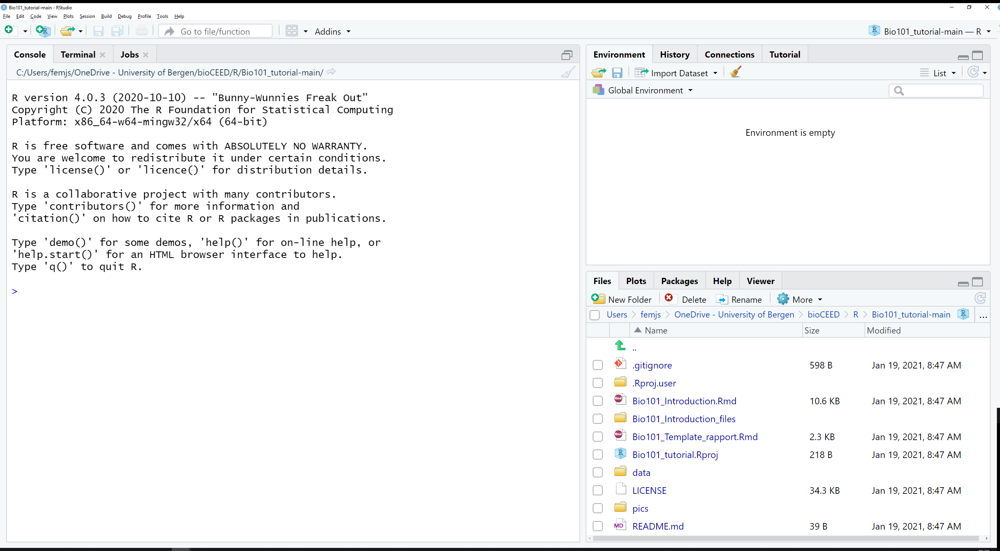
```
  
Øverst i vinduet finner du hovedmenyen med mange funksjoner:  

```{r rstudio-meny, echo = FALSE, fig.cap="_Skjermdump av hovedmenyen i RStudio._", out.width="100%"}
knitr::include_graphics("Pics/BIO104-RStudio-menu.png")
```
  
Via denne menyen kan du bl.a. lage ny fil, åpne eksisterende filer eller prosjekter, lagre endringer i filer, osv.  

Grensesnittet (se Figur \@ref(fig:rstudio-start)) deles i 3 områder:

+ et stort område til venstre der man finner fanene **`Console`**, `Terminal` og `Jobs`, 
+ et mindre område opp til høyre med de fanene `Environment`, `History`, `Connections` and `Tutorial`, 
+ et siste område ned til høyre med de fanene **`Files`**, `Plots`, `Packages`, `Help` and `Viewer`.  

Her skal vi fokusere på de fanene skrevet i fet skrift, nemlig **`Files`** (se seksjon \@ref(files)) og **`Console`** (se seksjon \@ref(console)).
Dessuten skal vi ta bruk av skript (se seksjon \@ref(skript)).

### Skript

Et skript er et arbeidsdokument der du skriver kode, kommentarer og tekst.
Du kan starte jobben i R/RStudio med et blankt skript, eller åpne et forhåndsfylt skript.
I denne øvelsen skal vi jobbe i en forhåndsfylt fil som heter `Bio104_Template_rapport.Rmd`. 
Vi kommer tilbake til det senere i seksjonen \@ref(kjor-ovelsen).  

Hvis du ønsker å opprette et nytt skript for å jobbe med noe annet eller trene på koding, så trykker du på `CTRL + Shift + N` (`⌘ + Shift + N`), eller velger File > New File > R Script i menyen øverst. 
Da dukker det opp et nytt ark opp til venstre. Dette arket heter `Untitled1` og er helt blankt (se Figur \@ref(fig:rstudio-script)).

```{r rstudio-script, echo = FALSE, fig.cap="_Opprettelse av et nytt skript._", out.width="100%"}
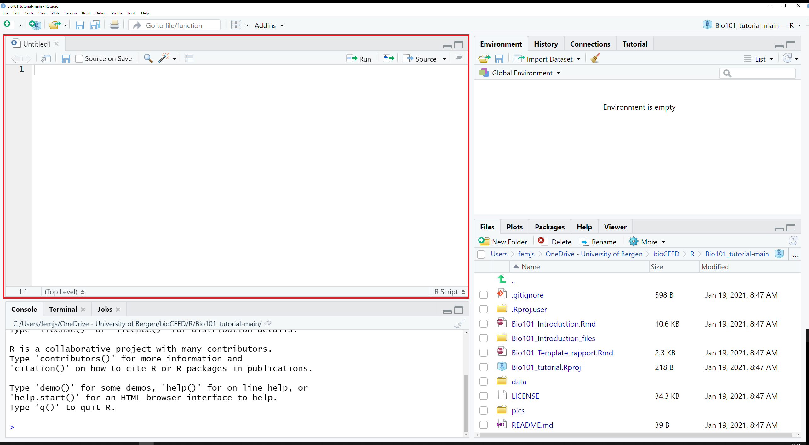
```

I dette skriptet kan du skrive kode.
Når du ønsker å utføre kode, så trykker du på `Run` (se Figur \@ref(fig:rstudio-run)).
```{r rstudio-run, echo = FALSE, fig.cap="_Utfør koden med knappen_ Run.", out.width="100%"}
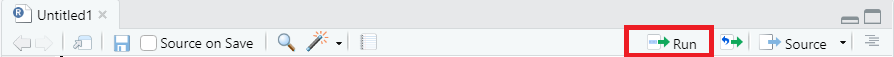
```

### Console

Fanen `Console` finnes du nederst til venstre i RStudio.
Konsolen er "motoren i R".
Det er konsolen som utfører koden som du sender ut fra skriptet.

Figur \@ref(fig:rstudio-gui2) viser en enkel kodelinje (`mean(1:10)`) i skriptet (øverste grønne boks) og det tilsvarende resultatet i konsolen (nederste grønne boks):

```{r rstudio-gui2, echo = FALSE, fig.cap="_Koden i skriptet utføres i konsolen_", out.width="100%"}
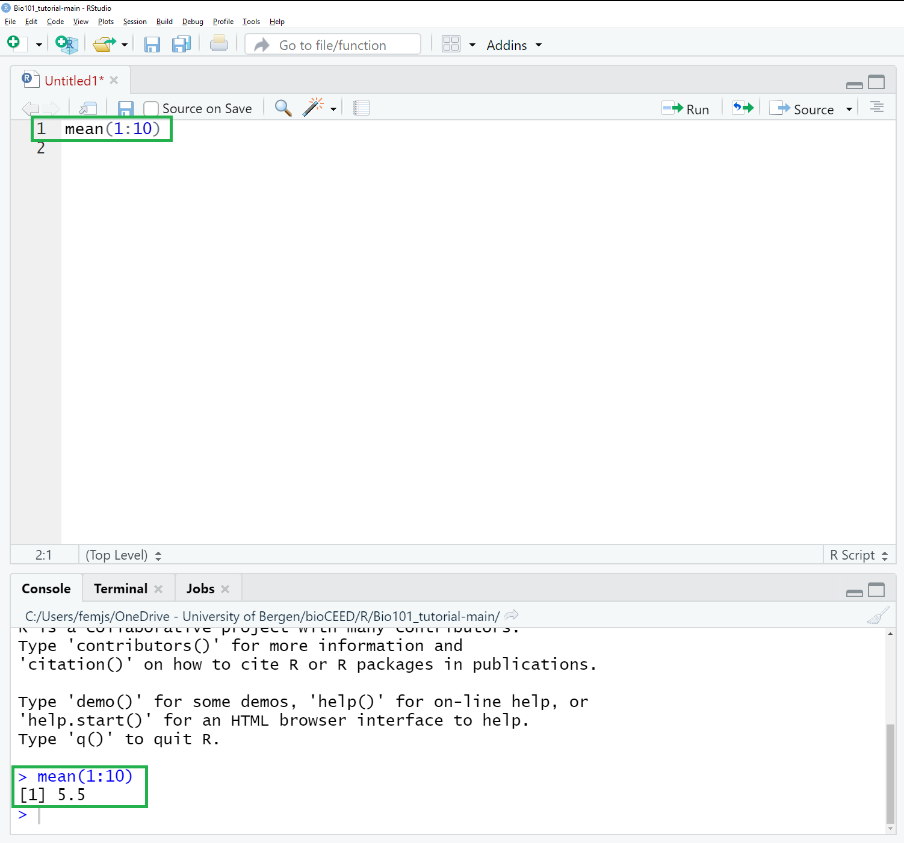
```

Koden vises i blått på en linje som starter på `>`.
Derimot skrives resultatet av `mean(1:10)` i svart på en linje som starter på `[1]`.


### Files

Fanen `Files` finner du nederst til høyre i RStudio (se Figur \@ref(fig:rstudio-gui6)).
`Files` er en filutforsker som viser innholdet på prosjektmappen.
Her skal du finne filen `Bio104_Template_rapport.Rmd` som vi skal snart ta i bruk.

```{r rstudio-gui6, echo = FALSE, fig.cap="_Den fanen_ Files _er filutforskeren i RStudio._", out.width="100%"}
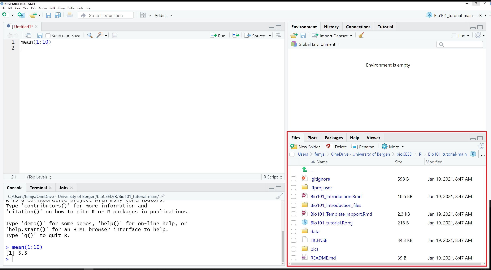
```


Hvis du ønsker å lagre endringer i skriptet ditt, så går du tilbake til fanen `Untitled1` og trykker på `CTRL + S` (`⌘ + S`). 
Oppgi et filnavn og trykk på `Save`.
Din fil vises nå i fanen `Files` (NB: som standard lagres nyopprettede filer i prosjektmappen).


Hvis du ønsker å importere filer i prosjektmappen, så klikker du på More > Show Folder in New Window i menyen til `Files` (se Figur \@ref(fig:rstudio-gui3)). Et nytt vindu åpnes som lar deg velge filene som skal importeres.
```{r rstudio-gui3, echo = FALSE, fig.cap="_Skjermdump av menyen i fanen_ Files.", out.width="100%"}
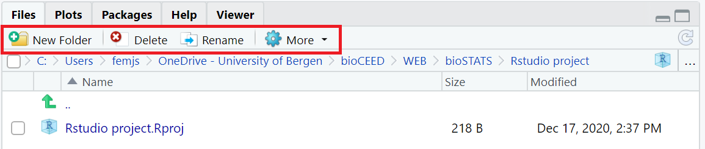
```


 

### Installere R-pakker via konsolen

R-pakker (altså "packages") er utvidelser som legger til funksjoner og funksjonaliteter i R.
Noen pakker gir muligheten til å rydde datasett, noen lar deg tegne fine plotter, osv.

I den øvelsen trenger vi pakkene `tidyverse` og `rmarkdown`. 
`tidyverse` samler funskjoner fra mange mindre pakker som f. eks. `ggplot2`, `tidyr` and `dplyr` som lar deg tegne fine plott, rydde og sortere datasett, og filtrere dataene.
Pakkene installeres via konsolen ved hjelp av funksjonen `install.packages()`. Kopiér og lim inn den følgende linjen direkte i konsolen, og trykk `Enter`:
```{r install-packages, echo = TRUE, eval=FALSE}
install.packages(c("tidyverse", "rmarkdown"))
```

`install.packages()` tar seg av å nedlaste og installere pakker i R/RStudio.
Dessuten bruker du funksjonen `library()` for å aktivere de installerte pakkene når de trenges.
Da kan du kopiere og lime inn denne koden i konsolen:
```{r activate-packages, echo = TRUE, eval=FALSE}
library(tidyverse)
library(rmarkdown)
```


### Kort om skript og konsolen

Som vi så i seksjon \@ref(skript), er et skript like en notisblokk. Der kan du skrive akkurat det du vil uten at R/RStudio skal utføre noe som helst før du ber den gjøre det.  

Du kan for eksempel skrive den følgende koden:
```{r script, echo=TRUE, eval=FALSE}
mean(1:10)
```

Denne enkle koden regner gjennomsnittet av tallene fra 1 til 10.
Det forklares på denne måten:

+ `1:10` er et uttryk som betyr "alle de tallene fra og med 1 til og med 10", 
+ `mean( )` er en funskjon som ber R regne ut gjennomsnittet av alt som finnes mellom parentesene `(` `)`.

Når du har skrevet koden i skriptet og er klar til å utføre den, så trykker du på knappen `Run` (se Figur \@ref(fig:rstudio-run)) for å sende koden til konsolen. Alternativt kan du trykke `CTRL + ALT + Enter` (`⌘ + ⌥ +  Enter`)  for å sende hele koden til konsolen.

Konsolen viser resultatet av koden i skriptet. 
```{r rstudio-gui4, echo = FALSE, fig.cap="_Koden i skriptet utføres i konsolen._", out.width="100%"}

```

### Unngå å skrive kode i konsolen

Det er helt mulig å skrive kode direkte i konsolen.
Når du gjør det, så trykker du bare på `Enter` for å utføre den.
Resultatet vises da på den nesten linjen.

Imidlertid er det ikke anbefalt å gjøre det. 
Når du utfører kode i konsolen, så blir den ikke lagret. 
Det betyr at du blir nødt til å taste den inn igjen hver gang du skal utføre den, eller redigere den.
Dette er relativt uproblematisk når man skriver så enkle kodelinjer som `mean(1:10)` eller `library(tidyverse)`.
Men det blir fort krevende og frustrerende når man skal skrive kode over flere linjer, eller utvikle koden steg for steg.
Derfor anbefales det på det sterkeste å *alltid skrive kode i et skript*, ikke direkte i konsolen.


# Kjør øvelsen {#kjor-ovelsen}

Her skal vi gå sammen gjennom hele øvelsen.
Du skal lære å:

+ lage et datasett i Excel og lagre det i CSV-format
+ importere datafilen i CSV-format i R/RStudio ved bruk av `read_csv2()`,
+ omorganisere datasettet for å kunne jobbe videre med det,
+ lage en tabell som viser dataene,
+ tegne et linjeplott som viser resultatet av eksperimentet.

Det skal gi deg all kunnskapen som du trenger for å skrive din rapport.


## Datainnsamling

Vi starter øvelsen i Excel. 
Her lager du en tabell som viser absorbansmålingene fra labeksperimentet, samt tidspunkter når målingene ble utført.  

Lag 3 kolonner som heter `Time`, `Control` og `Diauxic`:

+ i `Time` skriver du tiden (i minutter) der absorbans ble målt, fra `0` til `180`. 
+ i `Control` skriver du målingene fra kontrollen. Disse har vi registrert for deg.  
+ i `Diauxic` skriver du de eksperimentelle målingene som du har registrert selv.  

I utgangspunktet skal du ha en tabell som ligner mye på figuren \@ref(fig:rstudio-threecolumns)

```{r rstudio-threecolumns, echo = FALSE, fig.cap="_Datasett med absorbansmålinger fra labeksperimentet._", out.width="100%"}
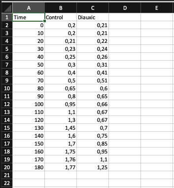
```


### Lagre filen i CSV-format

Excel filer skrives i et format som er upraktisk når man prøver å hente dataene fra en annen programvare.
For at R skal kunne lese og forstå datasettet, må man først konvertere filen til CSV-formatet (**C**omma-**S**eparated **V**alues) som er mye lettere å håndtere.
I CSV-formatert filer ligger verdiene delt med et symbol, vanligvis et komma `,` eller semi-kolon `;`.

Når du har registrert alle målingene, så lagrer du filen ved å gå til Fil > Lagre, eller Fil > Lagre en kopi...

```{r rstudio-saveas, echo = FALSE, fig.cap="_Slik lagrer du filen._", out.width="100%"}
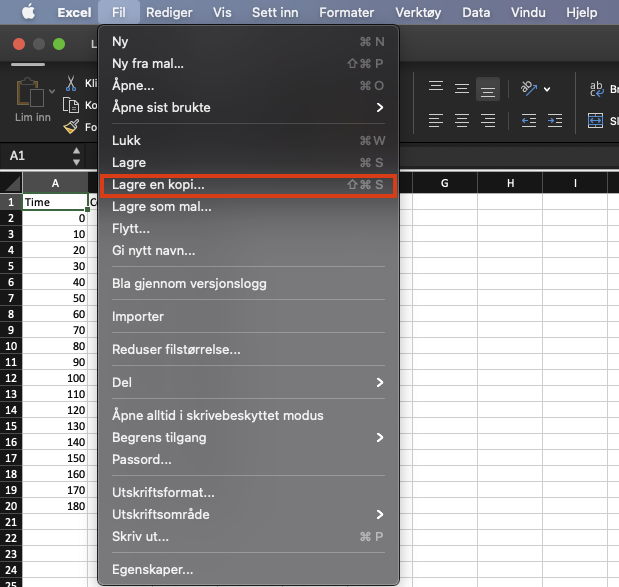
```

I neste steg skal du velge filformatet `CSV UTF-8`, navngi filen (f. eks. `diauxi_data`) og lagre den i mappen `\data\` som du må først opprette i den samme mappen som du finner :
```{r rstudio-savecsv, echo = FALSE, fig.cap="_Datasett med absorbansmålinger fra labeksperimentet._", out.width="100%"}
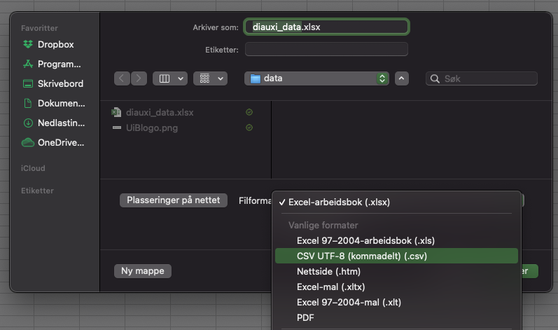
```

### Sjekk filen i et redigeringsverktøy

Hvis du er nysgjerrig og åpner filen i et vanlig tekstredigeringsverktøy (Notepad eller lignende), så ser du at alle målingene er delt med `;`.


```{r rstudio-csv, echo = FALSE, fig.cap="_Datasett med absorbansmålinger fra labeksperimentet._", out.width="100%"}
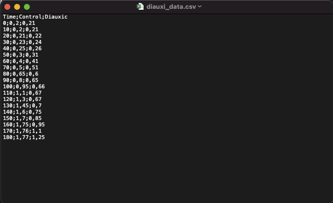
```

NB: du forventer sikkert at CSV-formatet bruker komma `,` til å dele verdier. Men siden komma `,` er desimaltegnet som brukes i det norske systemet , må Excel bruke semi-kolon en annen symbol, nemlig `;` som erstatning.


## Mal til rapporten

Gå til fanen `Files` og klikk på filen `Bio104_Template_rapport.Rmd`.
Filen åpnes øverst til venstre og viser malen til rapporten.

Malen ser sånn ut:

```{r rstudio-Template, echo = FALSE, fig.cap="_Skjermdump av malen til rapporten._", out.width="100%"}
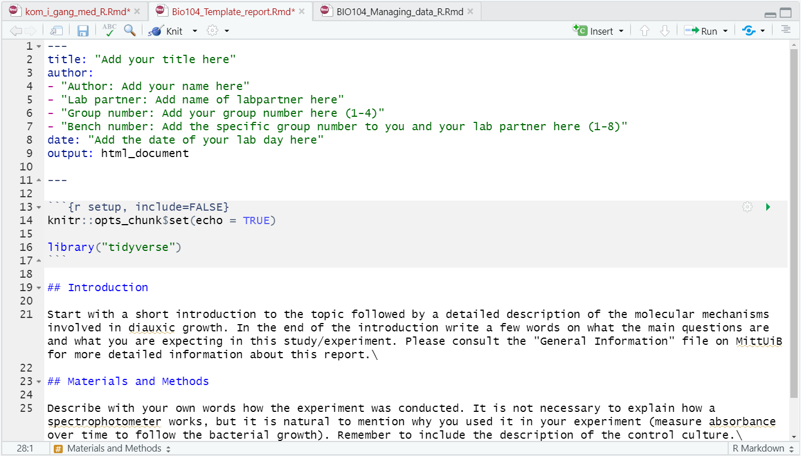
```

Denne filen er skrevet i `Rmarkdown`-format som gjør redigeringsprosessen pålitelig.
Ved bruk av den forhåndsinstallerte R-pakken `knitr` og knappen `Knit` (se den røde boksen i Figur \@ref(fig:rstudio-knitr)), produserer RStudio et ferdigformatert dokument med figurer, titler og tekst. 

```{r rstudio-knitr, echo = FALSE, fig.cap="_Knappen_ Knit _skriver ut rapporten._", out.width="100%"}
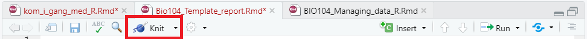
```

Hvis du trykker allerede nå på `Knit`, så får du dette dokumentet:

```{r rstudio-knitr-ferdig, echo = FALSE, fig.cap="_Skjermdump av rapporten produsert av knitr._", out.width="100%"}
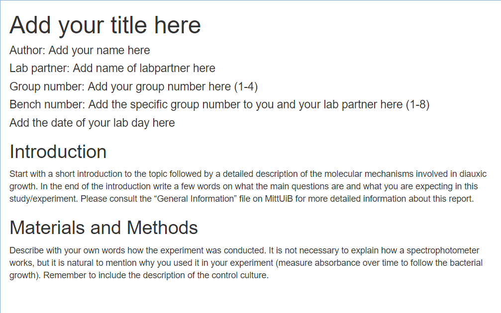
```

### Topptekst

Vi går tilbake til malen i RStudio.
Øverst i malen finner du et området som både starter og slutter på ` --- ` (se Figur \@ref(fig:rstudio-Template-topp)).
Dette er toppteksten.
Målet med toppteksten er å vise tittelen, navnet på forfatteren, navnet på labpartneren, gruppenummeret, lagnummeret og dato øverst i rapporten.
```{r rstudio-Template-topp, echo = FALSE, fig.cap="_Her skal du redigere toppteksten._", out.width="100%"}
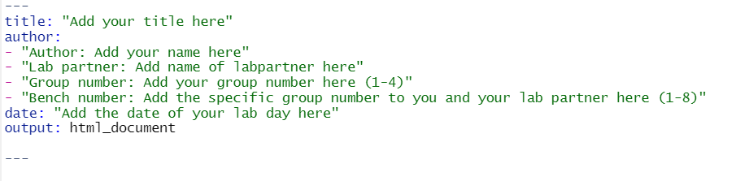
```

Legg til tittelen og alt som trenges mellom `"` `"`.
Pass på å ikke fjerne `" "`!
Den siste linjen med `output: html_document` må du la stå uendret.


### Setup

For at R/RStudio skal kunne lage figurer, må du først aktivere R-pakken `tidyverse`.
Det gjøres ved å skrive kode i denne første "code chunk-en".

NB: chunks er områder med grå bakgrunn som brukes til å utføre kode (f. eks. til å installere/aktivere pakker, behandle data og produsere figurene).
Hver chunk starter på ` ```{r } ` og slutter på ` ``` `.  
Her finner du den første chunk-en i malen:

```{r rstudio-chunk, echo = FALSE, fig.cap="_Eksempel på en code chunk - setup_", out.width="100%"}
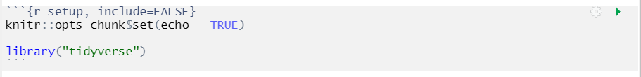
```

Den heter "setup" (` ```{r setup, include=FALSE} `). 
Målet med den er å aktivere `tidyverse` slik at den er klar til bruk gjennom hele øvelsen.  

### Introduksjon

I denne seksjonen skal du skrive en introduksjon til studien. 
Les og følg instruksjonene i malen.
Hvis du trenger litt hjelp med å skrive den delen, kan du gå til [denne bioSKRIV-siden](https://bioskriv.w.uib.no/struktur-imrod/#introduksjon){target="_blank"}.

### Metode

I denne seksjonen skal du beskrive hvordan eksperimentet ble utført og hvordan målingene ble registrert.
Les og følg instruksjonene i malen.
Hvis du trenger litt hjelp med å skrive den delen, kan du gå til [denne bioSKRIV-siden](https://bioskriv.w.uib.no/struktur-imrod/#material-og-metoder){target="_blank"}.

### Resultater

I denne seksjonen skal du presentere resultatene fra både kontrollen og eksperimentet. Les og følg instruksjonene i malen.
Hvis du trenger litt hjelp med å skrive den delen, kan du gå til [denne bioSKRIV-siden](https://bioskriv.w.uib.no/struktur-imrod/#resultat){target="_blank"}.

Du skal legge til en figur som viser resultatet i form av et linjeplott. Til dette skal vi bruke tre code-chunks: `collectingdataset`, `convert` og `plot`:

+ `collectingdataset` skal brukes til å importere datasettet i R og gi det et navn.
+ `convert` skal konvertere datasettet i en ryddig tabell som kan behandles av funksjoner i `tidyverse`.
+ `plot` skal tegne linjeplottet med resultatene fra eksperimentet.

#### Chunk collectingdataset

Her skal vi skrive koden som importerer datafilen i R/RStudio ved hjelp av en dedikert funskjon.
Hvis du har fulgt instruksene på denne siden, heter datafilen `diauxi_data.csv` og ligger nå i `\data` mappen. Stien til datafilen er da `data/diauxi_data.csv`. Husk den, den skal brukes i funksjonen. Hvis du har brukt et annet navn eller mappe, så blir du nødt til å tilpasse stien.  

Det finnes mange funksjoner som kan importere data i R. Her skal vi bruke `read_csv2()` som er en del av `readr` i `tidyverse`. 
`read_csv2()` er laget for å importere CSV-filer der `;` blir brukt for å dele dataene og `,` er desimaltegnet.
(NB: hvis du åpner din datafil og oppdager at `.` er desimaltegnet og `,` er symbolet som deler dataene, så skal du bruke `read_csv()` istedenfor).

Koden i chunk-en blir som følger:
```{r collectingdataset, echo=TRUE, message=FALSE}
# Start by reading your data set
growth <- read_csv2(file = "data/diauxi_data.csv")
```

Her ser du at vi har skrevet `growth <-` foran koden.
Det brukes til å navngi datasettet i R. Her er det logisk å kalle datasettet `growth`, men du kan gi det et annet navn om du ønsker.
Poenget med å gi et navn er å kunne bruke datasettet igjen og igjen, bare ved å skrive det navnet istedefor å skrive hele kodelinjen i chunken hver gang.
For eksempel kan vi nå utføre koden `growth` for å lese hele datasettet i R:

```{r view, echo=TRUE}
# folgende kode viser datasettet
growth
```

I rapporten skal du fylle ut koden i chunken `{r collectingdataset}` med alt som trenges:
```{r collectingdataset2, echo=TRUE, eval=FALSE}
# Start by reading your data set
... <- read_csv2(file = "...")
```

#### Chunk convert

Nå skal vi konvertere datasettet slik at det blir lesbart av funksjonene som skal tegne plottet. 
Vi gjør det ved bruk av R-pakken `tidyr` som er inkludert i `tidyverse`.
Grunnen for at dette **må** gjøres er at R og `tidyverse` jobber bare med *tidy data*, i.e. ryddig data, der hver variabel utgjør en kolonne, og hver observasjon utgjør en rad (se følgende figur \@ref(fig:tidyr)):

```{r tidyr, echo = FALSE, fig.cap="_Bruk_ tidyr _til å rydde datasettet - kilde: [tidyr.tidyverse.org - RStudio - CC BY SA](https://tidyr.tidyverse.org/)_", out.width="100%"}
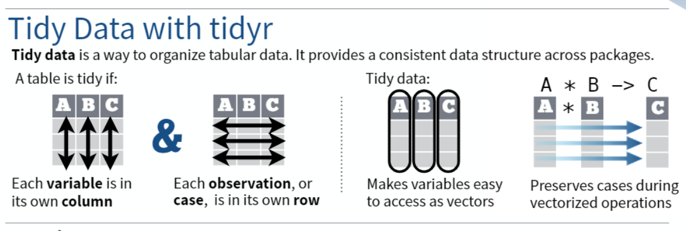
```

Datasettet som vi bruker (se figur \@ref(fig:rstudio-threecolumns)) viser målinger i to kolonner (`Control` og `Diauxic`), og hver rad viser to målinger; derfor innses datasettet som uryddig, og må omorganiseres.  

Planen er å lage ny tabell som:

+ heter `growth_sorted` (det gjør vi med `growth_sorted <-`)
+ viser kategoriene `Control` og `Diauxic` i en *key* kolonne som heter `Treatment` (det gjør vi med `key = "Treatment"` i `gather()`), og samler *alle* tilsvarende målingene i en *value* kolonne som heter `Absorbance` (det gjør vi med `value = "Absorbance"` i `gather()`) basert på verdiene som fins i den 2. og 3. kolonnen (det gjøre vi med argumentene `2, 3` i `gather()`)
+ sortere data iht. tidspunktene i `Time` (det gjør vi med `arrange(Time)`).

Koden skrives sånn:

```{r convert, echo=TRUE}
growth_sorted <- growth %>% 
  gather(key = "Treatment", value = "Absorbance", 2, 3) %>%
  arrange(Time)
```

Her ser du at vi har brukt `%>%` flere ganger. Dette symbolet heter "pipe" og kan oversettes til "deretter". 
Vi bruker den for å skrive en "kodesetning" der stegene følger hverandre på en logisk måte.
Setningen leses: start med datasettet `growth`, deretter omorganiser alle kategoriene og målingene i to kolonner som heter `Treatment` og `Absorbance`, deretter sorter hele tabellen iht. `Time`.

Nå ser det nye datasettet sånn ut:
```{r view2, echo=TRUE}
# folgende kode viser datasettet
growth_sorted
```

Det nye datasettet har 3 variabler: `Time`, `Treatment` og `Absorbance`, og 38 rader med enkle observasjoner.  

I rapporten skal du fylle ut koden i chunken `{r convert}` med alt som trenges:
```{r convert2, echo=TRUE, eval=FALSE}
# Sort the data
... <- ... %>% 
  gather(key = "...", value = "...", ..., ...) %>%
  arrange(...)
```


#### Chunk plot

Nå som vi har importert og konvertert datasettet, er det på tid å lage plottet.
Det skal gjøres ved bruk av funksjonen `ggplot()` i R-pakken `ggplot2` som er inkludert i `tidyverse`.  

Plottet skal:

+ hente og bruke data fra `growth_sorted` (det gjøres med `growth_sorted %>%`)
+ vise variabelen `Time` på x-aksen og `Absorbance` på y-aksen (det gjøres med `aes(x = ..., y = ...)`)
+ vise dataene i form av linjeplott (det gjøres med `+ geom_line()`)
+ representere hver kategorie i variabelen `Treatment` med eget linjeplott (det gjøres med `aes(group = ...)`).  

Syntaksen er relativt enkel:

```{r plot, eval=TRUE, echo=TRUE, fig.cap="Figur 1A: mitt første plott."}
growth_sorted %>% 
  ggplot(aes(x = Time, y = Absorbance, group = Treatment)) +
  geom_line() #This draws the line between datapoints
```


Dette er et ok plott, men det kan forberdres på mange måter, f. eks. ved å legge til eller endre farger, symboler og mye annet.

#### Automatiske farger 

`ggplot()` lar deg tilpasse farger til kategoriene i `Treatment` ved bruk av funksjonen `aes()` og argumentet `color =`. Her e det bare å erstatte `group =` med `color =`.  

#### Symboler

`ggplot()` lar deg legge til symboler til kategoriene i `Treatment` ved bruk av en ekstra linje med `geom_point()` og argumentet `shape =` i `aes()`. Størrelsen på symbolene endres med `size =` i `geom_point()`. Også, det er ingenting i veien for at `shape =` skal brukes i kombinasjon med `color =`.

Her er et eksempel som viser bruk av både farger og symboler:
```{r plot2, eval=TRUE, echo=TRUE, fig.cap="Figur 1B: mitt nye plott."}
growth_sorted %>% 
  ggplot(aes(x = Time, y = Absorbance, color = Treatment, shape = Treatment)) +
    geom_point(size = 2) + # This will draw the points
    geom_line() # This will draw the line
```

Ikke glem pluss-tegnet `+` til slutten av hver linje (bortsett fra den siste).
Her merker du sikkert at en forklaringsboks dukker opp til høyre. Den kommer automatisk med `shape =` eller `color =`, men tydeligvis ikke med `group =`. 

#### Aksetitler

Aksetitler endres med funksjonen `labs(x = "navn på x-aksen", y = "navn på y-aksen")`. Pass på å ikke fjerne `" "`.

#### Theme (utseende)

Du kan endre hele utseende (bakgrunn, akselinjer, osv) ved bruk av en av de funksjonene i `theme_...()` familien. 
[Denne siden](https://ggplot2.tidyverse.org/reference/ggtheme.html){target="_blank"} viser deg navnene på dem.
Mellom parentesene i den funksjonen `theme_()` kan du skrive `base_size =` og et nummer (f. eks. 15) for å endre tekststørrelsen.

#### Manuelle farger

Ønsker du å velge fargene selv, kan du legge til en ekstra linje med funksjonen `scale_color_manual(values=c("farge1", "farge2"))` der `farge1` og `farge2` er farger definert enten med navn eller fargekode. Navn og fargekode finner du [her](https://rstudio-pubs-static.s3.amazonaws.com/3486_79191ad32cf74955b4502b8530aad627.html){target="_blank"}.

NB: bruker du farger, så må du pass på at alle (inkludert fargeblinde folk) kan se de, ellers blir de umulig å tolke resultatene dine. Bruker du gråtoner, må du passer på at det er nok kontrast.


#### Håndplukket symboler

Ønsker du å velge symbolene selv, kan du legge til en ekstra linje med funksjonen `scale_shape_manual(values=c("symbol1", "symbol2"))` der `symbol1` og `symbol2` er koder i denne tabellen:

```{r shape, echo = FALSE, fig.cap="_Disse symbolene kan du bruke i plottet ditt_", out.width="50%"}
knitr::include_graphics("Pics/BIO104-shape.png")
```

Her er et eksempel på et mer avansert plott:

```{r 3, eval=TRUE, echo=TRUE, fig.cap="Figur 1C: mitt fantastisk plott."}
growth_sorted %>% 
  ggplot(aes(x = Time, y = Absorbance, color = Treatment, shape = Treatment)) +
    geom_point(size=2) +
    geom_line() +
    scale_color_manual(values=c("darkorchid4", "darkolivegreen") ) +
    scale_shape_manual(values=c(18, 8)) +
    labs(x = "Time (minutes)", y = "Absorbance") +
    theme_classic(base_size = 15)
```

Husk: for hver ny linje i koden må forrige linjen avsluttes med pluss-tegnet `+`.
  

I rapporten skal du fylle ut koden i chunken `{r plot}` med alt som trenges (vær kreativ!):

```{r plot4, eval=FALSE, echo=TRUE, fig.cap="ADD FIGURE TEXT HERE"}
... %>% 
  ggplot(aes(x = ..., y = ... ), color = ..., shape = ...) +
    geom_point(size = ...) +
    geom_line(...) +
    labs(...) +
    theme_put.a.theme.here(base_size = ...)
```
  
Husk å legge til figurteksten via argumentet `fig.cap=" "`.


### Diskusjon 

I denne seksjonen skal du tolke resultatene.
Er det noe overraskende, uforventet eller rart med dataene? Har du en forklaring for det? 
Her kan du gi din mening.

Hvis du trenger litt hjelp med å skrive den delen, kan du gå til [denne bioSKRIV-siden](https://bioskriv.w.uib.no/struktur-imrod/#diskusjon){target="_blank"}.

### Referanser

I denne delen skal du oppgi referanser og kilder som du har brukt i teksten til rapporten.

Hvis du trenger litt hjelp med å skrive den delen, kan du gå til [denne bioSKRIV-siden](https://bioskriv.w.uib.no/struktur-imrod/#referanser){target="_blank"}.

### Tilleggsmateriale

Her skal du vise en tabell med dataene som ble samlet inn og brukt til å tegne plottet.
Koden skal skrives i chunken ` ```{r table} `.

Det finnes flere muligheter; den enkleste måten er å ta i bruk funksjonen `kable()` i R-pakken `knitr` (siden pakken er ikke aktivert, skriver vi `knitr::kable()`).
Syntaksen er enkel:

```{r kable, echo=TRUE, fig.cap="ADD TABEL TEXT HERE"}
knitr::kable(growth_sorted)
```  

Denne tabellen er relativt lang på grunn av strukturen og mengden med data. 
Det fins en alternativ måte hvis du skal levere din rapport i html-format. 
Du kan lage en dynamisk tabell med flere sider ved bruk av `paged_table()` i R-pakken `rmarkdown` (siden pakken er ikke aktivert, skriver vi `rmarkdown::paged_table()`).
Fordelen er at tabellen tar mye mindre plass. 
Syntaksen er også enkel:

```{r paged-table, echo=TRUE, fig.cap="ADD TABEL TEXT HERE"}
rmarkdown::paged_table(growth_sorted)
```

Husk å legge til figurteksten via argumentet `fig.cap=" "`.
Hvis du trenger litt hjelp med å skrive figurteksten, kan du gå til [denne bioST@TS-siden](https://biostats.w.uib.no/hvordan-skrive-figurtekst/){target="_blank"}.


## Skriv ut rapporten

Når rapporten din er ferdig, så er det bare å trykke på knappen `Knit`.
Hvis alt er korrekt, så åpnes rapporten i et nytt vindu.
Les gjennom dokumentet.
Finner du noe feil, så kan du gå tilbake til malen og rette det.  

Hvis det ligger noen feil i koden din, skal fanen `R Markdown` (ved siden av `Console`) vise feilmelding istedenfor å skrive ut rapporten. Les feilmeldingen, rett feilen(e), og trykk på `Knit` igjen.


Liker du din rapport akkurat som den er, så trykker du på `Open in Browser` øverst i vinduet. 
Rapporten åpnes da i nettleseren din.
Trykk på `CTRL + P` (`⌘ + P`)  for å skrive ut rapporten.
Du kan f. eks. skrive den ut i pdf-format.
Den er klar til innlevering.  

Gratulerer med din første rapport i R/RStudio!
