```{r setup, include=FALSE}
knitr::opts_chunk$set(echo = TRUE, warning = FALSE)
library("tidyverse")
```

#   {- .toc-ignore}

Hei, 

Velkommen til den første numeriske øvelsen i BIO101 - Organismbiologi.
Som en del av labkurset i BIO101 skal du få levert et enkelt datasett som består av reelle observasjoner hentet fra tidligere labkurs i mikrobiologi. 
Dette datasettet skal du bruke for å lære deg å:

+ behandle ekte data, 
+ utføre enkle statistiske beregninger,
+ lage en tabell,
+ tegne en plot,
+ sette alt sammen til en fullstending rapport.

Øvelsen skal utføres i R/RStudio. Vi på [bioST@TS](https://biostats.w.uib.no/){target="_blank"} har utviklet denne siden for å hjelpe deg med å komme i gang med R/RStudio og å løse de numeriske oppgavene i denne øvelsen. 


# Om R/RStudio

## Litt om R

[R](https://cran.r-project.org/){target="_blank"} er både et programmeringsspråk og en programvare for statistiske beregninger og grafikk. 
R er et kraftig og fleksibelt verktøy som gjør jobben med data analyse enkelt og produktivt.

I motsetning til de fleste programvarene som du kjenner bruker R/RStudio kommandoer for å utføre oppgaver. 
Det betyr at du skal skrive kode for å håndtere data og for å lage tabeller og plotter.

Ved hjelp av denne siden skal du lære å bruke språket R for å skrive enkle "setninger" som transformere data til tabeller og figurer som skal brukes i din rapport.

## Et alternativt grensesnitt

R kommer med sitt eget grafiske grensesnitt som gjenkjennes som minimalistisk, med begrenset funksjonalitet, få knapper og få menyer.
Dermed installerer de fleste en alternativt grensesnitt som fortsatt kjører R, men som virker mer produktivt og brukervennlig.
Det finnes flere sånne programvarer.
Den som vi anbefaler og viser til heter [RStudio](https://rstudio.com){target="_blank"}.  

Merk at RStudio brukes _i kombinasjon med R_, ikke istedenfor R. 
Derfor kommer du til å installere begge på din maskin (se seksjon \@ref(installer-r-og-rstudio)). 
RStudio tar over R sitt grensesnitt, men alle beregninger utføres av R "i bakgrunnen". 
Dette forklarer hvorfor du skal ofte lese "R/RStudio" på denne siden.


## Hvorfor jobber vi i R/RStudio?

Det finnes mange fordeler med å ta R/RStudio i bruk:

+ Først og fremst er R _fri_ og _open-source_, og kan installeres den på de fleste maskinene (Windows, Mac, Linux, osv).
+ R kan utføre veldig enkle numeriske oppgaver (for eksempel kan R brukes som en helt vanlig kalkulator og regne ut `2+2`, `(2+3)*4`, logaritme (`log(42)`), eller kvadratrot (`sqrt(42)`), samt veldig avanserte statistiske analyser (f. eks. for å bygge data modeller basert på millioner av observasjoner).  
+ R er i konstant utvikling; det kan nedlastes utvidelser (som kalles for "R-pakker" eller "R-packages") som utvider funksjonalitetene.
+ R brukes av mange i akademia, og spesielt i biologi. 
Dermed finnes det garantert noen i nærheten av deg som kan hjelpe til når du er i trøbbel. 
+ Fordi R brukes av mange i hele verden og i mange discipliner, finnes det et stort sammfunn online som kan hjelpe deg (det forumet [Stack Overflow](https://stackoverflow.com/){target="_blank"} er godt kjent blant R-brukere)

## R/RStudio i biologiemner

Det er ikke bare BIO101 som tar bruk av R/RStudio. 
Flere emner i bachelorprogrammet bruker det òg, f. eks. BIO102, BIO104, STAT101 og BIO201. 
I tillegg blir R/RStudio sentralt i de obligatoriske emnene BIO300A og BIO300B i masterprogrammet.  
Derfor er det lurt å bli kjent med R så fort som mulig.

## Få hjelp med R/RStudio

Det finnes mange steder der du kan finne hjelp og informasjon om R/RStudio:

+ vår nettside [bioST@TS](https://biostats.w.uib.no/up-in-the-r-2/) har en dedikert seksjon hvor du skal lære mye om både R/RStudio og statistikk.
+ de oraklene på [biORAKEL](https://biorakel.w.uib.no){target="_blank"} er kjent med R/RStudio og tilbyr deg hjelp når du trenger det.  
+ [codeRclub](https://codeRclub.w.uib.no){target="_blank"} er et møtested for de som lærer eller jobber med R/RStudio.
Alle er velkommen og kan søke hjelp hos oss. 
Vi møtes på fredager fra kl.14:00 til 16:00 på Tunet (4. etasje på biologen, bygg A, Thormøhlensgate 53A, UiB) og på Zoom (ta kontakt med [Richard Telford](mailto:richard.telford@uib.no) for å få lenken). 
Kom på besøk om du er i trøbbel eller lurer på noe.
+ på nettet finner du mange fora der du får løsning på problemene dine. 
Ofte er det "bare" å google.
Mange spørsmål stilles på [Stack Overflow](https://stackoverflow.com/questions/tagged/r){target="_blank"}, og mange gode svar finnes der òg.
 


# Kom i gang med øvelsen

Nå er det på tid å starte jobben. 
Først skal du installere R og RStudio, og hente de filene som vi skal jobbe med.
Deretter skal vi åpne "prosjektet" og bli kjent med grensesnittet til RStudio.

## Installer R og RStudio

Som UiB student får du tilgang til mange programvarer via [UiB Tredjepartsportalen](apps.uib.no).
Der finner du både R og RStudio.
Informasjon om hvordan du får tilgang til portalen finner du [her på Mitt UiB](https://mitt.uib.no/courses/22090).
Søk etter de programvarene og installer dem på din maskin.  

Alternativt kan du laste ned R direkte fra nettsiden til [The Comprehensive R Archive Network](https://cloud.r-project.org/) og RStudio fra [RStudio sin nettside](https://rstudio.com/products/rstudio/download/#download). 
Pass på at du velger den versjonen som passer din maskin.

## Last ned filene

Nå skal vi hente de filene som du trenger til øvelsen.
Klikk på [denne lenken](https://github.com/biostats-r/Bio101_tutorial/archive/main.zip){target="_blank"} for å laste ned filen `Bio101_tutorial-main.zip`.
Åpne denne filen og ekstraher den hele mappen på harddisken din.
Velg et lurt sted, f.eks `.\Mine dokumenter\BIO101\` eller lignende.


## Første steg i RStudio

Mest av tiden kommer du til å starte R/RStudio ved å åpne et prosjekt.
Et prosjekt består av en mappe som inneholder en .Rproj-fil og eventuelt andre filer (data filer, skript, osv).
I denne øvelsen heter filen `Bio101_tutorial.Rproj`.
Når du dobbelklikker på filen, så åpnes den direkte i RStudio.
Da får du se dette grensesnittet (Figur \@ref(fig:rstudio-start)):
```{r rstudio-start, echo = FALSE, fig.cap="_Skjermdump av RStudio sitt grensesnitt._", out.width="100%"}
knitr::include_graphics("Pics/RStudio-start.png")
```
  
Øverst i vinduet finner du hovedmenyen med mange funksjoner:  

```{r rstudio-meny, echo = FALSE, fig.cap="_Skjermdump av hovedmenyen i RStudio._", out.width="100%"}
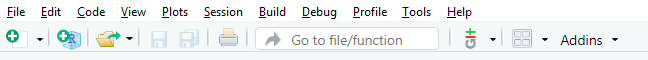
```
  
Via denne menyen kan du bl.a. lage ny fil, åpne eksisterende filer eller prosjekter, lagre endringer i filer, osv.  

Grensesnittet (se Figur \@ref(fig:rstudio-start)) deles i 3 områder:

+ et stort område til venstre der man finner fanene **`Console`**, `Terminal` og `Jobs`, 
+ et mindre område opp til høyre med de fanene `Environment`, `History`, `Connections` and `Tutorial`, 
+ et siste område ned til høyre med de fanene **`Files`**, `Plots`, `Packages`, `Help` and `Viewer`.  

Her skal vi fokusere på de fanene skrevet i fet skrift, nemlig **`Files`** (se seksjon \@ref(files)) og **`Console`** (se seksjon \@ref(console)).
Dessuten skal vi ta bruk av skript (se seksjon \@ref(skript)).


### Skript

Et skript er et arbeidsdokument der du skriver kode, kommentarer og tekst.
Du kan starte jobben i R/RStudio med et blankt skript, eller åpne et forhåndsfylt skript.
I denne øvelsen skal vi jobbe i en forhåndsfylt fil som heter `Bio101_Template_rapport.Rmd`. 
Vi kommer tilbake til det senere i seksjonen \@ref(kjor-ovelsen).  

Hvis du ønsker å opprette et nytt skript for å jobbe med noe annet eller trene på koding, så trykker du på `CTRL + Shift + N` (`⌘ + Shift + N`), eller velger File > New File > R Script i menyen øverst. 
Da dukker det opp et nytt ark opp til venstre. Dette arket heter `Untitled1` og er helt blankt (se Figur \@ref(fig:rstudio-script)).

```{r rstudio-script, echo = FALSE, fig.cap="_Opprettelse av et nytt skript._", out.width="100%"}
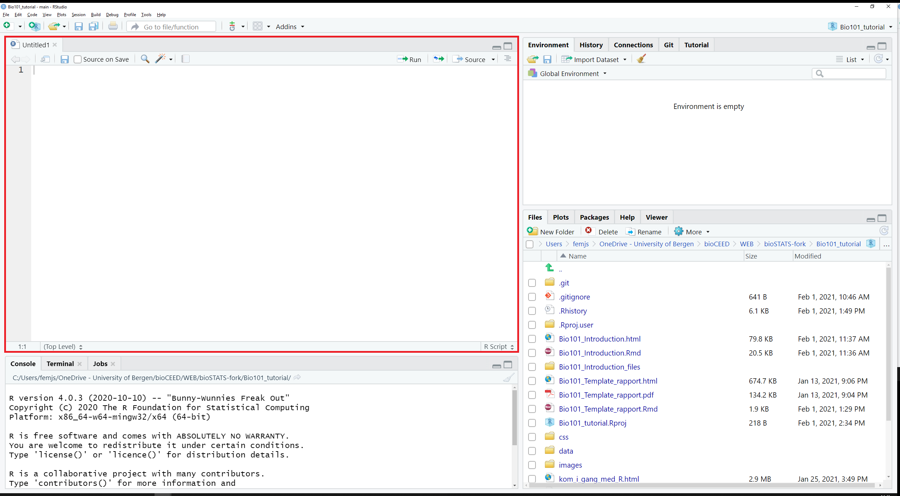
```

I dette skriptet kan du skrive kode.
Når du ønsker å utføre kode, så trykker du på `Run` (se Figur \@ref(fig:rstudio-run)).
```{r rstudio-run, echo = FALSE, fig.cap="_Utfør koden med knappen_ Run.", out.width="100%"}
knitr::include_graphics("Pics/RStudio-run.png")
```

### Console

Fanen `Console` finnes du nederst til venstre i RStudio.
Konsolen er "motoren i R".
Det er konsolen som utfører koden som du sender ut fra skriptet.

Figur \@ref(fig:rstudio-gui2) viser en enkel kodelinje (`mean(1:10)`) i skriptet (øverste grønne boks) og det tilsvarende resultatet i konsolen (nederste grønne boks):

```{r rstudio-gui2, echo = FALSE, fig.cap="_Koden i skriptet utføres i konsolen_", out.width="100%"}
knitr::include_graphics("Pics/RStudio-console.png")
```

Koden vises i blått på en linje som starter på `>`.
Derimot skrives resultatet av `mean(1:10)` i svart på en linje som starter på `[1]`.


### Files

Fanen `Files` finner du nederst til høyre i RStudio (se Figur \@ref(fig:rstudio-gui6)).
`Files` er en filutforsker som viser innholdet på prosjektmappen.
Her skal du finne filene `Bio101_Introduction.Rmd` og `Bio101_Template_rapport.Rmd` som vi skal snart ta i bruk.

```{r rstudio-gui6, echo = FALSE, fig.cap="_Den fanen_ Files _er filutforskeren i RStudio._", out.width="100%"}
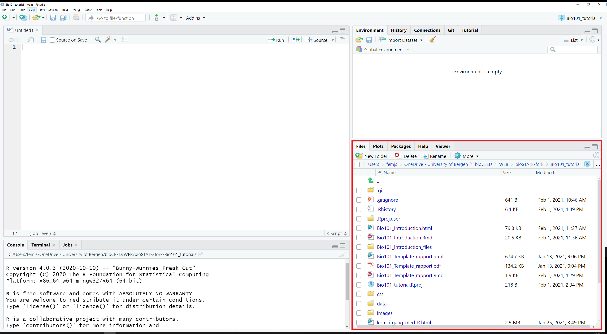
```


Hvis du ønsker å lagre endringer i skriptet ditt, så går du tilbake til fanen `Untitled1` og trykker på `CTRL + S` (`⌘ + S`). 
Oppgi et filnavn og trykk på `Save`.
Din fil vises nå i fanen `Files` (NB: som standard lagres nyopprettede filer i prosjektmappen).


Hvis du ønsker å importere filer i prosjektmappen, så klikker du på More > Show Folder in New Window i menyen til `Files` (se Figur \@ref(fig:rstudio-gui3)). Et nytt vindu åpnes som lar deg velge filene som skal importeres.
```{r rstudio-gui3, echo = FALSE, fig.cap="_Skjermdump av menyen i fanen_ Files.", out.width="100%"}
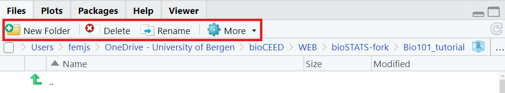
```


 

### Installere R-pakker via konsolen

R-pakker (altså "packages") er utvidelser som legger til funksjoner og funksjonaliteter i R.
Noen pakker gir muligheten til å rydde datasett, noen lar deg tegne fine plotter, osv.

I den øvelsen trenger vi pakken `tidyverse`. 
`tidyverse` installeres via konsolen ved hjelp av funksjonen `install.packages()`. Kopiér og lim inn den følgende linjen direkte i konsolen, og trykk `Enter`:
```{r install-packages, echo = TRUE, eval=FALSE}
install.packages("tidyverse")
```

`install.packages()` tar seg av å nedlaste og installere pakker i R/RStudio.
Dessuten bruker du funksjonen `library()` for å aktivere de installerte pakkene nå de trenges.
Da kan du kopiere og lime inn denne koden i konsolen:
```{r activate-packages, echo = TRUE, eval=FALSE}
library(tidyverse)
```


### Kort om skript og konsolen

Som vi så i seksjon \@ref(skript), er et skript like en notisblokk. Der kan du skrive akkurat det du vil uten at R/RStudio skal utføre noe som helst før du ber den gjøre det.  

Du kan for eksempel skrive den følgende koden:
```{r script, echo=TRUE, eval=FALSE}
mean(1:10)
```

Denne enkle koden regner gjennomsnittet av tallene fra 1 til 10.
Det forklares på denne måten:

+ `1:10` er et uttryk som betyr "alle de tallene fra og med 1 til og med 10", 
+ `mean( )` er en funskjon som ber R regne ut gjennomsnittet av alt som finnes mellom parentesene `(` `)`.

Når du har skrevet koden i skriptet og er klar til å utføre den, så trykker du på knappen `Run` (se Figur \@ref(fig:rstudio-run)) for å sende koden til konsolen. Alternativt kan du trykke `CTRL + ALT + Enter` (`⌘ + ⌥ +  Enter`)  for å sende hele koden til konsolen.

Konsolen viser resultatet av koden i skriptet. 
```{r rstudio-gui4, echo = FALSE, fig.cap="_Koden i skriptet utføres i konsolen._", out.width="100%"}
knitr::include_graphics("Pics/RStudio-console.png")
```

### Unngå å skrive kode i konsolen

Det er helt mulig å skrive kode direkte i konsolen.
Når du gjør det, så trykker du bare på `Enter` for å utføre den.
Resultatet vises da på den nesten linjen.

Imidlertid er det ikke anbefalt å gjøre det. 
Når du utfører kode i konsolen, så blir den ikke lagret. 
Det betyr at du blir nødt til å taste den inn igjen hver gang du skal utføre den, eller redigere den.
Dette er relativt uproblematisk når man skriver så enkle kodelinjer som `mean(1:10)` eller `library(tidyverse)`.
Men det blir fort krevende og frustrerende når man skal skrive kode over flere linjer, eller utvikle koden steg for steg.
Derfor anbefales det på det sterkeste å *alltid skrive kode i et skript*, ikke direkte i konsolen.


# Lær å kode med appen

I prosjektmappen til denne øvelsen finner du filen `start_intro_tutorial.R`.
Klikk på den i fanen `Files`.
Filen åpnes direkte i en ny fane opp til venstre.
I menyen øverst i fanen, klikk på `Source` (se Figur \@ref(fig:rstudio-run-intro)).

```{r rstudio-run-intro, echo = FALSE, fig.cap="_Start appen ved å trykke på_ Run document.", out.width="100%"}
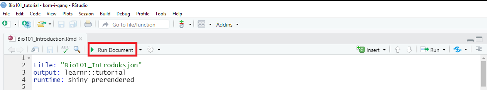
```

Etter noen sekunder åpner seg et nytt vindu i en internett browser (se Figur \@ref(fig:rstudio-app)).
Appen inneholder bakgrunnsinformasjon om alt du bør vite for å lage figurene i rapporten. 
Du skal lese og lære om datasettet, gjennomsnitt og variabilitet, koden som lar deg regne dem, koden som lar deg lage tabeller, tegne plot, osv.  

Appen ser sånn ut:
```{r rstudio-app, echo = FALSE, fig.cap="_Skjermdump av appen._", out.width="100%"}
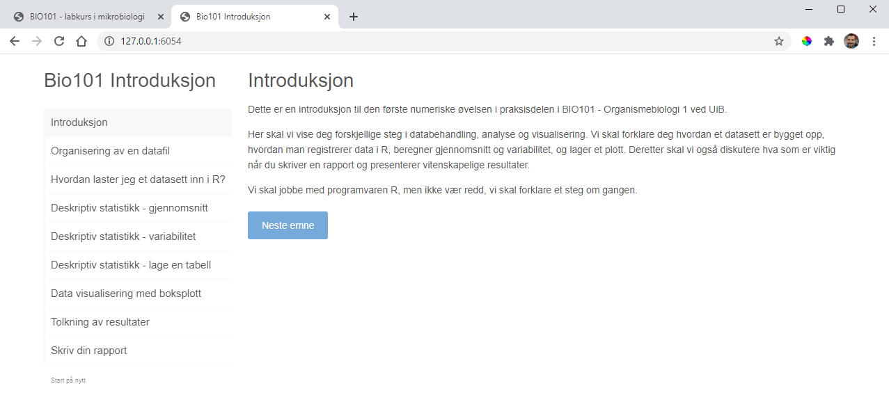
```


Den appen inneholder flere interaktive vinduer der du kan prøve koden selv, redigere og utføre den.
Slike vinduer ser sånn ut:

```{r rstudio-learnr, echo = FALSE, fig.cap="_Et interaktivt vindu i appen_", out.width="100%"}
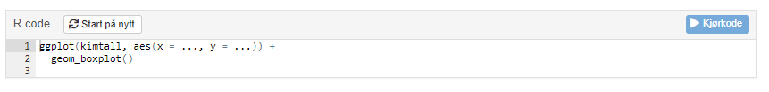
```

Disse vinduene er forhåndsfylt med ufullstendig kode.
Her kan du redigere koden, legge til data, og utføre den ved å trykke på knappen `Kjør kode`.
Resultatet vises med en gang. 
Er du ikke fornøyd med resultatet eller mangler det noe, så kan du redigere koden (eller begynne på nytt ved bruk av knappen `Start Over`) og utføre den på nytt.

Når du blir ferdig med appen, så skal du ha lært alt du trenger for å kjøre øvelsen.  

# Kjør øvelsen {#kjor-ovelsen}

Nå kan du åpne malen for rapporten.
Det gjør du ved å trykke på filen `Bio101_Template_rapport.Rmd` i fanen `Files`.

Malen ser sånn ut:

```{r rstudio-Template, echo = FALSE, fig.cap="_Skjermdump av malen til rapporten._", out.width="100%"}
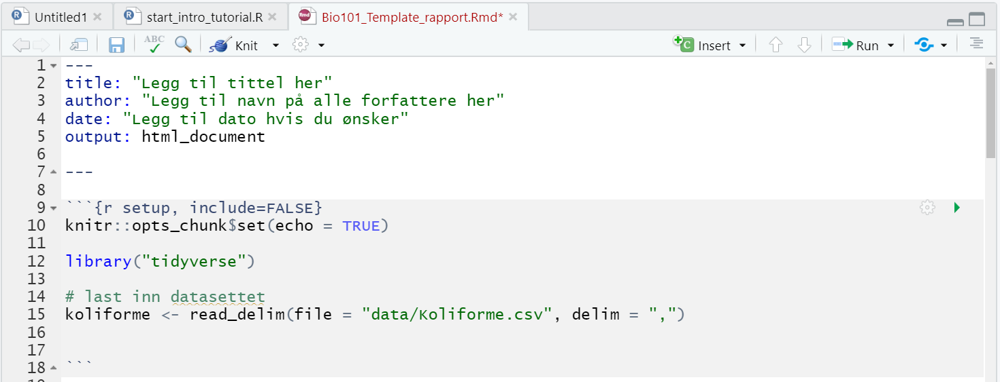
```

Denne filen er skrevet i `Rmarkdown`-format som gjør redigeringsprosessen pålitelig.
Ved bruk av den forhåndsinstallerte R-pakken `knitr` og knappen `Knit` (se den røde boksen i Figur \@ref(fig:rstudio-knitr)), produserer RStudio et ferdigformattert dokument med figurer, titler og tekst. 

```{r rstudio-knitr, echo = FALSE, fig.cap="_Knappen_ Knit _skriver ut rapporten._", out.width="100%"}
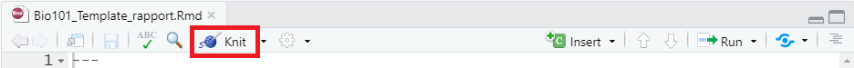
```

Hvis du trykker allerede nå på `Knit`, så får du dette dokumentet:

```{r rstudio-knitr-ferdig, echo = FALSE, fig.cap="_Skjermdump av rapporten produsert av knitr._", out.width="100%"}
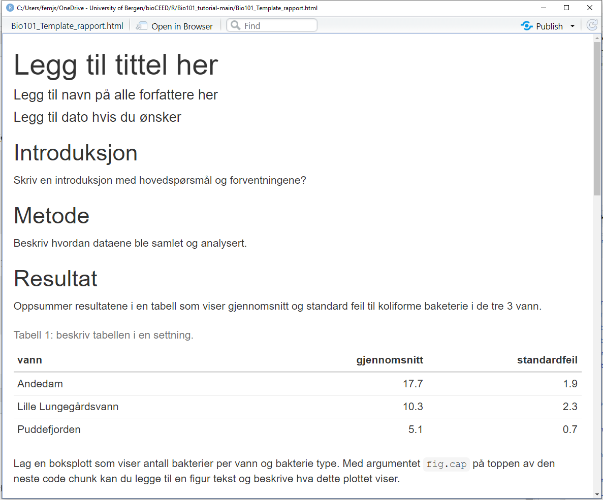
```

## Gjennomgang

Her skal vi se steg for steg hvordan du skal fylle ut malen. 

### Topptekst

Øverst i malen finner du et området som både starter og slutter på ` --- ` (se Figur \@ref(fig:rstudio-Template-topp)).
Dette er toppteksten.
Den skal vise titlen, forfattere og dato øverst i rapporten.
```{r rstudio-Template-topp, echo = FALSE, fig.cap="_Her skal du redigere toppteksten._", out.width="100%"}
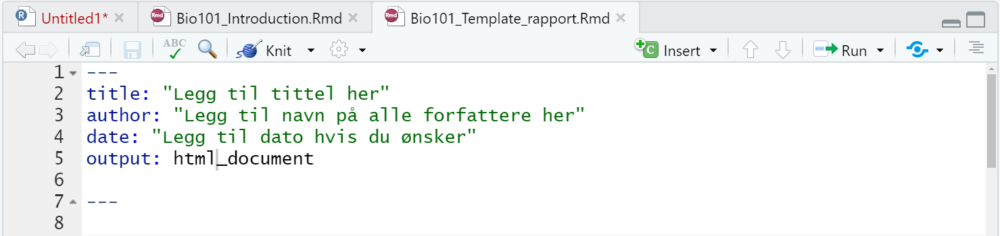
```

Legg til titlen, forfatternavn og datoen mellom `"` `"`.
Husk å ikke fjerne `" "`. 
Den siste linjen med `output: html_document` må du la stå uendret.


### Setup

For at R/RStudio skal kunne lage figurer, må du aktivere den R-pakken `tidyverse` og importere datasettet.
Det gjøres ved å skrive kode i denne første "code chunk-en".

NB: chunks er områder med grå bakgrunn som brukes til å utføre kode (f. eks. til å installere/aktivere pakker, behandle data og produsere figurene).
Hver chunk starter på ` ```{r } ` og slutter på ` ``` `.  
Her finner du den første av de fire chunk-ene i malen:

```{r rstudio-chunk, echo = FALSE, fig.cap="_Eksempel på en code chunk_", out.width="100%"}
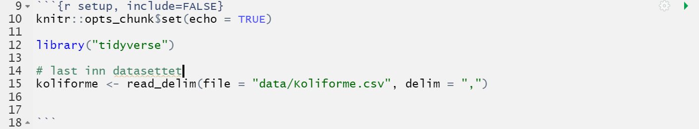
```

Den heter "setup" (` ```{r setup, include=FALSE} `). 
Målet med den er å aktivere `tidyverse` og importere datafilene.  

#### Tidyverse

I appen har du lært å bruke `library()` for å aktivere R-pakker.  
Skriv koden som aktiverer `tidyverse`.

#### Datasett

I appen har du lært hvordan man leser og importerer data med `read_delim()`.  
Skriv 2 linjer med kode, de ene som importerer `Koliforme.csv` og den andre som importerer `Vekst.csv`.  

NB: pass på å ikke fjerne ` ``` ` i slutten av chunk-en!


### Introduksjon

Skriv en innledning i ett eller to avsnitt om hva studien handler om.
Hva er hovedspørsmålet til denne studien og hva er forventningene?

Trenger du hjelp med introduskjonen, gå til [denne bioSKRIV-siden](https://bioskriv.w.uib.no/struktur-imrod/#introduksjon){target="_blank"}.  

NB: titlen selv (som begynner på `##` og vises i blått) skal du ikke redigere. Det er bare teksten (i svart) som skal endres. 

### Metode

Beskriv hvordan dataene ble samlet og analysert.
Hvor ble prøvene hentet?
Hva slags målinger består datasettet av?
Osv.

Trenger du hjelp med metodedelen, gå til [denne bioSKRIV-siden](https://bioskriv.w.uib.no/struktur-imrod/#material-og-metoder){target="_blank"}.


### Resultat

Her skal du presentere resultatene i studien ved å skrive noen setninger og legge til tre figurer: tabell, boksplott og vekstkurve.

Trenger du hjelp med resultatdelen, gå til [denne bioSKRIV-siden](https://bioskriv.w.uib.no/struktur-imrod/#resultat){target="_blank"}.


#### Tabell

Den første figuren er tabellen som viser gjennomsnitt og standardfeil til de to forskjellige bakterie typene i alle 3 vann.
For å lage tabellen skal du skrive den tilsvarende R-koden som du har lært i appen i den code chunk-en som starter på ` ```{r tabell, eval=TRUE, echo=FALSE}`. 
NB: Husk å ikke fjerne ` ``` ` i slutten!

#### Boksplott

Den neste figuren er boksplottet som viser antall bakterier per vann og bakterie type.
For å lage boksplottet skal du skrive kode i den chunk-en som starter på ` ```{r boksplott, eval=TRUE, echo=FALSE, fig.cap="..."}`.
Igjen, husk å ikke fjerne ` ``` `!

Det argumentet `fig.cap="..."` lar deg legge til figurteksten, altså den teksten som beskriver hva figuren handler om.
Trenger du hjelp med å skrive figurteksten, gå til [denne bioST@TS-siden](https://biostats.w.uib.no/hvordan-skrive-figurtekst/){target="_blank"}.


#### Vekstkurve

Den siste figuren er vekstkurven (med standardfeil) som viser antall bakterier for hver observasjon.
For å lage vekstkurven skal du skrive kode i ` ```{r vekstkurve, eval=TRUE, echo=FALSE, fig.cap="..."}`.

Husk figurteksten.


### Diskusjon

Diskusjonen er den siste delen i denne rapporten. Det er der du skal tolke og diskutere resultatene i studien.
Viser resultatene noe som var forventet eller rart? Finnes det en forklaring på det du ser i figurene? Skriv det her!

Trenger du hjelp med diskusjonen, gå til [denne bioSKRIV-siden](https://bioskriv.w.uib.no/struktur-imrod/#material-og-metoder){target="_blank"}.


## Skriv ut rapporten

Når din rapport er ferdig, så er det bare å trykke på knappen `Knit`.
Hvis alt er korrekt, så åpnes rapporten i et nytt vindu.
Les gjennom dette dokumentet.
Finner du noe feil, så kan du gå tilbake til malen og endre det.  

Liker du din rapport akkurat som den er, så trykker du på `Open in Browser` øverst i vinduet. 
Rapporten åpnes da i nettleseren din.
Trykk på `CTRL + P` (`⌘ + P`)  for å skrive ut rapporten.
Den er klar til innlevering med resten av din lab journal.  

Gratulerer med din første rapport i R/RStudio!


