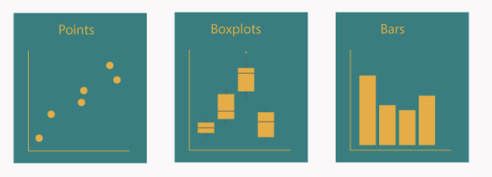
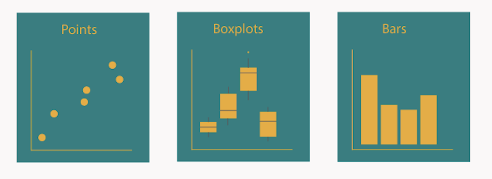
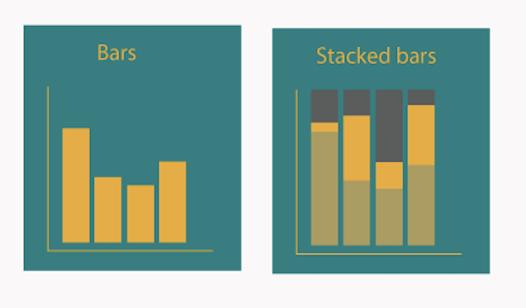
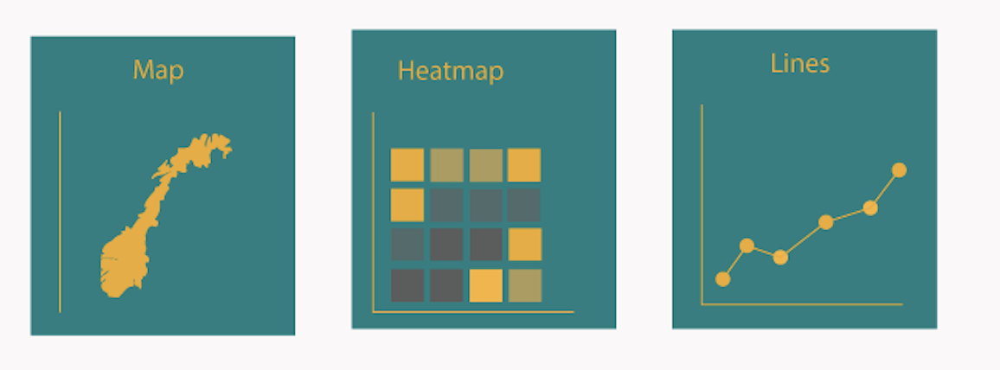
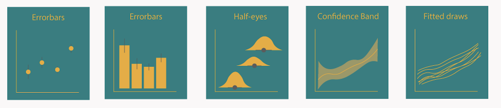

---
title: ""
output:
  html_document:
    highlight: tango
    toc: true
    toc_float: true
    css: ../css/style-chapters.css
--- 

```{r setup, include=FALSE}
knitr::opts_chunk$set(echo = TRUE)
library(ggplot2)
```

# Plot types

Choosing the right type of plot, depends on your data. Wheather you have continous data, a factor, grouped variables, will define what type of plots you can do. Here, we present a number of common plot types. You can find the code to plot these figures below.
Here is a guide that can help you choose the plot type (if we still want to keep it...)

In ggplot, the `geom_xxx()` funciton defines the type of plot that is drawn. in the example below, we use `geom_point()`, which makes dots.

```{r simple plot2, eval=TRUE, echo=FALSE}
ggplot(data = iris, aes(x = Sepal.Length, y = Petal.Length, colour = Species, shape = Species)) +
  geom_point(size = 2, alpha = 0.6) +
  labs(title = "Iris data", x = "Sepal Length", y = "Petal Length") +
  scale_color_viridis_d() +
  theme_minimal()
```
<br/><br/>

## Continous variables
Continous data is often visualized using dots, boxplots or bars. A heat map can also be used.

```{r continous, echo=FALSE, out.width = '100%'}

```
<br/><br/>

## Code {.tabset .tabset-fade}

### Points
Here is the code to make a dotplot using `geom_point()`:

```{r geom_point, eval=TRUE}
ggplot(data = iris, aes(x = Sepal.Length, y = Petal.Length, colour = Species, shape = Species)) +
  geom_point(size = 2, alpha = 0.6) +
  labs(title = "Iris data", x = "Sepal Length", y = "Petal Length") +
  scale_color_viridis_d() +
  theme_minimal()
```

### Box
Here is the code to make a boxplot using `geom_boxplot()`:

```{r geom_box, eval=TRUE}
ggplot(data = iris, aes(x = Species, y = Petal.Length, fill = Species)) +
  geom_boxplot() +
  labs(title = "Iris data", x = "Sepal Length", y = "Petal Length") +
  scale_fill_viridis_d() +
  theme_minimal()
```

### Bars
Here is the code to make a barplot using `geom_bar()`:

```{r geom_bar, eval=TRUE}
ggplot(data = iris, aes(y = Petal.Length, x = Species, fill = Species)) +
  geom_bar(stat = "identity") +
  labs(x = "", y = "") +
  scale_fill_viridis_d() +
  theme_minimal()
```

## {.toc-ignore}


## Categorical data, factors and groups
To show categorical data, factors and groups we often use boxplots, or other elements. We can use colour, size, shape or linetype to distinguish different groups. Another option is to divide the plot into subplots using the facet function.

```{r categorical, echo=FALSE, out.width = '100%'}

```
<br/><br/>

## Distributions
Histograms and density plots are most commonly used to plot densities. To visualize several density at the same time, boxplots, violin and sina plot are useful. 

Boxplots, show the median, quantiles, outliers = useful. Violin plots... Sina even show the data. Ridgeline plots

```{r distribution, echo=FALSE, out.width = '100%'}
knitr::include_graphics("Figures/Distribution.png")
```
<br/><br/>

## Proportions
Proportions are often displayed using barplots or stacked barplots.

```{r proportion, echo=FALSE, out.width = '100%'}

```
<br/><br/>

## x~y relationships
To show relationships between two continous variables, we often use scatterplots.
Contour lines
Correlations between variables can be shown using a correlogram.

```{r x-y, echo=FALSE, out.width = '100%'}
knitr::include_graphics("Figures/X-Y.png")
```
<br/><br/>

## Spatial and temporal data
Spatial data is often shown on maps.
Temporal data, is often shown with lines/smooth

```{r spatial temporal, echo=FALSE, out.width = '100%'}

```
<br/><br/>

## Uncertainty
Errorbars are often used to show uncertainty of the data or likely values
- posterior distribbution/eye plot
- confidence bands

```{r uncertainty, echo=FALSE, out.width = '100%'}

```
<br/><br/>

