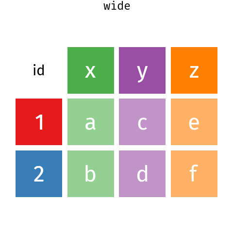

# Tidying data with `tidyr`

## Tidy data

Before you can start analysing or plotting data, you often need to tidy it.
[Tidy data](https://tidyr.tidyverse.org/articles/tidy-data.html) is a standardised way to structure a dataset which makes it much easier to process, analyse and plot the data.
Functions in the `tidyr` and `dplyr` packages, both part of tidyverse, can be very useful for tidying data.

```{r load-tidyr}
library(tidyr)
```


In tidy data 

  -  Every column is a variable.
  -  Every row is an observation.
  -  Every cell is a single value.

The process of tidying data is to convert the data you have to data that meets this standard.


## `separate()` multiple values

If a cell contains multiple values, we can use `tidyr::separate()`.

For example, in this small dataset, site code and plot number have been combined into one column separated by a hyphen.

```{r separate-data}
dat <- tribble(~id, ~value,
       "A-1", 1,
       "A-2", 2,
       "B-1", 3)

dat
```
We can use `separate()` to split site and plot into separate columns.
By default, `separate()` splits the data at non-alphanumeric values.
This behaviour can be controlled with the `sep` argument.

```{r separate}
dat |> separate(col = id, into = c("site", "plot"))
```


## Reshaping data - wide to long 

It is very common to need to reshape data to make it tidy.
This can be done with the `pivot_*` functions.

```{r pivot-anim, echo=FALSE, out.width = "400px", fig.cap = "Wide data to long data with `pivot_longer()` and `pivot_wider()` ."}

```


These are some Bergen climate data from [Wikipedia](https://no.wikipedia.org/wiki/Bergen) (NB for demonstration only wikipedia is not a good source of climate data - use [seklima](https://seklima.met.no/) for Norwegian data).

```{r, bergen_klima, echo = FALSE}
bergen_klima <- read_delim(
"Måned 	Jan 	Feb 	Mar 	Apr 	Mai 	Jun 	Jul 	Aug 	Sep 	Okt 	Nov 	Des
Normal maks. temp. °C 	3.6 	4.0 	5.9 	9.1 	14.0 	16.8 	17.6 	17.4 	14.2 	11.2 	6.9 	4.7
Døgnmiddeltemp. °C 	1.7 	1.7 	3.3 	5.8 	10.4 	13.1 	14.2 	14.2 	11.5 	8.8 	4.8 	2.7
Normal min. temp. °C 	-0.4 	-0.5 	0.9 	3.0 	7.2 	10.2 	11.5 	11.6 	9.1 	6.6 	2.8 	0.6
Nedbør (mm) 	190 	152 	170 	114 	106 	132 	148 	190 	283 	271 	259 	235", delim = "\t", trim_ws = TRUE)
bergen_klima
```

This might be a nice way to present the data but it is not tidy data:
each row is not an observation; each column is not a variable.

We can use `pivot_longer()` to reshape the data. 
The months, selected by the `cols` argument in the column names (see section \@ref(select-helpers) for more on the syntax used here) will become a new variable with a name set by the `names_to`, and the data values get put into a column named by the `values_to` argument. 


```{r pivot-long}
bergen_klima_long <- bergen_klima |> 
  pivot_longer(cols = Jan:Des, names_to = "Month", values_to = "value")
bergen_klima_long
```

The data are now tidier, but it would probably be more useful to reshape the data again, and have a column for each climate variable.
We can do this `pivot_wider()`.

## Reshaping data - long to wide

We can tell `pivot_wider()` which column contains what will become the column names and the data with the `names_from` and `values_from`, respectively.

```{r pivot-wider}
bergen_klima_wider <- bergen_klima_long |> 
  pivot_wider(names_from = "Måned", values_from = "value")

bergen_klima_wider
```

The data are now in a convenient format for plotting or analysis.

### Exercise {- .facta .toc-ignore}

With the Mt Gonga data downloaded previously, pivot the data so that the height data (H1-H10) are in one column.

 <details>
  <summary>Hint</summary>
`pivot_longer`
</details> 


### Further reading {.facta .toc-ignore}

- [tidy data vignette]( https://cran.r-project.org/web/packages/tidyr/vignettes/tidy-data.html)
 - [tidyr cheat sheet](https://github.com/rstudio/cheatsheets/raw/master/data-import.pdf)