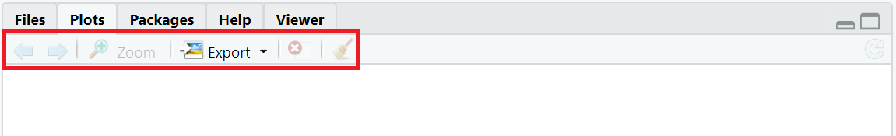
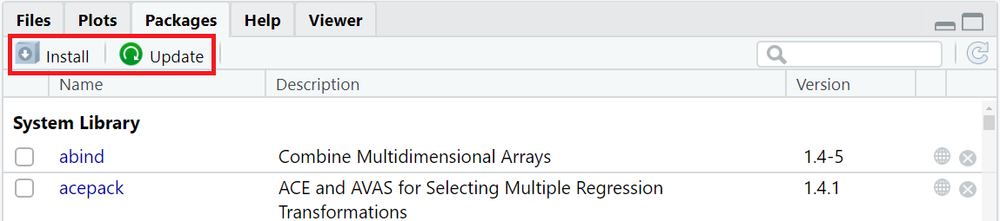
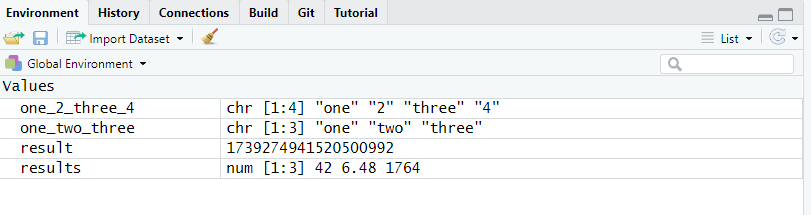
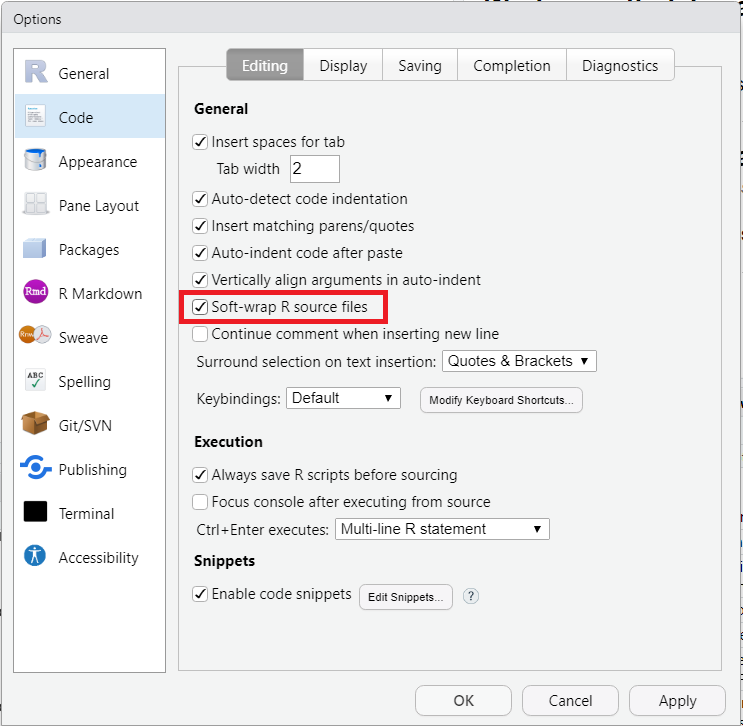

```{r setup, include=FALSE}
knitr::opts_chunk$set(echo = TRUE, warning = FALSE)
library("tidyverse")

data(penguins, package = 'palmerpenguins')

source("../Templates/biostats_theme.R")

```

### Before we start {- .facta .toc-ignore}

You must have successfully switched on your PC, Mac or Linux machine. 

# What is R?

R is powerful statistical and graphical tool which is available for most platforms (Windows, Mac, Linux, FreeBSD, etc.). 
R is both free and open source, which means that anyone can freely use it and access its source code, understand what it actually does with your data, create add-ons to fit a specific purpose, etc.  

R is not a conventional software where all tools are available via a graphical user interface (GUI) with menus and buttons. 
Instead, users run commands via a script, and read the output either in a console, or in a separate, dedicated window.  

R is also a programming language organized around objects that store data and functions that manipulate data. 
Throughout this website, you will learn this language and the art of writing meaningful code chunks that transform raw data into understandable results in the form of plots, tables, figures and reports.

## Why using R?

R has been widely adopted by biologists and more generally by the life science community. The reasons are many:

+ R is free.
+ R is efficient in terms of data processing, even with very large data sets. 
+ R has a large online community ready to help and answer your questions.
+ R is adaptable: you will most certainly find one or several packages (i.e. add-ons) for your discipline, or for solving the problems you face.
+ R is transparent: the code behind functions and packages is accessible, meaning that you know exactly what R does to your raw data (you don't have to assume it).
+ R produces clean figures ready for publication in scientific journals.
+ R allows for reproducible research: anyone running your code on your data will get the exact same result as you do. 
+ R code is easy to share and publish. 
+ R contributes to replicability: anyone can use your published code on another data set to replicate your findings (or not).
+ etc.


## Working in R via RStudio

R comes with its own GUI depicted in Figure \@ref(fig:r-gui).
Nearly everything in R happens either in the script editor (R editor - Figure \@ref(fig:r-gui), left window) where the user writes code, or in the console (R console - Figure \@ref(fig:r-gui), right window) which runs commands and prints results. 


```{r r-gui, echo = FALSE, fig.cap="_R Graphical User Interface._", out.width="100%"}
knitr::include_graphics("Pics/Rgui.png")
```

It is obviously a minimalist GUI that does not offer much more than a short main menu and five buttons in total. 
*Per se*, this workspace does not look like an organized interface that will ease your work.

Fortunately, other programmes can fix that.
RStudio is one of them.


## What is RStudio?

[RStudio](https://rstudio.com){target="_blank"} is an integrated development environment (IDE) for the R language. 
RStudio runs R "in the background", and replaces its minimalist interface with its own. 
This means that you do not lose anything of R's power, you simply work with it from a different perspective.

Figure \@ref(fig:rstudio-gui) shows RStudio's GUI.

```{r rstudio-gui, echo = FALSE, fig.cap="_RStudio Graphical User Interface._", out.width="100%"}
knitr::include_graphics("Pics/RStudiogui.png")
```

This interface is more complexe and organized.
The script editor (top left) is more advanced and equipped with a syntax highlighter, which will prove useful when writing code.
Many functions (console, file explorer, etc) are available and dispatched in panes and tabs.   
A significant benefit of using RStudio is the possibility to create and manage projects. 
Projects let you organize your tasks and load only the files and packages that you define as necessary for the workflow.  

We will further describe RStudio's interface in section \@ref(the-interface) and how to set up projects in section \@ref(working-with-a-project). 
For now, let's install everything we need, starting with R and RStudio.


# Installing R and RStudio

There are several ways to install R and RStudio on your machine, depending on whether you are a UiB/NTNU student or staff, or neither. 
The following sections give you the way to proceed in most cases.

## UiB student

UiB students can access and download R and RStudio, through the [Third Party Portal (apps.uib.no)](https://apps.uib.no). 
Simply go to [apps.uib.no](https://apps.uib.no), search for R and RStudio and install both on your machine.
You will find information about how to log on and use the Third Party Portal for the first time [here in Mitt UiB](https://mitt.uib.no/courses/22090).

## UiB staff

UiB staff working on a client setup machine shall use the app "Software Center" (Windows 10) or "Managed Software Center" (Mac OS) to install R and RStudio.
You will find help with programme installation [here (Windows)](https://hjelp.uib.no/tas/public/ssp/content/detail/knowledgeitem?unid=4e46c754-118f-4409-98dc-1ab8589aeccb) and [there (Mac OS)](https://hjelp.uib.no/tas/public/ssp/content/detail/knowledgeitem?unid=14b5270a-3528-4b60-9f84-d3d93d5b8479).

UiB staff who wish to install R and RStudio on a private machine can use the [Third Party Portal (apps.uib.no)](https://apps.uib.no). 
Simply go to [apps.uib.no](https://apps.uib.no), search for R and RStudio and install both on your machine.
You will find information about how to log on and use the Third Party Portal [here in Mitt UiB](https://mitt.uib.no/courses/22090).

## NTNU student

NTNU students can access and download many programmes, including R and RStudio, through the [software.ntnu.no](https://software.ntnu.no/). 
Simply go to [software.ntnu.no](https://software.ntnu.no), search for R and RStudio and install both on your machine.

## NTNU staff

NTNU staff working on a client setup Windows machine shall use the app "Software Center" that comes preinstalled to install R and RStudio.
A description of how to find and use Software Center can be found [here](https://innsida.ntnu.no/wiki/-/wiki/English/Install+applications+from+Software+Center).
Search for R and RStudio in "Applications", and install both on your machine.

Alternatively, go to [software.ntnu.no](https://software.ntnu.no), search for R and RStudio and install both.

## Neither UiB nor NTNU 

### Installing R

Go to [The Comprehensive R Archive Network](https://cloud.r-project.org/). 
In the top section "Download and Install R", click on the link that matches your platform and follow the instructions to install the version of R designed for your OS.


### Install RStudio

Go to [RStudio's website](https://rstudio.com/products/rstudio/download/#download) and download the free version of RStudio Desktop made for your OS.
Install it on your machine. 


# Starting with RStudio

Now that both R and RStudio are installed on your machine, you are ready to start.
Note that you do not need to do anything to link RStudio to R or vice versa.
Everything should be ready to use.

## The interface

When opening RStudio for the first time, the following main screen (Figure \@ref(fig:rstudio-start)) appears:
```{r rstudio-start, echo = FALSE, fig.cap="_Opening RStudio for the first time._", out.width="100%"}
knitr::include_graphics("Pics/Rstudio-start.png")
```

The interface is divided into 3 panes:

+ a large one to the left that contains the tabs **`Console`**, **`Terminal`** and `Jobs`, 
+ a smaller one in the top right quadrant with the tabs **`Environment`**, `History`, `Connections` and **`Tutorial`**, 
+ a last one in the bottom right quadrant with the tabs **`Files`**, **`Plots`**, **`Packages`**, `Help` and `Viewer`. 

In the upcoming sections, we will see what these tabs are made for (NB: only the tabs in bold will be dealt with here).


## Scripts

First, go to the main menu in File > New File and choose R Script.
This opens a new, empty tab called `Untitled1` in the top left pane (see Figure \@ref(fig:rstudio-gui2)).

```{r rstudio-gui2, echo = FALSE, fig.cap="_The script_ Untitled1 _shows up in the top left pane._", out.width="100%"}
knitr::include_graphics("Pics/RStudio-script.png")
```

This tab displays a *script*. 
A script is a worksheet that looks a lot like a plain text file.
This is where you will write your code, edit it, correct it if necessary.
It may contain just a few lines, or hundreds of them.
It may also contain comments (lines starting with the symbol `#`) which will help you keep track of your work.  

Here is a simple script:

```{r script, echo=TRUE, eval=FALSE, fig.cap="_A simple script_"}
# this is my data
simple_data <- c(4, 5, 9, 75, 2, 11, 8, 45, 61, 64, 54, 5, 4, 4, 16, 65, 4, 65, 1, 56, 16, 5, 49, 4, 65)

# calculate the mean
mean(simple_data)

# calculate the standard deviation
sd(simple_data)
```

You may open several scripts at the same time. 
Each of them will show up as a separate tab in the top left pane of RStudio.
If the tab title is red and followed with a star `*`, this means that the script is not yet saved, or has been edited since the last time it was saved.
Scripts may be saved at any time using `CTRL + S` (or ⌘ + S).

In section \@ref(working-with-a-script), we will talk more about working with scripts and adding comments.

## Console and Terminal

The tabs `Console` and `Terminal` are located in the bottom left pane of RStudio, along with `Jobs` (see Figure \@ref(fig:rstudio-gui3)).

```{r rstudio-gui3, echo = FALSE, fig.cap="_The tabs_ Console _and_ Terminal _are located in the bottom left pane._", out.width="100%"}
knitr::include_graphics("Pics/RStudio-console.png")
```

### The tab Console

The console is the R module that executes the commands.
This is where you find the output/results of your commands providing that they can be display with symbols or characters (as opposed to graphics).

A greater-than sign `>` displays at the beginning of the line.
This is the prompt.
In the console, every command that you enter at the prompt appears in blue; the output of your commands is printed in black, and errors or warning messages appear in red (see Figure \@ref(fig:rstudio-gui4)).

```{r rstudio-gui4, echo = FALSE, fig.cap="_The console prints code, output and messages in different colors._", out.width="100%"}
knitr::include_graphics("Pics/RStudio-print.png")
```

You can actually write a simple command directly in the console and run it with `Enter`, but this is not good practice: one should always write code in the script and run it in the console (see section \@ref(working-with-a-script)).  

If a plus sign `+` appears instead of `>`, that means that your command is incomplete (you are possibly missing a symbol like `)` to close your code line) and R is waiting for something more. 
You may either complete the code, or press `Esc` to return to the prompt.

### The tab Terminal 

The tab `Terminal` allows for manipulating files locally on your machine or remotely on a server, running Python scripts, etc (see Figure \@ref(fig:rstudio-gui5)).

```{r rstudio-gui5, echo = FALSE, fig.cap="_The tab_ Terminal _allows for running commands outside of the R environment._", out.width="100%"}
knitr::include_graphics("Pics/RStudio-term.png")
```

@AUD/RICHARD I NEED HELP/INPUT HERE.

## Files, Plots and Packages

The tabs `Files`, `Plots` and `Packages` are located in the bottom right pane, along with `Help` and `Viewer` (see Figure \@ref(fig:rstudio-gui6)).

```{r rstudio-gui6, echo = FALSE, fig.cap="_The tab_ Files, Plots _and_ Packages _are located in the bottom right pane._", out.width="100%"}
knitr::include_graphics("Pics/RStudio-files.png")
```

### The tab Files 

The tab `Files` is a file explorer that lets you navigate the folder structure of your project (for more info about projects, see section  \@ref(working-with-a-project)).

When RStudio starts up in a given project, the tab `Files` displays by default the content of the project folder.
For a new project, the only content should be able to see is a single .Rproj file.  
NB: We will see in section \@ref(working-with-a-project) what the benefits to work with a project are.  
This is also the folder where the scripts that you create are preferentially saved and stored. 
Feel free to add subfolders, data files and anything else that will be relevant for your work.  

At the top of the pane, you will find the following menu:
```{r rstudio-gui7, echo = FALSE, fig.cap="_The menu in the tab_ Files", out.width="100%"}
knitr::include_graphics("Pics/RStudio-files-menu.png")
```

Via this menu, you can rename and/or delete the files you have checked in the list beforehand; you can also create new folders, and copy or move items to other places via the dropdown menu of the button `More`.


### The tab Plots 

The tab `Plots` is the place where graphic outputs that result from your code will be displayed.

Whenever a code chunk leading to a plot is run in the console, the corresponding plot appears in that tab and its size will adapt automatically to the size of the pane.
When changing the dimensions of the pane, plots will be automatically refreshed to fit the new frame.

At the top of the pane, you will find the following menu:
```{r rstudio-gui9, echo = FALSE, fig.cap="_The menu in the tab_ Plots", out.width="100%"}

```

Via this menu, you can explore all the plots that have been created (not only the latest one) with the arrows, zoom in and out, delete the current plot or all the plots.
The button `Export` offers two options to save the currently displayed plot as a file. 
You may either `save as image` or `save as pdf`. 
In both cases, a dialog box pops up that lets you define the dimensions, target folder, file name, file type, etc. 

### The tab Packages 

The tab `Packages` provides you with a list of all the R packages that are currently installed on your machine (see Figure \@ref(fig:rstudio-gui11)).

```{r rstudio-gui11, echo = FALSE, fig.cap="_The tab_ Packages _shows the packages installed on your machine._", out.width="100%"}
knitr::include_graphics("Pics/RStudio-packages.png")
```

Each line corresponds to a specific package.
The checkbox to the left indicates whether the package is currently loaded in RStudio or not, in which case any command referring to it will not perform properly. 
A short description of the package comes along, as well as the version of the package currently installed.
Conveniently, the globe icon to the right brings you to the online information page, and the cross icon allows you to uninstall the package.

Only two items are found in the menu (depicted in Figure \@ref(fig:rstudio-gui12)): 

+ `Install`, which also you to install new packages from a remote repository or a file on your machine,
+ `Update`, which searches for newer versions of the packages that are already on your machine. 

```{r rstudio-gui12, echo = FALSE, fig.cap="_The menu in the tab_ Packages", out.width="100%"}

```


## Environment and Tutorial

The tabs `Environment` and `Tutorial` are located in the top right pane, along with `History` and `Connections` (see Figure \@ref(fig:rstudio-gui13)).

```{r rstudio-gui13, echo = FALSE, fig.cap="_The tabs_ Environment _and_ Tutorial _are located in the top right pane._", out.width="100%"}
knitr::include_graphics("Pics/RStudio-Environment.png")
```

### The tab Environment

The tab `Environment` lists all the R objects currently stored in memory in the current project along with a quick summary of their content.  

Figure \@ref(fig:rstudio-gui14) shows an example of the tab when four objects (`one_2_three_4`, `one_two_three`, `result` and `results`) have been stored in memory.
```{r rstudio-gui14, echo = FALSE, eval = TRUE, fig.cap="_The tab_ Environment _shows the R objects stored in memory._", out.width="100%"}

```

You can see that each object is displayed on its own line, along with a quick overview of its content and nature.
You will learn extensively about R objects and data in the [next chapter](LINK){target="_blank"}.

### The tab Tutorial 

The tab `Tutorial` lists R tutorials which come preinstalled with packages and which may be run directly in this tab (see Figure \@ref(fig:rstudio-gui15)).

```{r rstudio-gui15, echo = FALSE, fig.cap="_The tab_ Tutorial _is located in the top right pane._", out.width="100%"}
knitr::include_graphics("Pics/RStudio-Tutorial.png")
```

Each tutorial is displayed along with a short description, the package it originates from, and a button `Start Tutorial ?` (see Figure \@ref(fig:rstudio-gui16)).

```{r rstudio-gui16, echo = FALSE, fig.cap="_The tab_ Tutorial _provides you with tutorials linked to R packages._", out.width="100%"}
knitr::include_graphics("Pics/RStudio-Tutorial-list.png")
```

Along with the present website, we have written the package `biostats.tutorials` that will help you better learn stats and R. 
The installation procedure is described further below in section \@ref(installing-packages).
Once installed, our tutorials will be available in this tab. 


# Installing packages

Packages are add-ons to base R (the R base package) that expand the computing possibilities of R by adding new functions, classes, documentation, data sets, etc.
When installing RStudio for the first time, a long list of packages comes along. 
You will find this list in the tab `Packages` (see section \@ref(the-tab-packages)).

This section will show you how to install additional packages.
Every time you install a new one, R imports all necessary files into a local *library*, but does not activate it.
You will have to remember to activate the new package with `library()` every time your project require items or functions from that package. 

## Packages published on CRAN

If you want to install a package published on [CRAN](https://cran.r-project.org/){target="_blank"} repository, you may use the function `install.packages()`.
Simply type its name and add quotation marks `"` `"`.
Here is an example with the package `tidyr`:
```{r install-packages, echo = TRUE, eval=FALSE}
install.packages("tidyr")
```

You may use the exact same code to update the package later on.  

If you want to update all packages at once, use the following code:
```{r update-packages, echo = TRUE, eval=FALSE}
update.packages()
```

## Packages published on GitHub

If you want to install a package published on [GitHub](https://github.com/){target="_blank"}, you may use the function `remotes::install_github()`.
Type first the name of the repository, then `\` and the name of the package.
Here also, you must add quotation marks `"` `"`.
Here is an example with the package `biostats.tutorials`, located  in the repo `biostats-r`:
```{r install-github, echo=TRUE, eval=FALSE}
remotes::install_github("biostats-r/biostats.tutorials")
```

## Recommended packages

The present website refers to the use of several packages that we recommend, not only for learning R, but also for working with your course assignments and projects.
These packages are:

+ `tidyverse`
+ `biostats.tutorials`,
+ `palmerpenguins`.

These packages will be used throughout the website, so get ready to install them now.
Here is the procedure.


### The tidyverse

The tidyverse is an amazing toolbox which contains a growing, evolving collection of R packages for data science.
The packages are developed on the same philosophy and are fully compatible with each other.
Some of the tidyverse packages help you read files and import data, some packages let you draw plots and make figures, others help you rearrange your data set. Have a look at [the tidyverse webpages](https://www.tidyverse.org/){target="_blank"} to explore the collection.

Install and activate the tidyverse with the following lines:

```{r recommended-tidyverse, echo=TRUE, eval=FALSE}
install.packages("tidyverse")
library(tidyverse)
``` 


### biostats.tutorials

Along with the present website, our team has developed a package with tutorials called `biostats.tutorials`.
This package will help you learn and practice R functions and concepts. 
Several of the upcoming chapters refer to this package.
Install `biostats.tutorials` with this code:

```{r install-the-tutorial, echo=TRUE, eval=FALSE}
remotes::install_github("biostats-r/biostats.tutorials")
```

Explore the tab `Tutorial` (see section \@ref(the-tab-tutorial)) to get the name of the tutorials of the package (for example `naming-objects`).
Then run the tutorial with this code:
```{r run-the-tutorial, echo=TRUE, eval=FALSE}
learnr::run_tutorial("naming-objects", package = "biostats.tutorials")
```

### palmerpenguins

`palmerpenguins` is a package that provides you with 2 *real* data sets. 
They contain measurements from three penguin species found in the Palmer archipelago, Antarctica.
Several variables such as species, island, and body mass are included, and no less than 344 observations are found in the table.
These data sets will be used in the upcoming sections of this website.

Install and activate the package with these lines:

```{r install-the-penguins, echo=TRUE, eval=FALSE}
install.packages("palmerpenguins")
library(palmerpenguins)
```

Type this following line in the console if you want to know more about `palmerpenguins`:

```{r citation-penguins, echo=TRUE, eval=FALSE}
citation("palmerpenguins")
```


# Working with a project

RStudio allows you to divide your work into projects which are independent from each other. 
A project has its on working directory in which you can create specific scripts, load data sets, add external files, activate packages, etc.
For each project, you will thus be guaranteed to work in a dedicated workspace.  

Working with projects is a great way to keep things tidy. 
You do not risk to mix up files or variables with relatively similar names when writing your code, especially if you are not so creative when it comes to naming objects.
You will also find it easy to share your work with others since everything they need (and nothing less or more) is in a project.

For example, if you plan to work with course assignments in two different subjects in addition to the data analyses for your master's thesis, we strongly recommend to set up 3 independent projects in RStudio: one for each subject, and a third one for your thesis.

To create a project, go to the main menu and select File > New Project... as shown in Figure \@ref(fig:new-project):
```{r new-project, echo = FALSE, fig.cap="_Creating a new project -- step 1_", out.width="100%"}
knitr::include_graphics("Pics/RStudio-newproject.png")
```

Click again on New Directory > New Project, choose a project name and a destination on your disk, and click the button "Create Project" as shown in Figure \@ref(fig:new-project2):

```{r new-project2, echo = FALSE, fig.cap="_Creating a new project -- step 2_", out.width="100%"}
knitr::include_graphics("Pics/RStudio-createproject.png")
```

Feel free to import in the project folder all the files that you will need later on, such as original data sets, etc. 
You may also install and activate all the necessary packages at once. 
Again, we recommend that you install at least the tidyverse:

```{r recommended-tidyverse2, echo=TRUE, eval=FALSE}
install.packages("tidyverse")
library(tidyverse)
``` 


# Working with a script

## What is a script?

Practically, a script is a plain text file where you write your code, whether it contains a handful of lines or dozens of them.
It is an evolving document which not only helps you keep track of your code, but also your workflow. 

With time, you will realize that a script is a lot of things at the same time:

+ it is a whiteboard where you try coding for something and correct mistakes whenever you find out things do not work as expected,
+ it contains your coding history, where all the steps from loading a data set to printing the final output are chronologically exposed,
+ it is the key file that you may share with collaborators, etc,
+ it is guaranty that your work is reproducible, meaning that you can run your code on your data set again and again, and obtain the same result, consistently.  

A simple script may look like this:

```{r commented-script, echo=TRUE, eval=FALSE, fig.cap="_Example of a simple script_", out.width="100%"}
# activate tidyverse
library(tidyverse)

# load the data from external file 
Veronica_Vestland <- read_delim("Veronica_Vestland.csv", delim = ",")

# calculate the mean and standard deviation of Sepal.Length for each Location
mean_sd_SL <- Veronica_Vestland %>% 
           group_by (location) %>% 
           summarise (mean (Sepal.Length), sd(Sepal.Length))

# print the result
mean_sd_SL

# draw boxplot Sepal.Length for each Location 
ggplot(Veronica_Vestland, aes(x = Location, y  = Sepal.Length, fill = Location)) +
              geom_boxplot()
```


## Running the code

Writing code in a script does not do anything *per se*.
To tell R to do something, you must either:

+ place the cursor on a single line of code and press `CTRL + Enter` (`⌘ + Enter`) to run that *single line of code*, or
+ select several lines of code and press `CTRL + Enter` (`⌘ + Enter`) to run *ALL* the  selected lines at once, or
+ press `CTRL + ALT + Enter` (`⌘ + ⌥ +  Enter`)  to run the whole script.

The result of your command(s) will appear in the tab `Console` if the commands are intended to print something, and/or in the tab `Plots` if the commands lead to a plot.


## Code versus comment

In the script above, there are two types of lines: those that start with the symbol `#`, and those that do not. 

Let's start with the lines that do not start with a `#`. 
They are the *real* code, the commands that manipulate the data.
Right now these lines do not mean much to you, but in fact, each of them commands R to "do something specific" with your data. 
That "something specific" is defined by *functions* which are followed by parentheses -- `function()`.
In the R language, functions are verbs in your sentences, the data are their subject. 
For example, in the code above, `library(tidyverse)` commands R to *activate* the package tidyverse found in the package library.  

The lines that start with a `#` are *comments*. 
They do not code for anything at all. 
When you run the script via a console, R simply ignores them.
So use comments to keep track of what you do with the code.
Write what the point of each *real* code line is, what you plan to do.
That way, you will always remember what you originally intended to code for, in case you lose track.

The symbol `#` is also convenient to prevent R from running a specific code line or chunk, without having to delete that line. 
Indeed if you place a `#` in front of any line, the console will consider it as a comment, and simply skip it.

In the following example, each line was originally written to activate a different package:

```{r commenting-to-deactivate, echo=TRUE, eval=FALSE}
library(ggplot2)
library(tidyr)
#library(tidyverse)
library(vroom)
```

However, the third line has been *commented* with a `#`.
Consequently, only the packages `ggplot2`, `tidyr`, and `vroom` are activated; `tidyverse` will be ignored.

In the chapter [First Steps in R](LINK){target="_blank"}, you  will learn to write in the R language. 
We strongly advise you to work in scripts, and make extensive use of comments from the start.
This is considered good coding practice, and will save you quite some time and energy.


# Customizing RStudio

R/RStudio does not require much configuring at start, even if the menus in Tools > Global Options... let you change dozens of settings at any time.
In fact, you should be ready to work right now.
That being said, there are a couple of things in RStudio that we recommend you to customize.


## Taking care of .Rdata

.Rdata is a file that R uses to store objects, data, etc. 
It is saved automatically when RStudio shuts down, and restored at when it starts up again. 
We advise you to prevent RStudio from saving changes and restoring .Rdata.  

Go to Tools > Global Options... > General > Basic to get to the menu shown in Figure \@ref(fig:settings1). 
In the section Workspace (Fig. \@ref(fig:settings1), red box), uncheck the box, and select "Never" in the dropdown menu.

```{r settings1, echo = FALSE, fig.cap="_Taking care of .Rdata_", out.width="100%"}
knitr::include_graphics("Pics/RStudio-settings1.png")
```

## Imposing UTF-8 encoding

Not all symbols or characters are accepted or recognized in the format that RStudio uses by default when saving scripts.
We recommend to force RStudio to save scripts in UTF-8 format, which is much more permissive.

Go to Tools > Global Options... > Code > Saving to get to the menu shown in Figure \@ref(fig:settings2). 
In the section Serialization (Fig. \@ref(fig:settings2), red box), click "Change" and choose UTF-8.

```{r settings2, echo = FALSE, fig.cap="_Saving files as UTF-8_", out.width="100%"}
knitr::include_graphics("Pics/RStudio-settings2.png")
```

## Soft-wrapping R scripts

When the length of a code line exceeds the width of the editor, a horizontal scrollbar appears at the bottom of the editor, allowing you to navigate and review the whole line from its first to its last character. 
This setting makes things impractical as you will often have to scroll back and forth when reviewing multiple long lines.
An alternative is to force RStudio to split the code onto the next line(s) of the editor -- this is called *soft-wrapping*.
We recommend that you activate soft-wrapping in RStudio.  

Go to Tools > Global Options... > choose Code > Editing to get to the menu shown in Figure \@ref(fig:settings3). 
In the section General (Fig. \@ref(fig:settings3), red box), check the box "Soft-wrap R source files".

```{r settings3, echo = FALSE, fig.cap="_Activating soft-wrapping of R scripts_", out.width="100%"}

```


### Further Reading {- .literature .toc-ignore}

You may find the following links useful:

+ [R for Data Science](https://r4ds.had.co.nz/){target="_blank"}
+ [Using the RStudio IDE](https://support.rstudio.com/hc/en-us/sections/200107586-Using-the-RStudio-IDE){target="_blank"}
+ [The tidyverse](https://www.tidyverse.org/){target="_blank"}

### What's next {- .facta .toc-ignore}

You will now learn the basics of the R language, make simple calculations, learn about data types, store and handle data in R objects.

### Contributors {- .contributors .toc-ignore}

+ Jonathan Soulé
+ Aud Halbritter
+ Richard Telford

