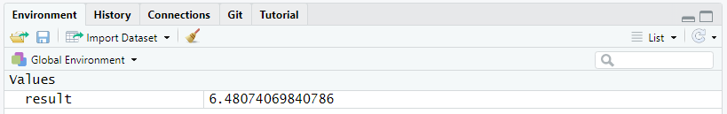

``` {r setup, include=FALSE}
knitr::opts_chunk$set(echo = TRUE, warning = FALSE)
library("tidyverse")

data(penguins, package = 'palmerpenguins')

source("../Templates/biostats_theme.R")
theme_set(theme_biostats)
```

### Before we start {- .facta .toc-ignore}

You must have successfully installed both R and RStudio on your machine. 
You must know how to install and activate a package.  


# Basic operations in R

## Arithmetic operations

Performing arithmetic operations is no big deal in R. 
Simply write any operation using the usual arithmetic operators `+`, `-`, `*` and `/` and run your code. 
No need to type `=`.  

R allows you to add parentheses `(` `)` when you need to impose the order of operations.
When it comes to raising a number to the power of another one, use the symbol `^` or `**`. 

Try this here in the following app with the example `4+9`, or any other operation of your choice. 
Try to use `(` `)`, try to combine several of the above-mentioned operators, be creative! 


<!---app1-->

<iframe class="app" src="https://bioceed.shinyapps.io/First_Steps_In_R_1/"  frameborder="no" height="250px" width="100%"></iframe>

<!--------->


## Operations with functions

More complex operations such as square root, logarithms and exponentiation shall be run using specific functions. 
These functions are `sqrt()`, `log()`, `ln()`, `exp()`,  etc. 


<!---app2-->

<iframe class="app" src="https://bioceed2.shinyapps.io/First_Steps_In_R_2/"  frameborder="no" height="450px" width="100%"></iframe>

<!--------->

## Comparisons

You can compare 2 elements using the following operators:

+ `>`    greater than, 
+ `>=`   greater than or equal to, 
+ `<`    less than,
+ `<=`   less than or equal to,
+ `==`   equal to,
+ `!=`   not equal to.

When comparing two elements, R returns either `TRUE` or `FALSE`.

```{r comp, echo = TRUE}
9^2 != 9*(3+6)
```

# Storing data in objects

R uses objects to store data in memory. 
Storing data in an object is referred to as "assigning data".
There are different types of data and objects; we will talk much more about them further below.
For now, let's see why one should assign data to objects, and how to do it.

## Why assigning data?

Putting data into named objects allows you to:

+ store *massive* amounts of data and/or code for later reuse in calculations, analysis, plots and figures,
+ *divide* your code into separate steps, each of which is clearly identifiable by name and thus reusable,
+ *simplify* your code by referring to previous calculations or plots.

```{r palmercode, echo=FALSE}
library(palmerpenguins)
library(dplyr)
library(ggplot2)
library(patchwork)
# Jitter plot example
plot3 <- ggplot(data = penguins, aes(x = species, y = body_mass_g)) +
           geom_jitter(aes(color = species),
              width = 0.1,
              alpha = 0.7,
              show.legend = FALSE) +
         scale_color_manual(values = c("darkorange","darkorchid","cyan4"))

# Histogram example
plot2 <- ggplot(data = penguins, aes(x = flipper_length_mm)) +
  geom_histogram(aes(fill = species), alpha = 0.5, position = "identity", bins = 30) +
  scale_fill_manual(values = c("darkorange","darkorchid","cyan4"))

# Count penguins for each species / sex
plot1 <- ggplot(penguins, aes(x = sex, fill = species)) +
  geom_bar(alpha = 0.8) +
  scale_fill_manual(values = c("darkorange","purple","cyan4"),
                    guide = FALSE) +
  theme_minimal() +
  facet_wrap(~species, ncol = 1) +
  coord_flip()
```


Let's take a look at the following figure. It is made of 3 plots, each of them based on different variables taken from a single data set: 

```{r palmer-figure, echo = FALSE}
plot1 / (plot2 + plot3)
```

Believe it or not, but the code that builds this figure is as simple as this: 

```{r finalcode, eval=FALSE}
plot1 / (plot2 + plot3)
```

In fact, everything that R needed in order to make the figure had been previously stored in the objects `plot1`, `plot2` and `plot3`. 

The clear benefit of assigning data into the above-mentioned objects is that it simplified a lot the code for the figure.


## Assigning data to an object

To assign data to an object, type first the name you want to give it followed by the operator `<-` and the data to store. 
In the following example, we will assign the result of the operation `sqrt(42)` in memory to the object named `result`: 

```{r result, echo=TRUE}
result <- sqrt(42)
```

At once, the object `result` and its associated value show up in the `Environment` tab of RStudio. 

```{r stored_result, echo = FALSE, out.width="100%"}

```

From now on, you can display the content of `result` simply by typing its name:
```{r display_result, echo=TRUE}
result
```

You can also reuse the object for other operations:
```{r operations_result, echo=TRUE}
result*3
result*result
```

## Modifying object content

To modify the content of an object, you simply have to assign new data to it. 
Here we modify the object `result`:
```{r modify_result, echo=TRUE}
result <- exp(42)
```

The content of `result` is automatically modify, as shown in the Environment tab.

```{r updated_result, echo = FALSE, out.width="100%"}
knitr::include_graphics("Pics/new_result.png")
```

Note that the previous content of `result` is lost as soon as the new data is assigned. 
To restore the original value, you will have to go back to your script and rerun the original command that assigned the square root of 42 to `result`.
This is one of the many reasons why you should always work with a script and annotate it: it is your life line in case you make a mistake, lose objects, modify data elements, etc.


## Concatenating data

If you want to assign more than one data element to an object, use the function `c()` which concatenates the elements given between parentheses. 
By concatenating data elements and assigning them to an object, you create a *vector*, one of the simplest objects in R. 
We will look further at vectors in section \@ref(vectors).  
The data elements to concatenate must be separated with a comma `,`.

```{r concatenate}
results <- c(42, sqrt(42), 42^2)
results
```

This may be applied not only to numerical values, but also to characters and strings. 
When storing characters, you must use quotation marks `"` `"` around the elements.

```{r concatenate2}
one_two_three <- c("one", "two", "three")
one_two_three
```

Note that you may concatenate data elements of various natures. 
Here we concatenate and store both numbers and strings: 

```{r concatenate3}
one_2_three_4 <- c("one", 2, "three", 4)
one_2_three_4
```


## Naming objects

Naming an object sounds quite easy if you are creative, but there is a set of rules to respect:

+ names must start with a letter (lower or upper case) or a dot `.`, nothing else!
+ names may include letters (lower and/or upper case), numbers, underscores `_` and dots `.`
+ you cannot use *reserved* names, i.e. names of existing functions or words already used in R (`TRUE`, `FALSE`, `break`, `function`, `if`, `for`, `NA`, `function`, see the complete list by running `?Reserved` in the console)

Beside these rules, you may find the following recommendations useful: 

+ be consistent and use a word convention when writing names, such as `snake_case` where words are written in lowercase and separated using an underscore symbol `_`
+ give your object a meaningful name such as `norwegian_seabirds`, `alpine_species_vestland`, etc
+ avoid names which meaning may change with time, such as `new_dataset`, `modified_dataset`, `last_year_data`, etc
+ avoid very long names
+ have a look at the [tidyverse style guide](https://style.tidyverse.org/syntax.html#object-names){target="_blank"}


We have prepared a tutorial that further describes the rules for naming objects, and gives you a chance to test how well you have understood. 
This tutorial is available both in the form of a web app and a _learnr_-tutorial.  

You can open the web app directly in your favorite net browser by clicking  [HERE](https://bioceed.shinyapps.io/naming_objects/){target="_blank"}.

The _learnr_-tutorial runs directly in RStudio. 
It is available after installing the package `biostats.tutorials` via the console. 
To do so, use the following line of code:
```{r install-the-tutorial, echo=TRUE, eval=FALSE}
remotes::install_github("biostats-r/biostats.tutorials")
```

Then run the tutorial:
```{r run-the-tutorial, echo=TRUE, eval=FALSE}
learnr::run_tutorial("naming-objects", package = "biostats.tutorials")
```

Alternatively, go to the tab `Tutorial` in the top right quadrant of RStudio.
The tutorial is called `Naming objects`. 
Simply click on the button `Start Tutorial?` to the right to start it.


## Viewing object content

As introduced in [Getting Started with R](LINK){target="_blank"}, the `Environment` tab of RStudio lists all the objects stored in memory in a given project.
This list comes with a quick summary of both the structure and the content of the objects.  

The function `View()` applied to any object opens a new tab which displays the whole object in the form of a table. 
Figure \@ref(fig:view) shows a screenshot of the tab that appears after running `View()` on a large object called `tb`.

```{r View, echo=TRUE, eval=FALSE}
View(tb)
```

```{r view, echo = FALSE, eval = TRUE, fig.cap="_The function `View()` opens a tab with the content of the object._", out.width="100%"}
knitr::include_graphics("Pics/view.png")
```

`View()` is particularly useful when you want to quickly check entries directly in the data set as it spares you from finding and opening the original data file on your disk via the explorer.

## Deleting objects

When you are done with a particularly large object that takes a lot of memory and you do not have a use for it any longer, it may be relevant to get rid of it. 
This is done by using the function `rm()`.
Here we will delete `result` from the current environment.
```{r delete1}
rm(result)
```

To delete several objects at the same time, use `rm()` and type their name separated with commas `,`. 

```{r result-reborn}
result <- exp(42)
```

```{r delete2}
rm(result, results)
```

Again, once it is done, there is only one way back: go to your script and rerun the commands that originally created `result` and `results`.


# Creating sequences and series

Throughout this website, we will use examples that include random series of numbers, sequences of characters or numbers, etc. 
These sequences and series are often created by a bunch of functions or expressions, some of which are described below. 


## Repetitions

The function `rep()` comes handy when you wish to repeat data elements `n` times in a row, or to repeat a sequence of elements `n` times. 
Using various arguments, you can decide how many times and/or in which manner the elements or sequences have to be repeated.

The simplest form of usage of `rep()` is `rep(x, times= n)` where `x` is what you want to repeat (string, number(s), etc) and `n` the number of iterations.

```{r rep, echo=TRUE}
rep(c(1, 2, 3), times= 3)
rep(c("One", "Two", "Three"), times= 3)
```

The argument `each= n` allows for repeating `n` times each element at a time. 

```{r rep2, echo=TRUE}
rep(c(1, 2, 3), each= 3)
rep(c("One", "Two", "Three"), each= 3)
```

## Sequences

The following section provides you with expressions or functions that build sequences of numerical or text values.

### Using the colon operator

The colon separator `:` used in the expression `a:b` creates a series of consecutive numbers ranging from `a` to `b` with an increment of 1. 

```{r series, echo=TRUE}
14:24
```

Note that `b` is not necessarily the last element of the series.
```{r series2, echo=TRUE}
14:24.5
14.5:24
```

### The function seq()

Similar to `a:b`, `seq(a, b)` creates a series of consecutive numbers ranging from `a` to `b` with an increment of 1. 
```{r seq, echo=TRUE}
seq(14, 24)
```

Again, `b` is not necessarily the last element of the series.
```{r seq2, echo=TRUE}
seq(14, 24.5)
seq(14.5, 24)
```

You can use a set of additional arguments in `seq()` to adjust the output. 
Adding `by=` allows to tune the incrementation to any value you want (including decimal values). `length.out=` (or `length=`) adjusts the incrementation to provide the desired number of elements ranging precisely from `a` to `b`.

```{r seq3, echo=TRUE}
seq(14, 24, by=2.5)
seq(14, 24, length.out=7)
```

## Random series

The following section provides you with functions that build series of random, numerical values.

### The function runif()

`runif(n)` returns a series of `n` random numbers between 0 and 1.

```{r runif, echo=TRUE}
runif(7)
```

`runif(n, min=a, max=b)` returns a series of `n` random numbers in the range from `a` to `b`:

```{r runif2, echo=TRUE}
runif(7, min=10, max=100)
```


### The function rnorm()

`rnorm(n)` creates a series of `n` numbers taken from a normal distribution. 

```{r rnorm, echo=TRUE}
rnorm(10)
```

By default, the normally distributed population is set up with a mean of 0 and a standard deviation of 1, but this may be adjusted manually with `mean= ` and `sd= `.
```{r rnorm2, echo=TRUE}
rnorm(10, mean=50, sd=3)
```

### The function sample()

`sample(x, n, replace=TRUE/FALSE)` returns a sample of `n` integers randomly taken in the object `x` (which may be a vector, a series such as `1:100`, etc). 
`replace=` followed by either TRUE or FALSE defines whether or not a data element can appear repeatedly in the sample.

```{r sample, echo=TRUE}
sample(1:100, 10, replace=FALSE)
sample(20:30, 7, replace=TRUE)
```

An interesting property of the function `sample()` is that it can be used to shuffle the result of an expression or the content of a vector, something which is useful for randomization of data elements. 
In the following example, `sample()` shuffles and returns all the values in `1:10`:
```{r sample2, echo=TRUE}
sample(1:10)
```


# Data types and objects

Objects may contain anything from a single numerical value to a fully developed data set with dozens of variables and thousands of observations. 
When working in R, it is important to understand what kind of data you manipulate and what kind of object you build from it. 

Here we will first review the primitive data types, then see a few useful data classes, and finally the object types that will be important in your studies. 


## Primitive data types

R lets you manipulate 6 primitive data types: numeric, integer, character, logical (also called boolean), complex and raw. 
Only the first four types are relevant in the scope of this website.

NB: in the following sections, we will use the function `class()` to identify the nature of the data stored in objects.

### numeric

Any number with a decimal value, whether positive or negative, is of type numeric. 
The object `num` created below contains a single decimal value and is thus also numeric.

```{r numeric, echo = TRUE}
num <- -35.2
class(num)
```

### integer

Integers are positive or negative numbers that do not contain a decimal value. 
The object `int` below contains a single integer and is thus of type integer.

```{r integer, echo = TRUE}
int <- 35L
class(int)
```

Note that `int` was assigned the number 35L. 
The "L" that follows the number forces the object to store it as an integer. 
If we write 35 instead of 35L, the object is just numeric as shown below.

```{r numeric2, echo = TRUE}
int <- 35
class(int)
```

### character

An object containing a string of letters combined (or not) with numbers, or even a single letter, is of type character. 
The letters may be upper and/or lower case. 
The object `char` below contains a single word and is thus defined as character.

```{r character, echo = TRUE}
char <- "Letters"
class(char)
```

Note that the strings of characters must be stored in objects using `"` `"`.

### logical

Logical (or boolean) defines binary objects which contain `TRUE` or `FALSE`. 
This is the case of the object `logic` below.

```{r boolean, echo = TRUE}
logic <- TRUE
class(logic)
```

Note that `TRUE` and `FALSE` are sometimes replaced with "T" or "F". Be warned that this is bad coding practice, which may result in (or be the origin of) errors that may compromise your work and the validity of its output.

### Modifying data types

It is possible to modify the type of an existing object with a series of simple functions like `as.numeric()`, `as.integer()`, `as.character()`, etc. 

Let's consider the object `integ` created below. 

```{r integ, echo = TRUE}
integ <- 35L
integ
```

`integ` contains a single data element (`35L`) which is defined as an integer:

```{r integ-class, echo = TRUE}
class(integ)
```

`integ` may be transformed into a simple numerical value by using the function `as.numeric()`:
```{r int-num, echo = TRUE}
integ_num <- as.numeric(integ)
class(integ_num)
```

And it is possible to reverse this action with `as.integer()`:
```{r num-int, echo = TRUE}
integ_int <- as.integer(integ_num)
class(integ_int)
```

It is also possible to transform it into a string of characters with `as.character()`:
```{r int-char, echo = TRUE}
integ_char <- as.character(integ)
class(integ_char)
```


## Advanced data classes

R allows to transform the format of an object from something simple like a number or a string of characters to something more advanced like a date or a factor. 
Date and factor are not data types *per se*, but data classes.

### Dates

The data element `1980-02-08` stored in the object `birthdate` below is nothing more than a string of characters.
```{r birthdate, echo = TRUE}
birthday <- "1980-02-08"
birthday
class(birthday)
```

To make it a date object, one must use the function `as.Date()`:
```{r birthdate2, echo = TRUE}
birthdate <- as.Date(birthday)
birthdate
class(birthdate)
```

Even though this does not seem to affect the way the data element is displayed, such a conversion is determining with regard to how th element is going to be handled in calculations. 
The calculation below displays the date that occurs 10 days before `birthdate`:

```{r birthdate3, echo = TRUE}
ten_days_before_my_birthdate <- birthdate - 10
ten_days_before_my_birthdate
```

Such a calculation would not have been possible without the conversion from character to date, as demonstrated by this error message:

```{r birthdate4, echo = TRUE, error = TRUE, warning=TRUE}
ten_days_before_my_birthday <- birthday - 10
```

### Factors

A factor is an object that only contains predefined values. 
These predefined values are called the *levels* of the factor. 
Factors are especially useful in the context of statistical analysis where categorical data are involved (like ANOVA, etc). 
Categories often appear as "text labels", and may thus look like simple strings of characters. 

In the following example, the object `scandinavian_countries` is a factor that contains 7 elements and three levels: `Norway`, `Sweden` and `Denmark`.

```{r scandia1, echo = FALSE}
scandinavian_countries <- factor(c("Norway", "Denmark", "Sweden", "Denmark", "Sweden", "Norway", "Denmark"), levels= c("Norway", "Denmark", "Sweden"))
```

```{r scandia2, echo = TRUE}
scandinavian_countries 
class(scandinavian_countries)
```


One way to build such a factor consists in converting a character object such as `scandinavia` with the function `factor()`.
However, one must not forget to set the levels correctly with the argument `levels=`.
```{r scandia3, echo = TRUE}
scandinavia <- c("Norway", "Denmark", "Sweden", "Denmark", "Sweden", "Norway", "Denmark")
scandinavian_kingdoms <- factor(scandinavia, levels=c("Norway", "Denmark", "Sweden"))
scandinavian_kingdoms
```


## Objects

Data in R may be stored in a multitude of object types, but the most important ones are vector, matrix, list, data frame and tibble.

### Vectors

A vector is an object that contains one or several values of the *same* data type. 
For example, the object `vec.char` described below is a vector that contains 3 data elements of the type character. 

```{r vector, echo=TRUE}
vec.char <- c("one", "two", "three")
vec.char
```

When conducting a statistical analysis, a vector is possibly the simplest object in which you may store entries for a single variable. 
In the following example, 24 data points corresponding to the temperature for a specific location registered over a period of 24 hours have been stored in the vector `temperature`: 

```{r temperature, echo=FALSE}
temperature <- c(8.7,9.2,9.4,9.5,9.7,10.1,10.3,10.6,10.7,10.8,11.3,11.9,12.2,12.3,11.7,10.2,10.3,10.3,10.4,10.3,10.1,9.7,9.5,9.4)
``` 

```{r temperature2, echo=TRUE}
temperature
``` 

Note that the data type of the whole vector is determined by the type of the elements it contains, as shown here:

```{r temperature-class, echo=TRUE}
class(temperature)
```

#### Coercion

If one tries to store data elements of different types in a single vector, all the elements in this vector will be coerced into the type that is the most informative.  
The ranking is as follows: logical < integer < numeric < character.  
Let's take the following example where we store a numeric, a character and an integer together:

```{r coercion, echo=TRUE}
coercion <- c(15, "fifteen", 15L)
class(coercion)
```

As you see here the type of `coercion` is character, in other words the type of the most informative data element.

#### Accessing data elements

It is possible to extract specific data elements from a vector based on their position.
To do so, we use brackets `[` `]`. 
Indicate first the vector name and then the element position(s) between the brackets:

```{r vector-ret, echo=TRUE}
temperature[c(2, 6)] 
```

### Matrices

A matrix is a two-dimensional object that displays data of the *same* type (numeric, character, etc) in the form of a table. 
It is built up with the function `matrix()` in which the data is imported either in the form of concatenated data elements (ex: `c(12, 54, 987, 5, ...)`), a series or sequence of data elements (ex: `1:25`), or a vector (ex: `temperature`). 
In addition, one must define the number of rows and columns with `nrow=` and `ncol=`.   

In the following example, the object `neo` is a matrix made of 4 rows and 6 columns filled with the numeric values stored in the vector `temperature` that we have previously created.

```{r matrix, echo=TRUE}
neo <- matrix(temperature, nrow=4, ncol=6)
neo 
```


#### Accessing data elements

In a matrix, each row is numbered `[x, ]` and each column is numbered `[ ,y]`.
Any of the data elements may be retrieved by using its coordinates `[x, y]` preceded by the name of the matrix:

```{r matrix2, echo=TRUE}
neo[2,3]
```

A full row or column may be retrieved with the same expression, but we leave empty the coordinate that is not needed:

```{r matrix3, echo=TRUE}
neo[2,  ]

neo[ , 3]
```

#### About the use of matrices

The use of matrices on this website is very limited.
However, it is not unlikely that you meet matrices in other projects, so it is best to know about their existence.
You can read more about matrices [here](https://www.rdocumentation.org/packages/base/versions/3.6.2/topics/matrix){target="_blank"}.

### Lists

A list is an object that contains values of *one or several* data types. 
It can not only contain single data elements, but also other objects such as vectors, matrices, etc.  

Lists are created by the mean of the function `list()` that concatenates data elements and objects.
`list()` conveniently allows for naming the elements by the mean of the symbol `=`.  

In the example below, we will store 6 elements and name them `string`, `number`, `temp`, `boolean`, `words` and `matrix`. 
Among these elements to be stored are `vec.char`, `temperature` and `neo`, 3 objects that we have created further above on this page. 

```{r list2, echo=TRUE}
my_list <- list(string = "one", 
                number = 2, 
                temp = temperature, 
                boolean = TRUE, 
                words = vec.char, 
                matrix = neo)
my_list 
```

#### Retrieving list elements

Naming elements is quite convenient as it allows you to retrieve them rapidly by the mean of the symbol `$`. 
The syntax is as follows: `list_name$element_name`.  
Here we retrieve the element `matrix` in the list `my_list`:

```{r listdollar, echo=TRUE} 
my_list$matrix
```

#### Retrieving single data elements

Even better, you can retrieve a single data element contained in a list element. 
Here you will have to write an expression that makes use of both the symbol `$` and the brackets `[` `]`in the proper order. 
The syntax is as follows: `list_name$element_name[data]`.  
In this first example, we retrieve the data element located at the third position of the object named `words` in the list `my_list`:

```{r list-element-data, echo=TRUE} 
my_list$words[3]
```

In the second example, we retrieve the data element located at the second row and third column of the matrix named `matrix` in the list `my_list`:

```{r list-element-data2, echo=TRUE} 
my_list$matrix[2,3]
```


You may read more information about lists [here](https://www.rdocumentation.org/packages/base/versions/3.6.2/topics/list){target="_blank"}.

### Data frames and tibbles

A data frame is a two-dimensional object that stores data of *various* types in the form of a table. 
Data frames are a popular way to store research data since the columns are usually associated with single variables (and are thus of a specific data type such as numeric or character) and rows are associated with observations.

Until recently, data frames were the main storage objects for research data. 
Nowadays, tibbles (an evolution of the data frame that appeared in the tidyverse) replace data frames as they are viewed as more practical to handle data sets (you will understand why further below).
Because of this trend, we will focus mainly on tibbles here in this section and further on this website.
It is however likely that you will meet data frames in the course of your studies. 
Do not worry as we will see how to transform data frames into tibbles.

Tibbles being a standard introduced in `tidyverse`, you must make sure that the package is active before using these objects. 
Simply run this command first:

```{r load tydiverse, echo=TRUE}
library(tidyverse)
```

NB: if you have not installed the package yet, have a look at the section [Installing the tidyverse](LINK) in the chapter [Getting Started with R](LINK).

#### Data frames vs. tibbles

The object `df` printed below is a data frame that stores the average temperature recorded monthly in 2017, 2018 and 2019 at Lygra (Vestland, Norway). It is created with the function `data.frame()`.

```{r df, echo=TRUE}
df <- data.frame(Year = rep(2017:2019, each = 12), 
                 Month = rep(month.name, 3), 
                 Avg_temperature = c(3.4,2.8,4.2,5.8,11.4,12.6,14.6,13.9,13.7,9.2,4.3,3.1,2.3,0.5,0.8,6.7,13.5,13.6,16.2,13.8,11.6,8.0,6.6,3.9,1.7,4.6,4.0,9.1,8.8,13.2,15.4,15.8,11.6,7.8,3.6,4.8))
df
```
As you may see, you get at once the _whole_ data set with all 36 rows, the 3 variables, the header with column names and the first column that gives a number to each row.  

The object `tbl` below is a tibble that contains exactly the same observations and variables as `df`. It is built up by the function `tibble()`.  

```{r tbl, echo=TRUE}
tbl <- tibble(Year = rep(2017:2019, each = 12), 
             Month = rep(month.name, 3), 
             Avg_temperature = c(3.4,2.8,4.2,5.8,11.4,12.6,14.6,13.9,13.7,9.2,4.3,3.1,2.3,0.5,0.8,6.7,13.5,13.6,16.2,13.8,11.6,8.0,6.6,3.9,1.7,4.6,4.0,9.1,8.8,13.2,15.4,15.8,11.6,7.8,3.6,4.8))
tbl
```

Here, you get a more convenient display of the same data:

+ only the first 10 rows and the header are displayed,
+ the number of rows _not_ printed is displayed in the present window (`# ... with 26 more rows`),
+ the dimensions of the tibble appear clearly in the header (`# A tibble: 36 x 3`),
+ the column names come along with a quick description of the data type (`<int>` for integer, `<chr>` for character, `<dbl>` for double, etc).

All in all, tibbles _print_ much better and give more information than data frames do! 


#### Retrieving data elements

Similarly to vectors, matrices and lists, one can extract single elements from data frames and tibbles.
Here, we use brackets `[` `]` to do so:
```{r dftbl2, echo=TRUE}
df[3, "Avg_temperature"]
tbl[3, "Avg_temperature"]
```

One can also retrieve rows or columns:

```{r dftbl3, echo=TRUE}
df[3, ]
tbl[3, ]
df[ , "Avg_temperature"]
tbl[ , "Avg_temperature"]
```

It is also possible to use the symbol `$` to retrieve the content of specific variables:

```{r dftbl3bis, echo=TRUE}
df$Avg_temperature
tbl$Avg_temperature
```


#### Transforming a data frame into a tibble

If you have been previously working with data frames, have been given a data frame to work with, or have imported data using functions that create data frames, you may convert them into tibbles by using `as_tibble()`. 
Here we convert the data frame `df` into a tibble:

```{r df-tibble, echo=TRUE}
df_as_tibble <- as_tibble(df)
df_as_tibble 
```

#### Penguins as a recurrent example

Here is the tibble called `penguins` which is part of the package `palmerpenguins`, and which was used previously in section  \@ref(why-assigning-data). 
You will certainly meet this tibble again and again on this website as it provides a convenient set of variables and observations well-suited for illustrating many purposes.

```{r penguins-tibble, echo=TRUE}
penguins
```

Here is the citation for the corresponding package:
```{r penguins-citation, echo=TRUE}
citation("palmerpenguins")
```

You may read more about tibbles [here](https://tibble.tidyverse.org/){target="_blank"}.  
You may read more about data frames [here](https://www.rdocumentation.org/packages/base/versions/3.6.2/topics/data.frame){target="_blank"}.


### Further Reading {- .literature .toc-ignore}

+ [R for data science](https://r4ds.had.co.nz/){target="_blank"}
+ [The tidyverse](https://www.tidyverse.org/){target="_blank"}


### What's next {- .facta .toc-ignore}

Now that you know the basics of R and that you have all the tools to "manually" create R objects, you will learn how to import a data set from an external source. 
We will see how to read and fetch data from various file types such as .txt, .csv, .xls, .xlsx, and directly store it in tibbles.


### Contributors {- .contributors .toc-ignore}

+ Jonathan Soulé
+ Aud Halbritter
+ Richard Telford
