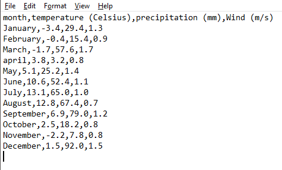
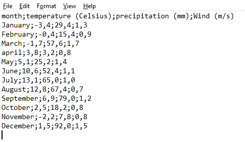
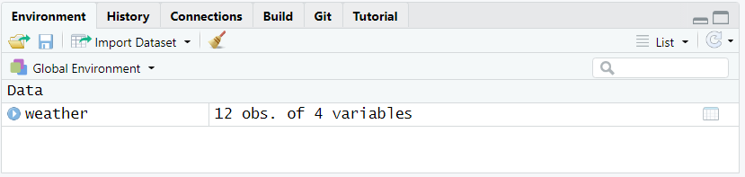
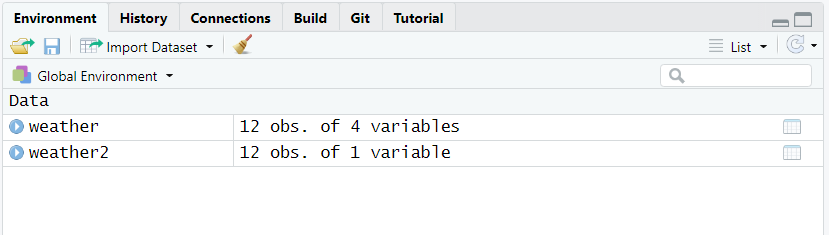
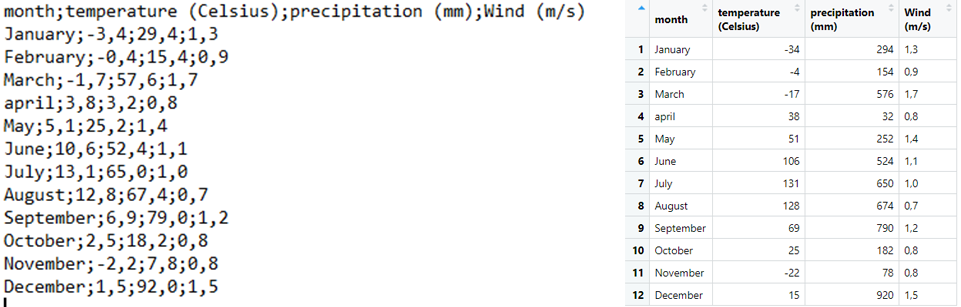

  
``` {r setup, include=FALSE}
knitr::opts_chunk$set(echo = TRUE, warning = FALSE)
library(tidyverse)

data(penguins, package = 'palmerpenguins')

source("../Templates/biostats_theme.R")

```

### Before we start {- .facta .toc-ignore}

You must be familiar with assigning data into objects, tibbles and data types (such as numeric, character, etc).

# {- .toc-ignore}


In this chapter, you will learn how to import data from a plain text file into a tibble. 
We will use functions from the package `readr` which is part of the package `tidyverse`, so make sure that you have activated it with `library(tidyverse)`.  

# Tabular data

## What is tabular data? 


Tabular data is data that is organized in the form of a table with rows and columns. 
A table often has a header, i.e. an additional row that displays variable names.
Here is an example of a formatted table with header:


``` {r kable, echo=FALSE, message=FALSE}
table <- read_delim(file = "Files/weather.csv", delim = ",")
knitr::kable(table, caption  ="_A simple table with header_")
```

In this example, the table consists of 4 variables (columns) and 12 observations (rows) in addition to the header (top row). 


## About tidy data

Sooner or later, you will read about *tidy data* which is a standard, consistent way to organize tabular data in R. 
Briefly, tidy data follows a short series of rules:

+ each variable in the data set is presented in a specific column,
+ each observation in the data set is presented in a specific row,
+ each cell at the intersection of a row and a column contains a single value.

Importing data from a file containing tidy data is a great way to start your work, but it is *not* a prerequisite to data import.
As long as your data is tabular, you will be able to import it in R, and later you will have the chance to tidy it (see chapter [Data handling and transforming](link){target="_blank"}).


## File formats

There are different formats in which tabular data is stored in plain-text files.
The most common format is CSV, which stands for **C**omma-**S**eparated **V**alues.
It is this format that we are going to deal with here.
In a CSV file, the data is stored in a  similar manner to this: 

``` {r csv-data, echo=FALSE, fig.cap="_Contents of a CSV file_", out.width="75%"}

```

For information, this file (here displayed in the text editor Notepad) matches the example in Table \@ref(tab:kable).
Each line corresponds to a row in the table (including header) and cell contents are separated with a comma `,`.
Note that `.` is used as decimal separator.

The CSV format is however not universal. 
Other symbols such as `;` may be used as delimiter.
Sometimes CSV is also confused with delimiter-separated formats, in which other delimiters like `|` or tabs replace commas. 
In European countries where commas are decimal separator, a semi-colon `;` delimits data fields in CSV files.
Here is the same data set as above, this time in the European format:

``` {r csv2-data, echo=FALSE, fig.cap="_Contents of another CSV file_", out.width="75%"}

```

## Know your data!

There are several reasons why different symbols are used in CSV files.
Among these reasons are:

+ locale, i.e. the parameters that define the language and regional settings (currency, time and date, number format setting) in use on your machine,
+ software-based preferences, the settings which are defined _by default_ by the software that you have used to punch your data,
+ user-based preferences, the settings that _you_ choose when punching or saving data.

It is thus very important to know what your CSV file is made of.
We therefore recommend to systematically inspect your data file before importing in R.
One way to do it is simply to open the file in a text editor (or visualize it in RStudio) and define:

+ which symbol is used as decimal separator (`,` or `.`),
+ which symbol is used as delimiter (`,` or `;`).


# The package Readr

`readr` is a package which is part of the `tidyverse` family.
`readr` comes with several functions that can import your data file. 
Among them are:

+ `read_delim()`,
+ `read_csv()`,
+ `read_csv2()`.

We will focus essentially on `read_delim()` as it can import all the formats. 
`read_csv()` and `read_csv2()` are simplified version of `read_delim()` which are preset to import CSV files in which a comma `,` or a semi-colon `;` is defined as delimiter, respectively.


## read_delim()

`read_delim()` is a simple function that does several things at once. First, it finds and reads the file to import. Then it looks at the first 1000 rows of the file and guesses the number of variables and rows, and the data type for each variable. Finally, it creates a *tibble* and puts the data in it while keeping the order of both the columns and rows and the nature of the data.

In its simplest form, `read_delim()` only needs to know two things about your data file:

+ where to find it,
+ which delimiter to consider.

The argument to locate the file on your machine is `file = " "`, and the argument to indicate the delimiter is `delim = " "`. 

In the following example, we import the file `weather.csv` located in the subfolder `Files` of the current RStudio project into the object `weather`. In `weather.csv`, the delimiter is `,` and the decimal separator is `.`

```{r delim-csv, echo=TRUE} 
weather <- read_delim(file = "Files/weather.csv", delim = ",")
```
When the function is executed, the console shows a short series of warnings and messages.
In the frame above, the message `Column specification` tells you that the content of the column `month` has been recognized as of data type `character`, and that the three other columns have been recognized as `double` (which is similar to `numeric`).  

Now the tibble `weather` is available in R as you may see in the tab `Environment` (see figure \@ref(fig:csv-env)). 

``` {r csv-env, echo=FALSE, fig.cap="_The tibble_ weather _is now stored in R._", out.width="100%"}

```

The content of the tibble is as follows:

```{r weather, echo=TRUE} 
weather
```

### Choose the right delimiter

The example above is rather simple and straight forward, but you may experience some issues depending on the content of the CSV file.
Relatively often, one tries to import CSV files assuming that `,` has been used as delimiter.
Here is what happens when doing this assumption for a file (`weather2.csv`) where `;` was in fact used as delimiter:

```{r delim-csv2, echo=TRUE} 
weather2 <- read_delim(file = "Files/weather2.csv", delim = ",")
```
The message `Column specification` tells you that the content of the whole CSV file has been transferred into one single column named `month;temperature (Celsius);precipitation (mm);Wind (m/s)` and recognized as of data type `character`.
Accordingly, the object `weather2`, now visible in the tab `Environment` (see figure \@ref(fig:csv-env2)), is described as a tibble with 12 observations and only one variable.

``` {r csv-env2, echo=FALSE, fig.cap="_The tibble_ weather2 _is now stored, but is wrongly formatted._", out.width="100%"}

```

The content of the resulting tibble is as follows:
```{r weather2, echo=TRUE} 
weather2
```


This shows how important it is to review the data before importing it. 
A quick check would have revealed the use of `;` as delimiter in `weather2.csv`, and you would have certainly used the follow code to import it. 

```{r delim-csv2bis, echo=TRUE} 
weather2 <- read_delim(file = "Files/weather2.csv", delim = ";")
```
Here, the message `Column specification` tells you that the content of the columns `month` and `Wind (m/s)` has been recognized as of data type `character`, and that the two other columns have been recognized as `double`. While `read_delim()` got things right about the number of variables, something went wrong with the variables as we could expect `Wind (m/s)` to be recognized as `double`.
To find out about this issue we need to review the imported data in the object `weather2` and compare it to the original file `weather2.csv`.

### Review the imported data

The example above shows the importance of carefully verifying that the imported data in R matches the original data set.
The following figure compares the content of the file `weather2.csv` (Fig. \@ref(fig:comp) left) to the content of the object `weather2` (Fig. \@ref(fig:comp) right):

``` {r comp, echo=FALSE, fig.cap="_The data in the object does not match the data in the file._", out.width="100%"}

```

Looking at the rows in both pictures, one can understand that all commas have simply been ignored, excepted those in the last column.
This is a problem that may occur when the decimal separator used in the file is different from the decimal separator defined by your system (a.k.a locale).
To solve that issue, you must impose the separator using `locale = locale(decimal_mark = ",")`:

```{r delim-csv2ter, echo=TRUE} 
weather3 <- read_delim(file = "Files/weather2.csv", delim = ";", locale = locale(decimal_mark = ","))
```

The last column is now recognized as `double` and the data in the object `weather3` matches the data in the file:
``` {r comp2, echo=FALSE, fig.cap="_The data in the object now matches the data in the file._", out.width="100%"}

```


## Other functions

As we have seen in the section above, `read_delim()` can read CSV files where `,` and `;` are used as delimiters.
`readr` also comes with other functions such as `read_csv()` and `read_csv2()` which are "clones" of `read_delim()` where the argument `delim =` is preset to  `delim = ","` and `delim = ";"`, respectively. 
Thus, the only argument that is strictly required is `file = " "` to determine the path of the file.

Here are two examples. The first one shows the use of `read_csv()`:

```{r read-csv, echo=TRUE} 
weather_csv <- read_csv(file = "Files/weather.csv")
```

The resulting tibble looks correct:

```{r read-csv-tibble, echo=TRUE} 
weather_csv
```


The second one shows the use of `read_csv2()`:

```{r read-csv2, echo=TRUE} 
weather_csv2 <- read_csv2(file = "Files/weather2.csv")
```

Note the message above `Column specification` that indicates which symbols `read_csv2()` has considered when importing the data. The resulting tibble looks correct:

```{r read-csv-tibble2, echo=TRUE} 
weather_csv2
```


### Further Reading {- .literature .toc-ignore}

You may find the following links useful:

+ [R for Data Science - Data import](https://r4ds.had.co.nz/data-import.html){target="_blank"}
+ [Data Import Cheatsheet - readr/tidyr](https://github.com/rstudio/cheatsheets/raw/master/data-import.pdf){target="_blank"}
+ [readr](https://readr.tidyverse.org/){target="_blank"}


### Contributors {- .contributors .toc-ignore}

+ Jonathan Soulé
+ Aud Halbritter
+ Richard Telford

