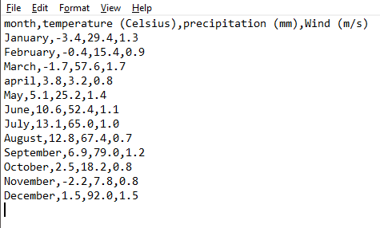
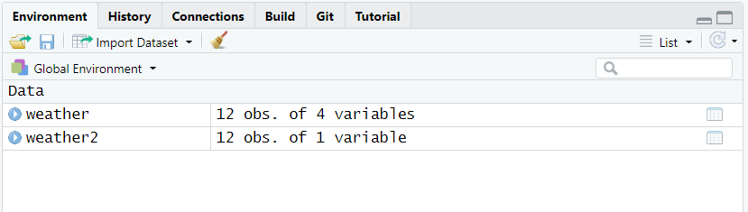

# Importing data in R

R can import data from files in many different formats. 
For example:

 - csv files with the `readr` package
 - excel files with the `readxl` package
 - xlm files with the `xml2` package
 - netcdf files with the `ncdf4` package
 - shapefiles with the `sf` package
 
In this chapter, you will learn how to import tabular data from an external text file as a tibble.
We will use functions from the package `readr` which is part of the `tidyverse` package, so make sure that you have activated it with `library(tidyverse)`. 

### Before we start {- .facta .toc-ignore}

You must be familiar with tibbles and data types (such as numeric, character, etc).


## What are tabular data? 

Tabular data are data that is organized in the form of a table with rows and columns. 
A table often has a header, i.e. an additional row that displays variable names.
Here is an example of a formatted table with header:


``` {r kable, echo=FALSE, message=FALSE}
table <- read_delim(file = "data/weather.csv", delim = ",")
knitr::kable(table, caption  ="_A simple table with header_")
```

In this example, the table consists of 4 variables (columns) and 12 observations (rows) in addition to the header (top row). 
All cell contents are clearly delimited.  

Below is an example of a *non*-tabular dataset. 
This dataset is a list of profiles with recurrent fields (`Name`, `Position`, `Institution`). 
Each profile contains three lines with a `field:value` pair. 

```{r nontabular, echo = FALSE}
cat(readLines('data/profile.txt'), sep = '\n')
```


## About tidy data

Sooner or later, you will read about *tidy data* which is a standard, consistent way to organize tabular data in R. 
Briefly, tidy data follows a short series of rules:

+ each variable in the data set is presented in a specific column,
+ each observation in the data set is presented in a specific row,
+ each cell at the intersection of a row and a column contains a single value.

The following figure illustrates well these rules.

``` {r threerules, echo=FALSE, fig.cap='_In a tidy dataset, variables are in columns, observations are in rows, and values are in cells._ --- Source: [R for Data Science](https://r4ds.had.co.nz/tidy-data.html) - [CC BY-NC-ND 3.0 US](https://creativecommons.org/licenses/by-nc-nd/3.0/us/)'}
knitr::include_graphics("Pics/tidy1.png")
```


The dataset presented in Table \@ref(tab:kable) respects all three rules, and is thus a tidy dataset.  

On the contrary, the following dataset is *not* tidy:
``` {r tidy, echo=FALSE, message=FALSE}
table2 <- read_delim(file = "data/nottidy.csv", delim = ";")
rmarkdown::paged_table(table2)
```
Indeed, at least one of the rules is broken since columns display data matching several variables (Date, time, Weather, etc).   

Importing data from a file containing tidy data is a great way to start your work, but it is *not* a prerequisite to data import.
As long as your data is tabular, you will be able to import it in R, and later you will have the chance to tidy it (see chapter \@ref(tidying-data-with-tidyr)).


## File formats

Tabular data may be stored in files using various formats, spreadsheets, etc. 
The most common spreadsheets store data in their own, proprietary file format, e.g. MS Excel which produces `.xls` and `.xlsx` files.
Such formats may be a limitation to data management in R.
Simpler formats such as plain text files with `.txt` or `.csv` should always be preferred when saving or exporting data from spreadsheets.


### The CSV format

One of the most common format for storing tabular data in plain text files is CSV, which stands for **C**omma-**S**eparated **V**alues.
It is this format that we are going to deal with here.
Note that CSV-formatted files often have (but not always) a `.csv` extension. They may also have a regular `.txt` extension.  

In a CSV-formatted file, the data is stored in a similar manner to this: 

``` {r csv-data, echo=FALSE, fig.cap="_Contents of a CSV file viewed in the text editor Notepad_", out.width="75%"}

```

For information, this file matches the example in Table \@ref(tab:kable).
Each line corresponds to a row in the table (including header) and cell contents are separated with a comma `,`.
Note that the period symbol `.` is used as decimal separator.

The use of commas in the CSV format is however not universal. 
Other symbols such as a semi-colon `;` may be used as a delimiter.
This is the case in several European countries where commas are decimal separator.
Here is the same data set as above, this time in the European format:

``` {r csv2-data, echo=FALSE, fig.cap="_Contents of another CSV file_", out.width="75%"}
knitr::include_graphics("Pics/csv2.png")
```

Finally, you should know that there exist other delimiter-separated formats, in which delimiters like `|` or tabs replace commas. 


## Know your data!

There are several reasons why different symbols are used in CSV files.
Among these reasons are:

+ locale, i.e. the parameters that define the language and regional settings (currency, time and date, number format setting) in use on your machine,
+ software-based preferences, the settings which are defined _by default_ by the software that you have used to punch your data,
+ user-based preferences, the settings that _you_ choose when punching or saving data.

It is thus very important to know what your CSV file is made of.
We therefore recommend to systematically inspect your data file before importing in R.
One way to do it is to open the file with `cat(readLines('file.txt'), sep = '\n')` and define:

+ which symbol is used as decimal separator (`,` or `.`),
+ which symbol is used as delimiter (`,` or `;`).  

Here is our previous example:
```{r readLines, echo = TRUE}
cat(readLines('data/weather.csv'), sep = '\n')
```
In this file, the decimal separator is `.` and the delimiter is `,`.


## Import with readr

`readr` comes with several functions that read data files. 
Among them are:

+ `read_delim()`,
+ `read_csv()`,
+ `read_csv2()`.

We will focus essentially on `read_delim()` as it is a general function that can import all the formats. 
`read_csv()` and `read_csv2()` are more specific functions which are preset to import CSV-formatted files in which a comma `,` or a semi-colon `;` is defined as delimiter, respectively.


### read_delim()

`read_delim()` is a simple function that does several things at once. 
First, it finds and reads the file to import. 
Then it looks at the first 1000 rows of the file and guesses the number of variables and rows, and the data type for each variable. 
Finally, it displays the data as a tibble keeping track of the order of both the columns and rows, and the nature of the data.

NB: the function does not automatically *store* the data after reading the file. 
This is why the tibble produced by `read_delim()` must be assigned to an object using `<-`.  

`read_delim()` has two main mandatory arguments:

+ `file = " "` which defines where to find the data file,
+ `delim = " "` which defines the symbol used as delimiter.

When searching for the file, R/RStudio uses the location of the current RStudio project as a root. 
As a consequence, you may simply write the file name if the file is in the same folder as your `.Rproj` file. 
Alternatively, write `[subfolder]/[filename]` if the file is in a subfolder.
For more info about projects, read section 5 of the chapter [Getting started with R](LINK){target="_blank"}.

In the following example, we import the file `weather.csv` located in the subfolder `data` of the current RStudio project into the object `weather`. 
In `weather.csv`, the delimiter is `,` and the decimal separator is `.`

```{r delim-csv, echo=TRUE} 
weather <- read_delim(file = "data/weather.csv", 
                      delim = ",")
```

When the function is executed, the console shows a short series of warnings and messages.
In the frame above, the message `Column specification` tells you that the content of the column `month` has been recognized as of data type `character`, and that the three other columns have been recognized as `double` (which is similar to `numeric`).  

Now the tibble `weather` is available in R as you may see in the tab `Environment` (see figure \@ref(fig:csv-env)). 

``` {r csv-env, echo=FALSE, fig.cap="_The tibble_ weather _is now stored in R._", out.width="100%"}
knitr::include_graphics("Pics/csv-env.png")
```

You can display the table as follows:

```{r weather, echo=TRUE} 
weather
```

#### Choose the right delimiter

The example above is rather simple and straight forward, but you may experience some issues depending on the content of the CSV file.
Relatively often, one tries to import CSV files wrongly assuming that `,` has been used as a delimiter.
Here is what happens when doing this assumption for a file (`weather2.csv`) where `;` was in fact used as delimiter:

```{r delim-csv2, echo=TRUE} 
weather2 <- read_delim(file = "data/weather2.csv", 
                       delim = ",")
```
The message `Column specification` tells you that the content of the whole CSV file has been transferred into one single column named `month;temperature (Celsius);precipitation (mm);Wind (m/s)` and recognized as of data type `character`.
Accordingly, the object `weather2`, now visible in the tab `Environment` (see figure \@ref(fig:csv-env2)), is described as a tibble with 12 observations and only one variable.

``` {r csv-env2, echo=FALSE, fig.cap="_The tibble_ weather2 _is now stored, but is wrongly formatted._", out.width="100%"}

```

The content of the resulting tibble is as follows:
```{r weather2, echo=TRUE} 
weather2
```


This shows how important it is to review the data before importing it. 
A quick check with `cat(readLines('data/weather2.csv'), sep = '\n')` would have revealed the use of `;` as delimiter in `weather2.csv`, and you would have certainly used the follow code to import it. 

```{r delim-csv2bis, echo=TRUE} 
weather2 <- read_delim(file = "data/weather2.csv", 
                       delim = ";")
```
Here, the message `Column specification` tells you that the content of the columns `month` and `Wind (m/s)` has been recognized as of data type `character`, and that the two other columns have been recognized as `number`. 
While `read_delim()` got things right about the number of variables, something went wrong with the variables as we could expect `Wind (m/s)` to be recognized as `double`.
To find out about this issue we need to review the imported data in the object `weather2` and compare it to the original file `weather2.csv`.

#### Review the imported data

The example above shows the importance of carefully verifying that the imported data in R matches the original data set.
The following figure compares the content of the file `weather2.csv` (Fig. \@ref(fig:comp-fig) left) to the content of the object `weather2` (Fig. \@ref(fig:comp-fig) right):

``` {r comp-fig, echo=FALSE, fig.cap="_The data in the object does not match the data in the file._", out.width="100%"}
knitr::include_graphics("Pics/comp.png")
```

Looking at the rows in both pictures, one can understand that all commas have simply been ignored, excepted those in the last column.
This is a problem that may occur when the decimal separator used in the file is different from the decimal separator defined by your system (a.k.a locale).
To solve that issue, you must impose the separator using `locale = locale(decimal_mark = ",")`:

```{r delim-csv2ter, echo=TRUE} 
weather3 <- read_delim(file = "data/weather2.csv", 
                       delim = ";", 
                       locale = locale(decimal_mark = ","))
```

The last column is now recognized as `double` and the data in the object `weather3` matches the data in the file:
``` {r comp2, echo=FALSE, fig.cap="_The data in the object now matches the data in the file._", out.width="100%"}
knitr::include_graphics("Pics/comp2.png")
```


### read_csv()

As we have seen in the section above, `read_delim()` can read CSV files where `,` and `;` are used as delimiters.
`readr` also comes with other functions such as `read_csv()` and its twin `read_csv2()`.
These are "clones" of `read_delim()` where the argument `delim =` is preset to  `delim = ","` and `delim = ";"`, respectively. 
Thus, the only argument that is strictly required is `file = " "` to determine the path of the file.

Here are two examples. The first one shows the use of `read_csv()`:

```{r read-csv, echo=TRUE} 
weather_csv <- read_csv(file = "data/weather.csv")
```

The resulting tibble looks correct:

```{r read-csv-tibble, echo=TRUE} 
weather_csv
```


The second one shows the use of `read_csv2()`:

```{r read-csv2, echo=TRUE} 
weather_csv2 <- read_csv2(file = "data/weather2.csv")
```

Note the message above `Column specification` that indicates which symbols `read_csv2()` has considered when importing the data. The resulting tibble looks correct:

```{r read-csv-tibble2, echo=TRUE} 
weather_csv2
```

### Useful arguments

Both `read_delim()`, `read_csv()` and `read_csv2()` have a multitude of arguments that allow for adjusting the way data is read and displayed. Here we review a handful of them.

#### n_max

`n_max` sets a limit to the number of *observations* to be read.
Note that `n_max` does not consider the first row (header) of the data file as an observation. 


```{r nmax, echo=TRUE} 
weather <- read_delim(file = "data/weather.csv", 
                      delim = ",",
                      n_max = 6)
```
```{r nmax2, echo=TRUE} 
weather
```


#### skip

The argument `skip` may be used to skip rows when reading the data file.  
Be aware that:

+ the header in the original data file counts as one row,
+ the first row that comes after those which have been skipped becomes the header for the resulting tibble.

In the following example, we read the data file `weather.csv` and skip the first row:

```{r skip, echo=TRUE} 
weather <- read_delim(file = "data/weather.csv", 
                      delim = ",", 
                      skip = 1)
```

```{r skip2, echo=TRUE} 
weather
```

As expected, the first row (with the header) is skipped, and the data from the observation `January` have become the header of the tibble.
The argument `col_names()` introduced below will be useful for solving this issue.

#### col_names

The argument `col_names` may be used to define the name of the variables/columns of the tibble.
If you use `col_names = TRUE`, the first row of the data file defines the name of the variables. 
```{r col-namesT, echo=TRUE} 
weather <- read_delim(file = "data/weather.csv", 
                      delim = ",", 
                      col_names = TRUE)
weather
```

If you use `col_names = FALSE`, the first row of the data file will be the first observation in the resulting tibble, and the variables will be named `X1`, `X2`, etc.

```{r col-namesF, echo=TRUE} 
weather <- read_delim(file = "data/weather.csv", 
                      delim = ",", 
                      col_names = FALSE)
weather
```

`col_names =` may also be followed by the actual variable names that you want to use.
In that case, write `col_names = c()` and list the names between the parentheses.
Be aware that:

+ the names that you input will be placed on top of the tibble,
+ the header in the original data file will become the first row of the resulting tibble.
Here is an example:

```{r col-names, echo=TRUE} 
weather <- read_delim(file = "data/weather.csv", 
                      delim = ",", 
                      col_names = c("Month", "Temp", "Precip", "Wind"))
```

```{r col-names2, echo=TRUE} 
weather
```


#### col_types 

The argument `col_types` may be used to modify the data type of the variables.
This is useful for example when you need to set a variable as `factor` whereas R has defined it as `character`.
Here is an example with three simple variables.

```{r col-types, echo=TRUE} 
counts <- read_delim(file = "data/groups.csv", 
                     delim = ",")
```
As the message clearly indicates, the first and last variables are recognized as `double` (i.e. `numeric`) while the second one is recognized as `character`. 
The tibble in the object `counts` displays as follows:
```{r col-types2, echo=TRUE} 
counts
```
Let's use `col_types = cols()` to manually set the data types to `double`, `factor` and `integer`, respectively.

```{r col-types3, echo=TRUE} 
counts <- read_delim(file = "data/groups.csv", 
                     delim = ",", 
                     col_types = cols(col_double(), col_factor(), col_integer()))
```

Now the tibble displays like this, with the correct data types for each column:
```{r col-types4, echo=TRUE} 
counts
```
If you only need to modify one or a few variables, you must name it/them when writing the code:

```{r col-types5, echo=TRUE} 
counts <- read_delim(file = "data/groups.csv", 
                     delim = ",", 
                     col_types = cols(group = col_factor()))
```

The tibble displays like this:
```{r col-types6, echo=TRUE} 
counts
```


Note that `col_types` is particularly useful when importing tabular data that includes formatted dates.
Dates are usually recognized as `character` when their format does not match the expected format set as default (locale, etc).
In the following example, dates entered  as `yyyy-mm-dd` in the last column are recognized as of type `date`:
```{r col-types-dates1, echo=TRUE} 
countsdates <- read_delim(file = "data/groups-dates1.csv", 
                     delim = ",")
```

However, in the example below, dates entered as `dd-mm-yyyy` are converted to `character`:

```{r col-types-dates2, echo=TRUE} 
countsdates <- read_delim(file = "data/groups-dates2.csv", 
                     delim = ",")
```

To solve this issue, add the function `col_date()` in `cols()` to help R understand how dates are formatted and shall be read.

```{r col-types-dates3, echo=TRUE} 
countsdates <- read_delim(file = "data/groups-dates2.csv", 
                     delim = ",",
                     col_types = cols(date = col_date("%d-%m-%Y")))
```

The result is the following tibble now correctly formatted:
```{r col-types-dates4, echo=TRUE} 
countsdates 
```


You will find the whole list of `cols()` parameters for `col_types`  [here](https://readr.tidyverse.org/reference/cols.html){target="_blank"}.  


### Further Reading {- .literature .toc-ignore}

You may find the following links useful:

+ [R for Data Science - Data import](https://r4ds.had.co.nz/data-import.html){target="_blank"}
+ [Data Import Cheatsheet - readr/tidyr](https://github.com/rstudio/cheatsheets/raw/master/data-import.pdf){target="_blank"}
+ [readr](https://readr.tidyverse.org/){target="_blank"}


### Contributors {- .contributors .toc-ignore}

+ Jonathan Soulé
+ Aud Halbritter
+ Richard Telford

