---
title: "Collaborating with forks and branches"
output:
  html_document:
    highlight: tango
    toc: true
    toc_float: true
    #css: ../css/style-chapters.css
--- 

```{r setup, include=FALSE}
knitr::opts_chunk$set(echo = FALSE, out.width = '100%')
```

```{r title-pic}
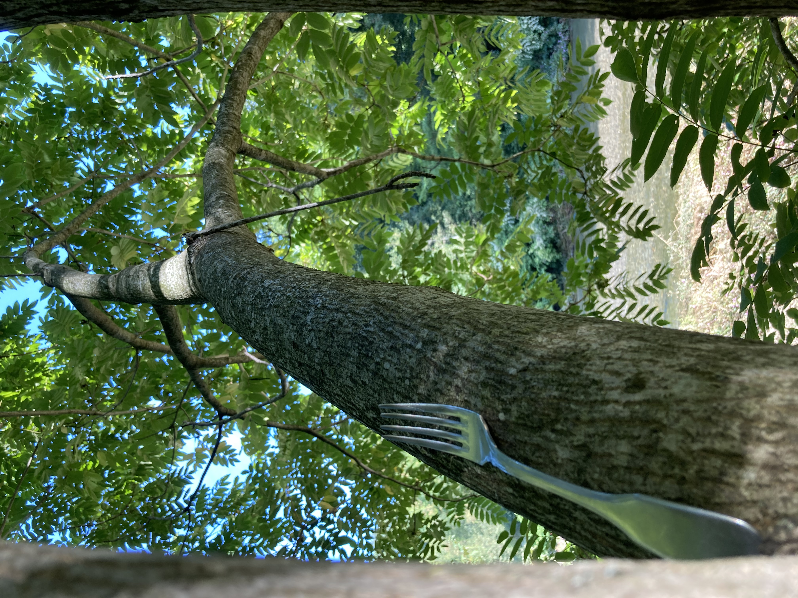
```


## What are forks?

GitHub is useful for developing your own code, but at some point you might want to collaborate with other people on a project. 
Or you might come across a GitHub repository that you want to use as a starting point for your own work. In both cases "forks" are the way to go. 

A fork is making a copy of somebody's GitHub repository. 
You can fork a repo and work independently of the original project. 
Or if you are collaborating with other people you can stay connected with the original repository via pull requests. However, you cannot directly affect (or damage) the original project, which is somewhat less scary, right?


```{r github}
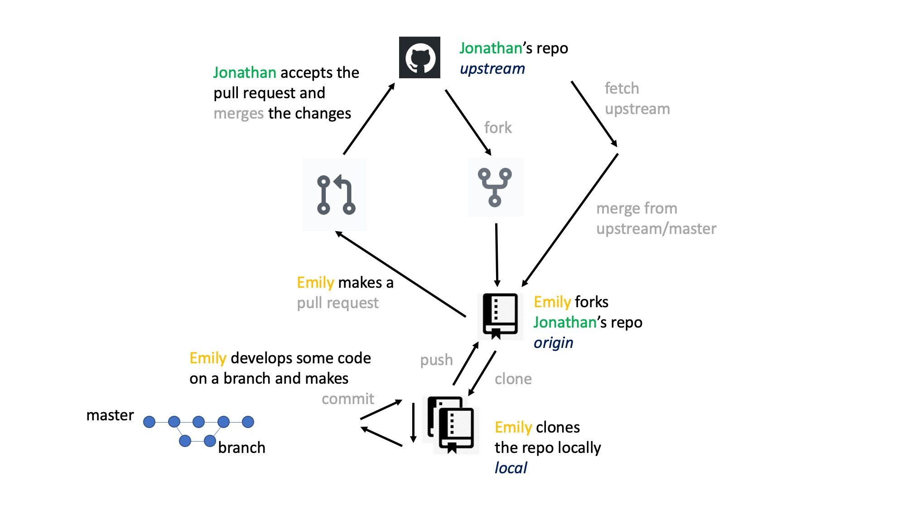
```
<br/><br/>

```{r how-forks-work}
#knitr::include_graphics("Pics/.jpg")
```
<br/><br/>
<br/><br/>

### Fork a repo (on github)

Go to GitHub, login into your account (see here for how to make an GitHub account) and go to the repository you want to fork. 
Click on the fork button on the top right of the webpage.


```{r fork-repo}
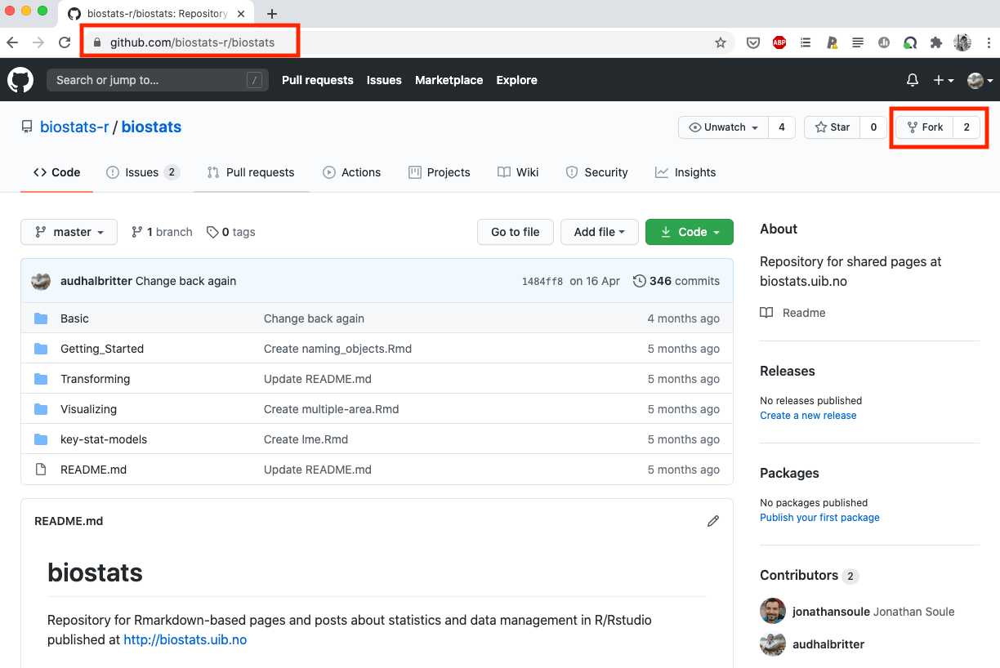
```
<br/><br/>
<br/><br/>

### Clone a repo (Rstudio)

On the top left you find the name of your forked repository and you can see it has been forked from another project.
Click on the green button on the top right and copy the url link.

```{r clone}
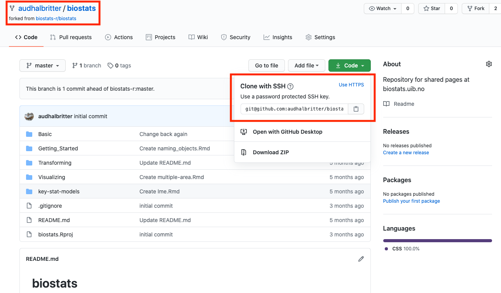
```
<br/><br/>
<br/><br/>
Go to RStudio and click on File > New Project

```{r new-project, out.width = '60%'}
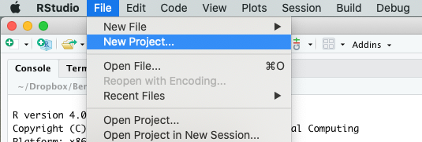
```
<br/><br/>
<br/><br/>
Select Version Control

```{r version-control, out.width = '60%'}
knitr::include_graphics("Pics/4. Version_control.png")
```
<br/><br/>
<br/><br/>
Select Git

```{r git, out.width = '60%'}
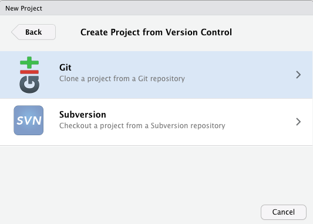
```
<br/><br/>
<br/><br/>
And paste the url link from above.

```{r add-url, out.width = '60%'}
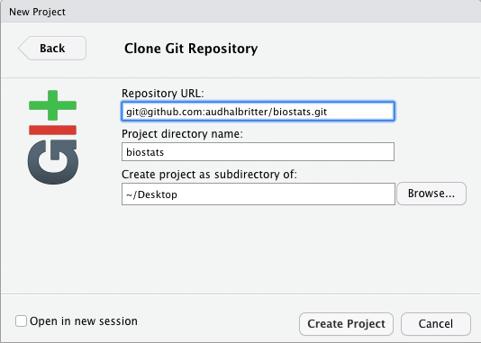
```
<br/><br/>
<br/><br/>

## What is a branch?

You have forked a repository and are ready to start working on the project. 
Let's talk about branches.

A branch lets you develop code or test an idea without affecting the original project. 
This means you can bravely develop code that works or does not work. 
Once you are happy with the new code, or the idea is tested and working you can merge the branch you are working on with master branch, if you are working on your own project. If you are collaborating with other people you do not want to merge with the master branch. This is when pull requests come in handy (see below). 
If the idea did not work or you have another idea, the branch can be deleted and nobody ever needs to know about it. 
Make a new branch and start all over again. None of this will affect the original project.

Let's have a look how to create, use and delete branches.
<br/><br/>
<br/><br/>

### Make new branch (RStudio)

In RStudio, click on the New Branch button in the Git window. 
The box next to it will tell you in which branch you are. 
Master is the default and original branch.

```{r new-branch}
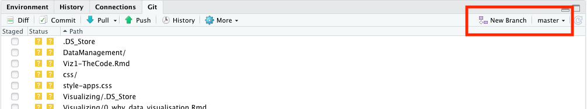
```
<br/><br/>
<br/><br/>
Give the branch a short and informative name (no spaces) and click create.

```{r name-branch, out.width = '50%'}
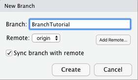
```
<br/><br/>
<br/><br/>
You can now see that you are in the new branch.

```{r new-branch-2}
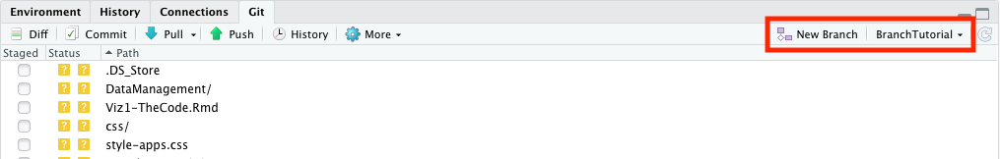
```
<br/><br/>
<br/><br/>

### Write R code, commit and push to origin (Rstudio)

Now is the time to open a new or an existing file and start to work on the project. 
Work in the usual way, add small bits of code, commit regularly, add a useful commit message and push once in a while (see here how to code with GitHub).
Once you are done with your project, test it and push it to your orgin repository on GitHub. 
This works in the same way as when you work in your own repository.

```{r make-file}
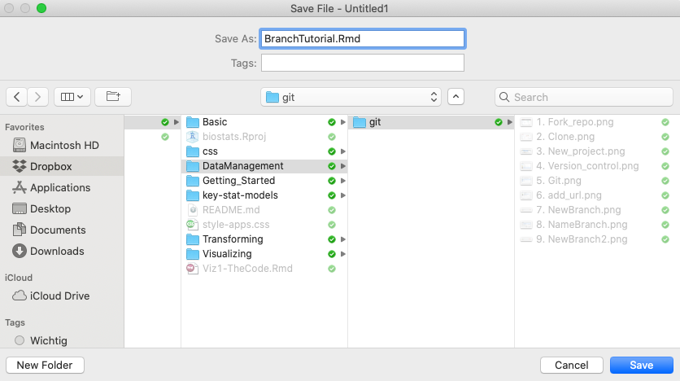
```
<br/><br/>
<br/><br/>


### Make pull request (github)

Once you have pushed your branch back to the master branch you can make a pull request. 
Go back to GitHub, to your forked repository. 
A green box appears at the top of the page "pull requst". 
Click on this button.
<br/><br/>
<br/><br/>
```{r pull-request-1}
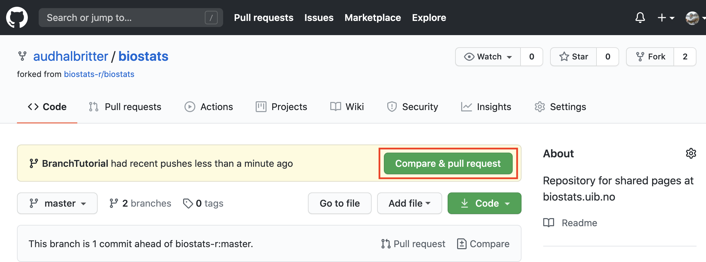
```
<br/><br/>
<br/><br/>
Add a comment about your pull request if necessary and create the pull request.
<br/><br/>
<br/><br/>
```{r pull-request-2}
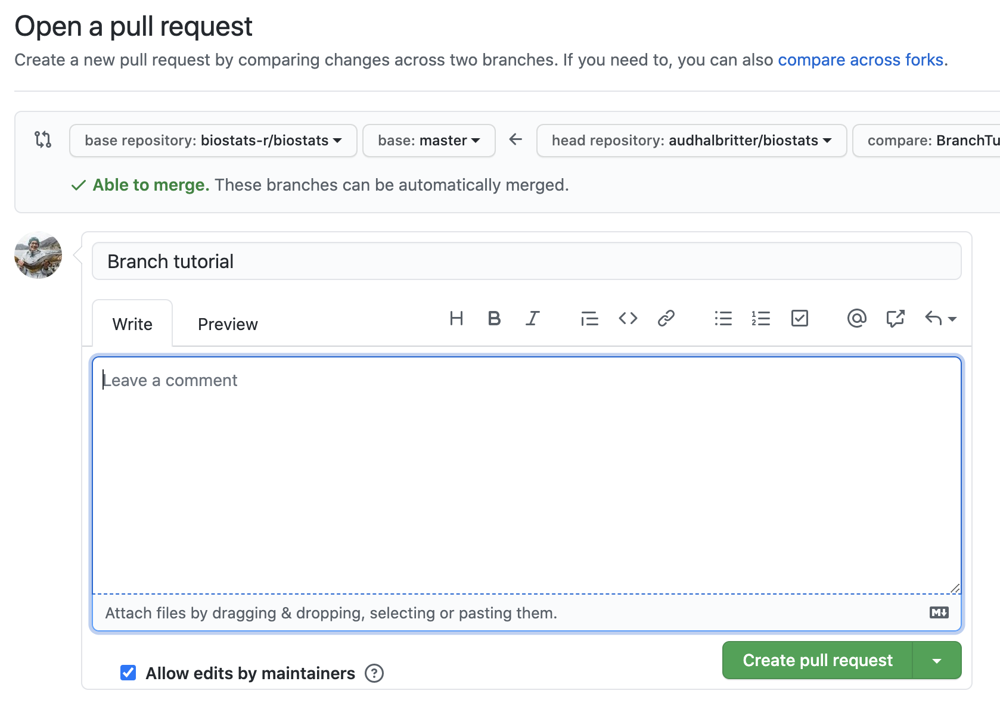
```
<br/><br/>
<br/><br/>
Once you have created your pull request, github will check if there are any merge conflict. 
If no merge conflicts occur, the box will become green. 
If there are merge conflicts, click on the box resolve merge conflicts and fix the problems.
<br/><br/>
<br/><br/>
```{r pull-request-3}
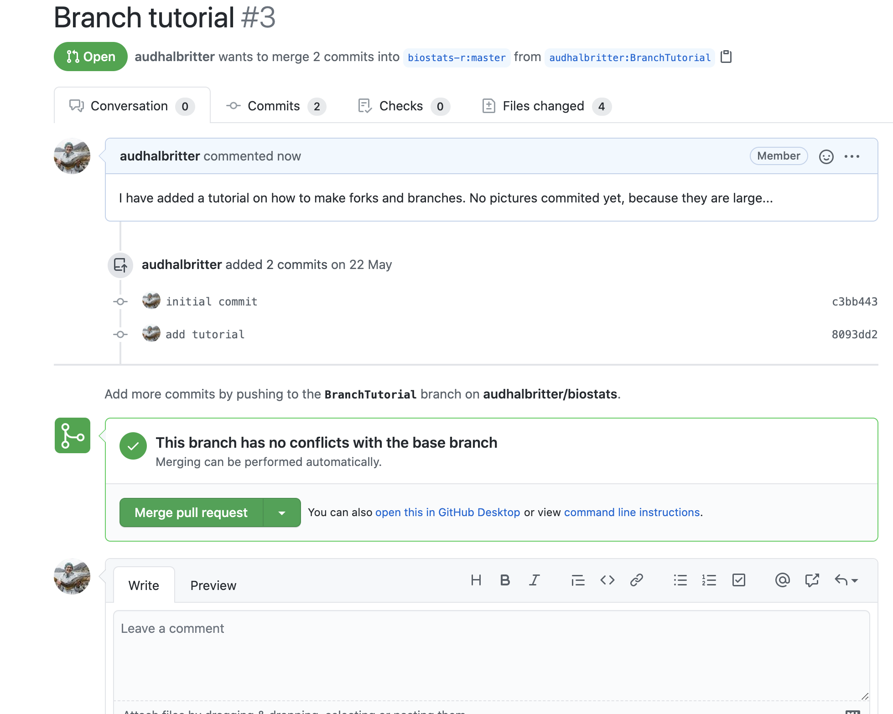
```
<br/><br/>
<br/><br/>
Now it's time for you to relax, have some cake 🍰, you have earned it!
<br/><br/>
<br/><br/>

### Owner accepts pull request (or not)

The owner of the original project has to evaluate your changes to the project. 
The owner can accept your code, decline or make suggestions for improvement.

You will get a notification if your pull request has been accepted.
<br/><br/>
<br/><br/>

### Update your fork (Terminal)

Once your pull request has been accepted, you have to update your fork to get the lastest changes from upstream. 
Go to RStudio and the terminal tab and type:
<br/><br/>
<br/><br/>
```{r terminal-request}
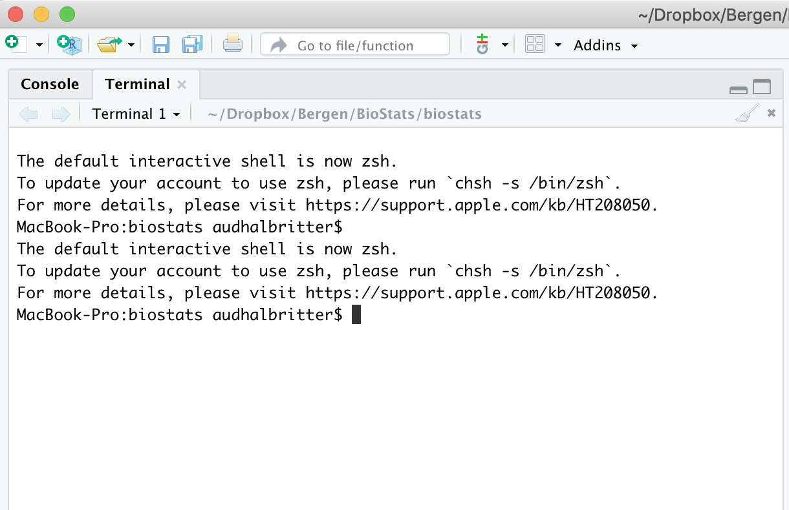
```
<br/><br/>
<br/><br/>

```
git fetch upstream

git checkout master

git merge upstream/master
```
Fetch downloads all the changes from upstream. 
Checkout master makes sure your master branch is active. 
And merge upstream/master merges the changes on your local repository.

<br/><br/>
<br/><br/>

### Delete branches

Once you have created a couple of branches, it will become messy and you want to delte the once you are not using anymore. 
To delete the branches locally and on the origin type:

```
git branch -D BranchTutorial
```

This will delete the branch locally.

And:
```
git push origin --delete BranchTutorial
```

This will delete the branch remotely.

<br/><br/>
<br/><br/>

### When things go wrong

!!! Still needs to be added:
- Need to explain that working on the master branch summons zombies. Maybe explain how to lock master branch (bit advanced - maybe a link is sufficient)
- what is a merge conflict and how to handle it


<br/><br/>
<br/><br/>

### Further reading {.facta .toc-ignore}

https://happygitwithr.com/