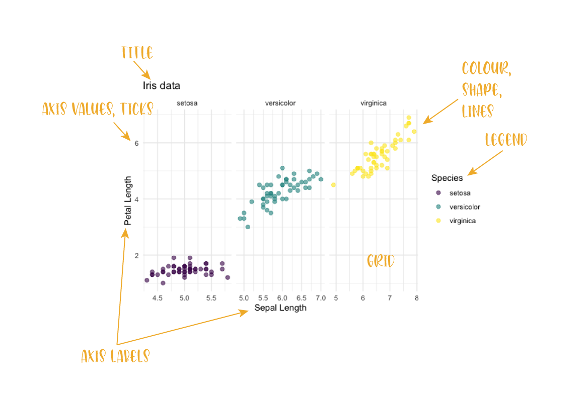

---
title: ""
output:
  bookdown::html_document2:
    highlight: tango
    toc: true
    toc_float: true
    css: ../css/style-chapters.css
--- 

```{r setup, include=FALSE, out.width = '100%'}
knitr::opts_chunk$set(echo = TRUE, warning = FALSE)
library("ggplot2")
```

# Essential ggplot Elements
A plot is made of different components such as data, axis, title, legend... and has different elements such as colour, shape and linetype.
Each of these components and elements can be changed and customized.
Click on the figure below to get information on how to change each component.


```{r clickable-plot, echo=FALSE}

```


## Titles, axis text/labels (labs)
- add, remove and change axis labels, add units
- add title, subtitles, tags
- change size, colour, position


## Axis limits and ticks (scale_)
- Remove/add customize axis values
- change axis ticks position, labels, ...
- change size and colour
- tansform, reverse
- add second axis


## Scales: changing colour, shape, lines,...
- customize colour, shape,... `scale_colour_...()`
- colour brewer etc. (we could also have a chapter on colours)
- ...


## Legend
- change legend position (top, bottom, inside plot)
- change legend title, labels
- remove legend
- remove parts of the legend


## faceting things: labels, free axis, facet grid/wrap
- facet wrap and grid
- free scales
- change labels on facets
- space between panels?


## theme options: change grid, ...
- change themes (minial, bw,...)
- change elements of the grid manually
- change all sorts of things: text, etc for the whole plot


## Change the data
- add data (e.g. add a regression line to the plot)
- add mean values using a second geom_point()


## Change the plot type
- geoms


## Save plots
- ggsave