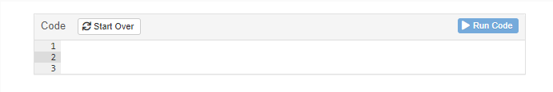

  
``` {r setup, include=FALSE}
knitr::opts_chunk$set(echo = TRUE, warning = FALSE)
```


# Preamble

## About this website

These pages are the result of a collaborative effort between bioCEED, Centre for Excellence in Biology Education, the Department of Biological Sciences at the University of Bergen (UiB), and the Department of Biology and the Department of Mathematical Sciences at the Norwegian University of Science and Technology (NTNU).

## Who is it for?

These pages are essentially meant for biology students both at the bachelor and master level, and link up to courses held at UiB and NTNU.
Contents may certainly be useful for other educational programmes (biomedicine, etc) and other institutions. 
Some of our pages offer more advanced content which may be relevant at doctoral levels and in research generally. 


## Prerequisites

+ functional computer and access to the internet (sais in a humoristic)
+ stats 101 ?


## Structure of the webpages

### Before we start

At the top of each page, you will find the `Before we start` box which tells you what you must already know or be familiar with before you read further. 

### Body

The body of the page introduces the topic(s) along with relevant examples.

### Interactive Learnr tutorials

R is a language; thus it is **important to practice writing** to learn it better and faster. 
To do so, we have embedded a set of interactive tutorials created with the packages `learnr`. 
These small applications allow you to try the code directly in your web browser. 
Figure \@ref(fig:app0) shows how such an interactive app looks like.
 
```{r app0, echo = FALSE, eval = TRUE, fig.cap="_Screenshot of an interactive app._", out.width="100%"}

```

Sometimes, the app will be pre-filled with the full code ready to run. 
Sometimes the code will be partial or incorrect, meaning that you will have to edit it first. 
In all cases, run the code by clicking the green button `Run Code` in the upper right corner. 
Alternatively, start again from the beginning by clicking the `Start Over` button.

Some of these applications are set up as more or less complex exercises. 
Two additional buttons may be available: `Hint` and `Solution`. 
`Hint` may provide you with fragments of the code or tips that will point you in the right direction; `Solution` reveals the answer.


### What's next

At the bottom of the page, you will find the `What's next?` box which introduces the topics to come. You will thus understand that what you have just learned in the present page get to know what the topics you have just learned 

### Literature 

Finally, we provide you with a list of references that support the topic introduced in the pages, details or documentation about the packages, functions or data sets, examples of how what you have learned may be used practically.  


## Structure of the pages


# Chapters
