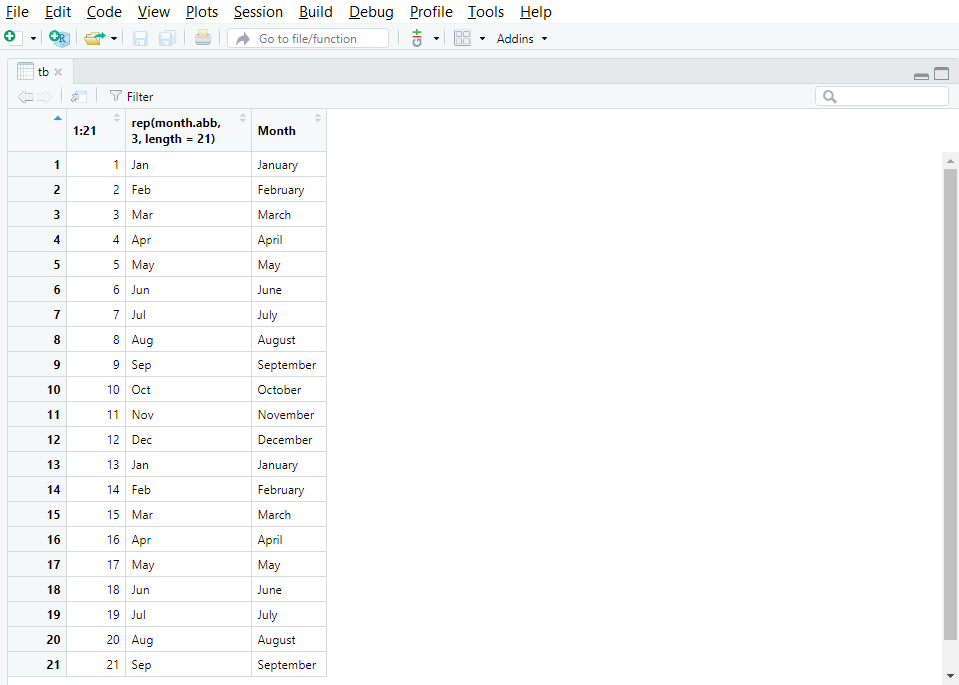

``` {r setup, include=FALSE}
knitr::opts_chunk$set(echo = TRUE, warning = FALSE)
library("tidyverse")

data(penguins, package = "palmerpenguins")

source("../Templates/biostats_theme.R")
theme_set(theme_biostats)
```

### Before we start {- .facta .toc-ignore}

You must have successfully installed both R and RStudio on your machine. 
You must know how to install and activate a package.  


# Basic operations in R

## Simple arithmetic operations

Performing simple arithmetic operations is no big deal in R. 
Simply write any operation using the usual arithmetic operators `+`, `-`, `*` and `/` and run your code. 
No need to write `=`. Also, raising a number to the power of another one requires the use of `^` or `**`. 

Try this here in the following app with the example `4+9`, or any other operation of your choice. 
Try to use `(` `)`, try to combine several of the above-mentioned operators, be creative! 


<!---app1-->

<iframe class="app" src="https://bioceed.shinyapps.io/First_Steps_In_R_1/"  frameborder="no" height="250px" width="100%"></iframe>

<!--------->


## Operations with functions

More complex operations such as square root, logarithms and exponentiation shall be run using specific functions. 
These functions are `sqrt()`, `log()`, `ln()`, `exp()`,  etc. 


<!---app2-->

<iframe class="app" src="https://bioceed2.shinyapps.io/First_Steps_In_R_2/"  frameborder="no" height="450px" width="100%"></iframe>

<!--------->

## Comparisons

You can compare 2 elements using the following operators:

+ `>`    greater than, 
+ `>=`   greater than or equal to, 
+ `<`    less than,
+ `<=`   less than or equal to,
+ `==`   equal to,
+ `!=`   not equal to.

When comparing two elements, R returns either `TRUE` or `FALSE`.

```{r comp, echo = TRUE}
9^2 != 9 * (3 + 6)
```

# Storing data in R objects

R uses objects to store data in memory. 
Storing data in an object is referred to as "assigning data".
There are different types of data and objects, and we will talk much more about them further below.

## Assigning data

To assign data to an object, type first the name you want to give it followed by the operator `<-` and the data to store. 
For example, the result of an arithmetic operation may be conveniently stored in memory for later reuse. 
In the following example, we will assign the result of the operation `sqrt(42)` in memory under the name `result`: 

```{r result, echo=TRUE}
result <- sqrt(42)
```

At once, the object `result` and its associated value show up in the Environment tab in RStudio. 

```{r stored_result, echo = FALSE, out.width="100%"}
knitr::include_graphics("Pics/result.png")
```

From now on, you can display the content of `result` simply by typing its name:
```{r display_result, echo=TRUE}
result
```

You can also use it in more or less complex operations:
```{r operations_result, echo=TRUE}
result * 3
result * result
```

## Modifying the content of an object

To modify the content of an object, you simply have to assign new data to it. 
Here we modify the object `result`:
```{r modify_result, echo=TRUE}
result <- exp(42)
```

The content of `result` is automatically modify, as shown in the Environment tab.

```{r updated_result, echo = FALSE, out.width="100%"}

```

Note that the old data is lost as soon as the new data is assigned. 


## Concatenating data

If you want to assign more than one data element to an object, use the function `c()` which concatenates the elements given between parentheses. 
The data elements to concatenate must be separated with a comma `,`.

```{r concatenate}
results <- c(42, sqrt(42), 42^2)
results
```

This may be applied not only to numbers, but also to characters and strings. 
When storing characters, you must use quotation marks `"` `"` around the elements.

```{r concatenate2}
one_two_three <- c("one", "two", "three")
one_two_three
```

Note that you may concatenate data elements of various natures. 
Here we concatenate and store both numbers and strings: 

```{r concatenate3}
one_2_three_4 <- c("one", 2, "three", 4)
one_2_three_4
```


## Deleting data

When you are done with an object or do not have a use for it, it may be relevant to get rid of it. 
In such a situation, use the function `rm()` to delete it.

Here we will delete `result` from the current environment.
```{r delete1}
rm(result)
```

To delete several objects at the same time, use `rm()` and provide their name separated with commas. 

```{r delete2}
rm(result, results)
```

Again, once it is done, there is no way back.


# Creating sequences and series

Throughout this website, we will use examples that include random series of numbers, sequences of characters or numbers, etc. 
These sequences and series are often created by a bunch of functions or expressions, some of which are described below. 


## Repetitions

The function `rep()` comes handy when you need to repeat data elements `n` times in a row, or to repeat a sequence of elements `n` times. 
Using various arguments, you can decide how many times and in which manner the elements or sequences of elements have to be repeated.

The simplest form is `rep(x, n)` where `x` is what you want to repeat (character, string, number(s), etc) and `n` the number of iterations.

```{r rep, echo=TRUE}
rep(c(1, 2, 3), 3)
rep(c("One", "Two", "Three"), 3)
```

The argument `each=` allows for repeating `n` times each element at a time. 

```{r rep2, echo=TRUE}
rep(1:5, 3)
rep(c("One", "Two", "Three"), each = 3)
```

The argument `length=` limits the length of the resulting series to the specified number of elements.

```{r rep3, echo=TRUE}
rep(1:10, 3, length = 12)
```


## Sequences

The following section provides you with expressions or functions that build sequences of numerical or text values.

### a:b

`a:b` creates a series of consecutive numbers ranging from `a` to `b` with an increment of 1. 
Note that `b` is not necessarily the last element of the series.

```{r series, echo=TRUE}
14:24
14:24.5
14.5:24
```

### seq()

Similar to `a:b`, `seq(a, b)` creates a series of consecutive numbers ranging from `a` to `b` with an increment of 1. 
Note that `b` is not necessarily the last element of the series.

```{r seq, echo=TRUE}
seq(14, 24)
seq(14, 24.5)
seq(14.5, 24)
```

You can use a set of additional arguments in `seq()` to adjust the output. 
Adding `by=` allows to tune the incrementation while `length.out=` (or simple `length=` adjusts the incrementation to provide the desired number of elements ranging precisely from `a` to `b`.

```{r seq2, echo=TRUE}
seq(14, 24, by = 2)
seq(14, 24, length.out = 7)
```

## random series

The following section provides you with functions that build series of random, numerical values.

### runif()

`runif(n)` returns a series of `n` random numbers between 0 and 1.

```{r runif, echo=TRUE}
runif(7)
```

`runif(n, min=a, max=b)` returns a series of `n` random numbers in the range from `a` to `b`:

```{r runif2, echo=TRUE}
runif(7, min = 10, max = 100)
```


### rnorm()

`rnorm(n)` creates a series of n numbers taken from a normal distribution. 

```{r rnorm, echo=TRUE}
rnorm(10)
```

By default, the normally distributed population has a mean of 0 and a standard deviation of 1, but this may be adjusted manually.
```{r rnorm2, echo=TRUE}
rnorm(10, mean = 50, sd = 3)
```

### sample()

`sample(x, n, replace=TRUE/FALSE)` returns a sample of `n` integers taken in the object `x` (which may be a vector, a series such as `1:100`, etc). 
`replace=` followed by either TRUE or FALSE defines whether or not a data element can appear repeatedly in the sample.

```{r sample, echo=TRUE}
sample(1:100, 10, replace = FALSE)
sample(20:30, 7, replace = TRUE)
```

An interesting property of the function `sample()` is that it can be used to shuffle a vector, something which is useful for randomization of data elements. 
In the following example, `sample()` shuffles and returns all values in the vector `one.to.ten`:
```{r sample2, echo=TRUE}
one.to.ten <- 1:10
one.to.ten
sample(one.to.ten)
```

# Data types and objects


Data may be a single value, a list of values or words, a table with numerical entries, a matrix, a full data set with variables and observations, etc. 

When you assign data to an object and give it a name, R stores that object in memory and allows you to manipulate its content simply by referring to its name. 

Here we will first see how to create a simple object and give it a name, and then explore different types of objects, which means how different data objects can be stored.

and name a simple object, then see what kind of data you can store in an object, and finally we will review several of the main object types which will be useful in your research.


# Data objects


## Naming objects

Naming an object sounds quite easy if you are creative, but there is a set of rules to respect:

+ names must start with a letter (lower or upper case) or a dot, nothing else!
+ names may include letters (lower and/or upper case), numbers, underscores `_` and dots `.`
+ you cannot use *reserved* names, i.e. names of existing functions or words already used in R (`TRUE`, `FALSE`, `break`, `function`, `if`, `for`, `NA`, `function`, see the complete list by running `?Reserved` in the console)

Beside these rules, you may find the following recommendations useful: 

+ be consistent and use a word convention when writing names, such as `snake_case` where words are written in lowercase and separated using an underscore symbol `_`
+ give your object a meaningful name such as `norwegian_seabirds`, `alpine_species_vestland`, etc
+ avoid names which meaning may change with time, such as `new_dataset`, `modified_dataset`, `last_year_data`, etc
+ avoid very long names
+ have a look at the [tidyverse style guide](https://style.tidyverse.org/syntax.html#object-names)

Sounds easy? Try this [app](https://bioceed.shinyapps.io/naming_objects/) and you will realize that naming objects may be tricky.

## Modifying objects

When you have stored data into an object, its content is stable until you assign a new set of data to the same object name. 
Note that there will be no warning, exclamation mark or question like "do you really want to overwrite the data in the object?". 
In most cases, once the new data is assigned, the old data is lost. Let's see that with `result`:

```{r reload-result, echo=FALSE}
result <- exp(42)
```


```{r modify}
result
result <- 44
result
```

The only chance that you have to return to the original state of the object is to reassign its original content. 

```{r modify2}
result
result <- 42
result
```

This sounds simple in the present case since `fortytwo` only has one value, but sooner or later you will work with hundreds or thousands of entries. 
If you do not have a copy of the original data set, you will find yourself in trouble.


## Primitive data Types

R lets you manipulate all sorts of data types: numeric, integer, character, logical (also called boolean) and complex. 
Not sure about what the data types actually are? 
No worries, we will define them below. 

In the following sections, we will use the function `class()` to reveal or confirm the nature of the data stored in objects.

### numeric

Any number with a decimal value, whether positive or negative, is numeric. 
The object `num` created below contains a single decimal value and is thus numeric.

```{r numeric, echo = TRUE}
num <- -35.2
class(num)
```

### integer

Integers are numbers that do not contain a decimal value. 
Integers may be positive or negative. 
The object `int` below contains a single integer and is thus defined as integer.

```{r integer, echo = TRUE}
int <- 35L
class(int)
```

Note that `int` was assigned the number 35L. 
The L that follows the number forces the object to become an integer. 
If we write 35 instead of 35L, the object is just numeric as shown below.

```{r numeric2, echo = TRUE}
int <- 35
class(int)
```

### character

An object containing a string of letters combined (or not) with numbers, or even a single letter, is defined as a character. 
The letters may be upper and/or lower case. 
The object `char` below contains a single word and is thus defined as character.

```{r character, echo = TRUE}
char <- "Letters"
class(char)
```

Note that the strings of characters must be stored in objects using `"` `"`.

### logical

Logical (or boolean) defines binary objects which contains `TRUE` or `FALSE`. 
This is the case of the object `logic` described below.

```{r boolean, echo = TRUE}
logic <- TRUE
class(logic)
```


## Data classes

### date


### factor

## Objects

R can handle a multitude of object types, but you will certainly need to know only about the following ones: vector, factor, list, matrix, data frame and tibble.

### Vectors

A vector is an object that contains one or several values of the **same** data type. 
For example, the object `vec.char` described below is a vector that contains 3 data elements of the type character. 

```{r vector, echo=TRUE}
vec.char <- c("one", "two", "three")
vec.char
```

A vector is possibly the simplest object to store many entries for a *single* variable such as, for example, the temperature for a specific location registered over a period of 24 hours. 
In this case, the 24 data points are stored in a sequence that will be maintained, meaning that 8.7 will remain at the first position, 9.2 at the second position, etc.

```{r temperature, echo=TRUE}
temperature <- c(8.7, 9.2, 9.4, 9.5, 9.7, 10.1, 10.3, 10.6, 10.7, 10.8, 11.3, 11.9, 12.2, 12.3, 11.7, 10.2, 10.3, 10.3, 10.4, 10.3, 10.1, 9.7, 9.5, 9.4)
temperature
``` 

Note that the data type of the whole vector is the same as the elements in the vector, as shown by `class()`.

```{r temperature-class, echo=TRUE}
class(temperature)
```

Read more about vectors [here](https://www.rdocumentation.org/packages/base/versions/3.6.2/topics/vector).

### Factors

A factor is a vector which elements may be organized in levels (i.e. category labels), which comes handy when running a statistical analysis that includes categorical variables.
Data elements stored in a factor are usually numeric and/or character, and vectors containing numeric and/or character data may easily be converted to factors using `as.factor()`.

```{r factor, echo=TRUE}
factor.num <- as.factor(1:10)
factor.num
```

As you can see in the example above, the content of `factor.num` is conveniently displayed along with a list of levels. 
When working with a data set that includes repeated elements, the list of levels is restricted to one occurrence per level, thus giving a better overview of the content.

```{r factor_rep, echo=TRUE}
factor.rep <- as.factor(c(1:10, 5:15))
factor.rep
```

Read more about factors [here](https://www.rdocumentation.org/packages/base/versions/3.6.2/topics/factor).


### Matrices

A matrix is a two-dimensional object that displays data of the **same** type (numeric, character, etc) in the form of a table. 
The object `neo` is a matrix made of 4 rows and 5 columns filled with numeric values ranging from 1 to 20.

```{r matrix, echo=TRUE}
neo <- matrix(1:20, nrow = 4, ncol = 5)
neo
```

The use of matrices in this website is very limited
XXXXXXXXXXXXX
XXXXXXXXXXXXXX


Read more about matrices [here](https://www.rdocumentation.org/packages/base/versions/3.6.2/topics/matrix).

### Lists

A list is an object that contains values of one or several data types. It may also contain objects such vectors, matrices, etc.  

The object `my_list` described below is a list that contains 6 elements.  
Some of them are objects that we have created previously on this page, others are new data elements of type numeric, character and logical.

The list is created using the function `list()` that concatenates the elements while preserving their nature.
Note that a specific name may be given to any of these elements. 
Simply write `name =` followed by the element. 
Here we will name them `a`, `b`, `c`, `d`, `e` and `f`.


```{r list, echo=TRUE}
my_list <- list(a = "one", b = 2, c = temperature, d = TRUE, e = vec.char, f = neo)
my_list
```


Naming elements when creating a list is quite convenient as it allows you to retrieve them rapidly with <list_name>`$`<element_name>. Here we retrieve the element `f` in the list `my_list`:

```{r listdollar, echo=TRUE} 
my_list$f
```

Read more about lists [here](https://www.rdocumentation.org/packages/base/versions/3.6.2/topics/list).

### Data frames

A data frame is a two-dimensional object that stores data of **various** types in the form of a table. 
Data frames are a popular way to store research data since the columns are usually associated with single variables (and are thus of a specific data type such as numeric or character) and rows are associated with observations.

It is fairly easy to create a data frame by using the function `data.frame()` to put vectors or factors side-by-side, vertically, and in a given sequence. 
However you must make sure that these vectors have the same length (i.e. the same number of elements) since a data frame cannot have empty cells. 
As a result of using `data.frame()`, the column names will match the name of the vectors. 
You can also specify a name for a column using `=`.

```{r df, echo=TRUE}
df <- data.frame(1:12, month.abb, "Month" = month.name)
df
```

When printing a data frame (like in the example above) to visually evaluate it, the whole object is displayed, including row numbers/names and column names. 
This means that several hundred lines or observations may suddenly invade your screen as soon as you run the name of the object in R.
You will find some useful functions to shortly describe a huge data frame further below in Chapter \@ref(describing-an-object).

Read more about data frames [here](https://www.rdocumentation.org/packages/base/versions/3.6.2/topics/data.frame).

### Tibbles

A tibble is an evolution of the data frame described above. 
It is not part of the R base package (a.k.a. base R), but comes with the package `tidyverse`, which you have to install/load ahead of time.

THEY PRINT BETTER AND ARE A STANDARD INT THE TIDYVERSE.

```{r load tydiverse, echo=TRUE}
library(tidyverse)
```

The tibble, like the data frame, is still a table that stores data of **various** types. 
However, it drops some of the inconvenient features of the data frame that used to make your work frustrating or less efficient. 
For example, instead of displaying the whole data set at once, it shows only the first 10 to 20 observations (depending on the actual length of the data set) and only the columns that the width of the screen or window allows. 
Along with that table comes a quick description of the structure of the tibble as well as the data type for each column (`<int>` for integer, `<chr>` for character, ...).

```{r tibble, echo=TRUE}
temperature_lygra <- tibble(year = rep(2017:2019, each = 12), Month = rep(month.name, 3), avg_temperature = c(3.4, 2.8, 4.2, 5.8, 11.4, 12.6, 14.6, 13.9, 13.7, 9.2, 4.3, 3.1, 2.3, 0.5, 0.8, 6.7, 13.5, 13.6, 16.2, 13.8, 11.6, 8.0, 6.6, 3.9, 1.7, 4.6, 4.0, 9.1, 8.8, 13.2, 15.4, 15.8, 11.6, 7.8, 3.6, 4.8))
temperature_lygra
```

You may convert data frames into tibbles by using `as_tibble()`.

```{r df-tibble, echo=TRUE}
df_tibble <- as_tibble(df)
df_tibble
```

Here is a tibble called `penguins` which is part of the package `palmerpenguins`. 
You will certainly meet this tibble again and again on this website as it provides a convenient set of variables and observations well-suited for illustrating many purposes.

```{r penguins-tibble, echo=TRUE}
penguins
```


## Describing an object

Further below you will find a handful of functions that help you analyze objects. 
Some of these functions will tell you how the data stored inside the object look like, others will give you an idea of its structure, the data type(s) or simply a quick overview of the data set.
When working with tibbles, most of these functions are not of much interest or use since R always describes the structure of the tibble when printing it. 
However when working with data frames, these functions will give you a better overview.


### The Environment tab

Working in RStudio, you will find a quick but useful overview of the objects stored in memory by looking at the ´Environment´ tab which is usually located in the upper right fraction of the main window, as shown in Figure \@ref(fig:env).

```{r env, echo = FALSE, eval = TRUE, fig.cap="_Screenshot of the_ Environment _tab in RStudio._", out.width="100%"}

```

This tab lists all the objects currently stored in memory (in the RStudio project currently in use) along with a quick summary of their content. 
The top part of the tab shows complex objects such as lists, matrices, data frames and tibbles whereas the bottom part shows simpler objects such as vectors and factors. 
Note that some of the complex objects appear next to a blue, round icon with a white arrowhead. 
Click on it to expand the summary as shown in Figure \@ref(fig:exp).

```{r exp, echo = FALSE, eval = TRUE, fig.cap="_Clicking on the icon provides more info about the structure of the object._", out.width="100%"}

```

If you click directly on the line that describes the object in the ´Environment´ tab, a new tab appears in the top left section of Rstudio which displays the object itself. 
Figure \@ref(fig:click) shows a screenshot of the tab that pops up after clicking on the line with `tb`.

```{r click, echo = FALSE, eval = TRUE, fig.cap="_Clicking on the object line opens a tab with the content of the object._", out.width="100%"}

```


DESCRIBE THE STRUCTURE OF THE OBJECT AND LINK STR()


### View()

The function `View()` leads to the same result as clicking on the line of the object in the `Environment` tab: it opens a new tab which displays the whole object.
Figure \@ref(fig:view) shows a screenshot of the tab that appears after running the following line of code.

```{r View, echo=TRUE}
View(temperature_lygra)
```

```{r view, echo = FALSE, eval = TRUE, fig.cap="_The function `View()` opens a tab with the content of the object._", out.width="100%"}

```


### What's next {- .facta .toc-ignore}

Now that you know the basics of R and that you have all the tools to create "manually" data frames or tibbles, you will learn how to import a data set from an external source. 
R can indeed read and fetch data from various file types such as .txt, .csv, .xls, .xlsx, and directly store it in data frames or tibbles.

### Literature {- .literature .toc-ignore}

### Contributors {- .contributors .toc-ignore}

+ Jonathan Soulé
+ Aud Halbritter
+ Richard Telford
